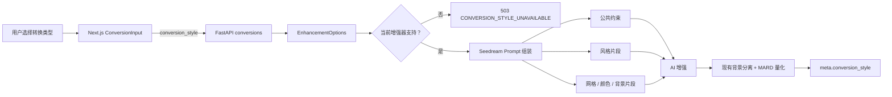

# 图片转换类型选择技术方案

> 状态：待实施  
> 目标版本：MVP3  
> 方案日期：2026-08-27  
> 方案版本：v2（不保留旧契约兼容）  
> 影响范围：`apps/api`、`apps/web`、Seedream Prompt  
> 首期类型：原图增强、Q版、贴纸风、简约插画、剪纸风

## 1. 结论

在现有 `POST /api/v1/conversions` 的 `multipart/form-data` 中新增字段：

```text
conversion_style=original | chibi | sticker | minimal_illustration | paper_cut
```

- `original`：对应“原图增强”，保持当前转换行为和效果，不额外注入风格要求。
- `chibi`：在现有网格、颜色预算、轮廓和背景提示词之外，增加一个独立的 Q 版风格片段。
- `sticker`：使用轮廓醒目、色彩鲜明、主体聚焦的贴纸插画表达。
- `minimal_illustration`：主动归纳形体和色彩，形成低细节、低层级的简约插画。
- `paper_cut`：使用边界明确、分层克制的彩色剪纸表达，不生成真实纸纹和复杂投影。
- `conversion_style` 是必填字段；任何调用方都必须明确表达本次转换意图。
- 转换类型只影响 AI 增强阶段，不改变裁剪、背景分离、MARD 色卡匹配、缩格和导出算法。
- 当前增强器不支持所选类型时返回稳定错误，不允许静默回退到原图增强。
- 响应的 `meta.conversion_style` 回传实际使用的类型，便于结果解释、日志排查和效果复现。

目标链路：



这里把转换类型放进现有 `ImageEnhancer` 模块的接口，而不是在路由或页面复制分支。调用方只需提供一个稳定枚举，具体提示词、供应商能力和失败方式全部留在增强模块内部。

## 2. 背景与当前基线

当前图片转换流程已经具备适合扩展的模块 seam：

- `apps/web/src/components/pindou-converter.tsx` 维护上传、网格、色卡和背景模式等用户参数。
- `apps/web/src/lib/types.ts` 的 `ConversionInput` 是页面状态到 HTTP 表单的类型化中间结构。
- `apps/api/src/pindou/api/routes/conversions.py` 负责校验表单并组装 `EnhancementOptions`。
- `apps/api/src/pindou/services/enhancer.py` 定义 `ImageEnhancer` 接口；路由不感知 Seedream 的提示词细节。
- `apps/api/src/pindou/services/seedream_prompt.py` 已把网格、颜色预算、轮廓和背景提示词拆成正交片段。
- `prepare_foreground()` 是 AI 增强与背景分离的唯一入口，后续 `build_bead_grid()` 只做确定性量化。

因此四种视觉风格都不应被实现为独立转换路由、独立量化算法或页面直接传入 prompt。它们本质上是增强阶段的受控业务选项，最小改动是把转换类型加入 `EnhancementOptions`，再由 Seedream 提示词模块统一解释。

## 3. 产品语义

### 3.1 首期五种类型

| 展示名称 | API 值 | 语义 | 是否改变后处理 |
| --- | --- | --- | --- |
| 原图增强 | `original` | 保持当前主体比例、形态和画面表达，只做现有的拼豆化预处理 | 否 |
| Q版 | `chibi` | 在保留主体身份和核心关系的前提下，使用大头、小身体、圆润简洁的可爱化表达 | 否 |
| 贴纸风 | `sticker` | 使用粗而稳定的轮廓、鲜明色块和聚焦主体的贴纸插画表达 | 否 |
| 简约插画 | `minimal_illustration` | 主动合并次要结构、纹理和明暗，将画面归纳为简洁几何形体和少量连续色块 | 否 |
| 剪纸风 | `paper_cut` | 使用清晰的纸片分层和封闭色块表达主体，不保留真实纸纤维、细碎镂空和复杂投影 | 否 |

Q 版允许改变人物或角色的视觉比例，但仍必须保留：

- 主体类别、身份特征、数量和主要配色；
- 姿态、朝向、动作以及主体之间的关系；
- 标志性服饰、配件和物体的核心识别特征；
- 原图构图重心及用户选择的背景模式。

Q 版不承诺像素级复现，也不等于“动漫化”“像素画”或“增加拼豆格子”。仍需禁止模型增加角色、文字、边框、网格、珠子材质和水印。

其他三种风格的产品约束：

- **贴纸风**强调粗轮廓与高辨识度，但不生成物理贴纸的白色裁切边、离型纸、包装、投影或摆拍场景；否则这些元素会被错误量化成实体拼豆。
- **简约插画**与原图增强的区别是“主动简化”：它允许进一步归并次要结构和颜色层级，但不能改变主体数量、身份、动作和构图关系。
- **剪纸风**保留彩色纸片的层次关系，但只使用硬边界和克制的明暗分层；禁止纸张纤维、毛边、密集镂空、卷曲和真实投影，避免制造量化噪点。

### 3.2 类型与其他参数的关系

`conversion_style`、`background_mode`、`grid_size` 和颜色预算是四个正交维度：

- 转换类型决定主体的视觉表达方式。
- 背景模式决定背景保留、简化或分离方式。
- 网格大小决定可保留的细节等级。
- 颜色预算决定色块层级，最终由 MARD 量化执行硬约束。

不要为每个组合维护完整 prompt。首期已有 `5 × 3 × 4 × 3` 个主要组合，复制模板会很快产生漂移。提示词必须继续按片段组合。

## 4. HTTP 契约

### 4.1 请求字段

| 字段 | 类型 | 必填 | 默认值 | 说明 |
| --- | --- | --- | --- | --- |
| `conversion_style` | string form field | 是 | 无 | 本次 AI 转换的受控类型 |

示例：

```bash
curl -X POST http://127.0.0.1:8000/api/v1/conversions \
  -F 'image=@/absolute/path/source.png' \
  -F 'grid_size=78' \
  -F 'color_set_size=221' \
  -F 'background_mode=solid' \
  -F 'background_color=#FFFFFF' \
  -F 'conversion_style=chibi'
```

后端使用 `StrEnum` 和 FastAPI Form 解析。缺失值或未知值由请求校验返回 `422`，不进入路由业务处理、不解码图片、不扣减次数、不调用 AI。multipart 仍会由 ASGI/FastAPI 框架完成协议层解析，因此这里不承诺客户端可以中途停止上传。

### 4.2 契约升级策略

本次不考虑旧客户端兼容，采用明确的破坏性契约升级：

- 请求缺少 `conversion_style` 时返回 FastAPI 标准 `422`，不进入路由业务处理、不解码图片、不扣次数、不调用 AI。
- 不提供 `default` 别名，也不在服务端把缺失值推断为 `original`。
- Web 页面初始选中“原图增强”只是 UI 默认状态；提交时仍必须显式发送 `original`。
- 所有内部调用方、测试替身和脚本必须同步传入类型，禁止在模块内部隐藏默认值。

响应新增 `meta.conversion_style`：

```json
{
  "meta": {
    "enhancer": "seedream-5-lite",
    "enhancer_prompt_version": "seedream-pindou-v10-conversion-style",
    "conversion_style": "chibi"
  }
}
```

响应契约同步升级为 `schema_version="4"`，量化算法仍为 `algorithm_version="bead-grid-constrained-v3"`：

- `meta.conversion_style` 是必填响应字段，不允许前端推断或兜底。
- `schema_version` 描述 JSON 契约；既然必填 meta 形状发生变化，就应明确升级版本。
- `algorithm_version` 不变，因为前景/背景分层、MARD 量化、rows 和 palette 算法没有改变。
- Web 的类型定义和 `parseBeadGrid()` 必须只接受 schema 4，不再透传或接受 schema 3。

这个决策要求 Web 与 API 作为同一个版本进行原子切换，不能依赖先后发布形成兼容窗口。

### 4.3 能力不支持错误

| HTTP | code | 场景 | 是否降级 |
| --- | --- | --- | --- |
| `503` | `CONVERSION_STYLE_UNAVAILABLE` | 当前部署的增强器不支持所选类型 | 否 |

例如 `PassThroughEnhancer` 只支持 `original`。当服务端配置为 passthrough 而请求其他风格时，必须在读取图片和扣次之前返回：

```json
{
  "error": {
    "code": "CONVERSION_STYLE_UNAVAILABLE",
    "message": "当前转换类型暂不可用，请选择原图增强后重试"
  }
}
```

静默返回原图增强会让用户误以为获得了所选风格，也会污染效果数据，因此禁止自动回退。

## 5. 后端设计

### 5.1 领域枚举与增强选项

在 `apps/api/src/pindou/schemas/conversion.py` 定义公开枚举：

```python
class ConversionStyle(StrEnum):
    ORIGINAL = "original"
    CHIBI = "chibi"
    STICKER = "sticker"
    MINIMAL_ILLUSTRATION = "minimal_illustration"
    PAPER_CUT = "paper_cut"
```

在 `EnhancementOptions` 增加不可变字段：

```python
@dataclass(frozen=True, slots=True)
class EnhancementOptions:
    grid_size: int
    color_budget_band: ColorBudgetBand
    background_mode: BackgroundMode
    conversion_style: ConversionStyle
    background_color: str | None = None
    chroma_key: str | None = None
```

`conversion_style` 不设置默认值，并放在有默认值字段之前。这样任何新调用方在类型检查或运行测试时都会被迫明确选择，而不会无意继承原图增强行为。

### 5.2 增强器能力接口

现有 `SeedreamEnhancer` 与 `PassThroughEnhancer` 对风格的支持确实不同，因此这是一个真实 seam，可以在 `ImageEnhancer` 增加只读能力：

```python
class ImageEnhancer(Protocol):
    @property
    def supported_styles(self) -> frozenset[ConversionStyle]: ...

    def enhance(
        self,
        image: Image.Image,
        *,
        options: EnhancementOptions,
    ) -> EnhancementResult: ...
```

适配器能力：

```python
ORIGINAL_ONLY = frozenset({ConversionStyle.ORIGINAL})
SEEDREAM_STYLES = frozenset(ConversionStyle)
```

路由只根据接口做一次前置校验，不判断 `enhancer.name`，也不直接识别供应商：

```python
if conversion_style not in enhancer.supported_styles:
    raise ApiError(
        503,
        "CONVERSION_STYLE_UNAVAILABLE",
        "当前转换类型暂不可用，请选择原图增强后重试",
    )
```

这个校验应位于低成本表单校验之后、读取上传文件和 `access_keys.consume()` 之前。`EnhancementOptions` 是后续行为的单一事实来源，`prepare_foreground()`、`SeedreamEnhancer` 和测试替身都从同一对象获得类型。

即使路由已校验，适配器仍应在 `enhance()` 入口防御性拒绝不支持的值，避免未来的 CLI 或内部调用绕过 HTTP 校验。

### 5.3 路由与响应

路由新增必填参数。Python 要求无默认值参数位于有默认值参数之前，因此它必须放在 `color_set_size` 之后、`max_colors` 之前：

```python
def create_conversion(
    request: Request,
    response: Response,
    image: Annotated[UploadFile, File()],
    grid_size: Annotated[int, Form()],
    color_set_size: Annotated[int, Form()],
    conversion_style: Annotated[ConversionStyle, Form()],
    max_colors: Annotated[int | None, Form()] = None,
    # 其余参数保持不变
) -> ConversionResponse:
    ...
```

构造增强选项时显式传入：

```python
EnhancementOptions(
    grid_size=grid_size,
    color_budget_band=color_budget.prompt_band,
    background_mode=background_mode,
    background_color=normalized_background_color,
    conversion_style=conversion_style,
)
```

`ConversionResponse.schema_version` 和前端 `BeadGrid.schema_version` 改为字面量 `"4"`。`ConversionMeta` 新增必填的 `conversion_style: ConversionStyle`，响应值直接来自已经校验的请求。日志增加以下低基数字段：

- `conversion_style`
- `enhancer`
- `enhancer_prompt_version`
- `background_mode`
- `grid_size`
- AI 耗时与最终成功/错误码

不记录原图、完整 prompt、Base64 或密钥。图片备份的现行行为不因类型扩张；若用于效果验收，文件名或旁车清单应记录类型，避免不同风格的样本混淆。

### 5.4 Prompt 组装

在 `seedream_prompt.py` 增加风格片段映射，不复制现有完整模板：

```python
CHIBI_STYLE_PROMPT = """
主体风格：将前景主体转换为清晰、可爱、圆润的 Q 版平面插画表达。
人物或拟人角色使用约 2–3 头身的大头小身体比例，适度放大最有身份意义的面部特征，
简化四肢、服饰褶皱和次要配件；非人物主体也使用圆润、紧凑、低细节的可爱化比例。
保留主体身份、类别、数量、朝向、动作、主要配色、标志性服饰或结构，以及主体之间的关系。
比例变化不能造成肢体缺失、主体粘连、遮挡关系颠倒或构图重心明显偏移。
""".strip()

STICKER_STYLE_PROMPT = """
主体风格：将主体转换为轮廓醒目、色彩鲜明、形体紧凑的贴纸插画表达。
使用粗细稳定的单层深色外轮廓和少量必要内部线条，色块平坦、封闭、连续，主体与背景清楚分离。
保留主体身份、数量、姿态、主要配色和标志性结构，不增加文字、标志或装饰。
不要生成白色裁切边、离型纸、包装、投影、翘边、反光或贴在物体表面的展示场景。
""".strip()

MINIMAL_ILLUSTRATION_STYLE_PROMPT = """
主体风格：将画面主动归纳为简约现代的平面插画。
使用简洁几何形体、克制的封闭轮廓和少量连续大色块，合并次要结构、重复装饰、纹理和细碎明暗。
保留主体身份、类别、数量、动作、主要配色、关键识别特征和构图关系；简化不等于删除主体或改变语义。
不要生成渐变、颗粒、笔触、复杂光影或装饰性小图形。
""".strip()

PAPER_CUT_STYLE_PROMPT = """
主体风格：将画面转换为彩色剪纸插画，使用少量完整纸片形状表达主体结构和必要空间层次。
所有纸片使用清晰封闭的硬边界、连续纯色色块和克制的前后分层，保留主体身份、数量、姿态、主要配色和构图。
不要生成纸张纤维、毛边、褶皱、卷曲、密集镂空、真实投影、桌面摆拍或立体手工作品照片。
不要让纸片分层改变主体数量、肢体完整性和遮挡关系。
""".strip()

STYLE_PROMPTS: dict[ConversionStyle, str | None] = {
    ConversionStyle.ORIGINAL: None,
    ConversionStyle.CHIBI: CHIBI_STYLE_PROMPT,
    ConversionStyle.STICKER: STICKER_STYLE_PROMPT,
    ConversionStyle.MINIMAL_ILLUSTRATION: MINIMAL_ILLUSTRATION_STYLE_PROMPT,
    ConversionStyle.PAPER_CUT: PAPER_CUT_STYLE_PROMPT,
}
```

建议组装顺序：

```text
公共语义保护
+ 转换类型片段（original 不插入文本）
+ 下游网格上下文
+ 网格细节档位
+ 主体优先与轮廓约束
+ 颜色预算
+ 背景模式
+ 输出禁止项
```

关键约束：

- `original` 不插入额外文本，使当前 prompt 内容保持不变，降低原图增强效果回归风险。
- `chibi` 只描述允许的比例和形态变化，不覆盖背景模式。
- `sticker`、`minimal_illustration`、`paper_cut` 也只描述视觉表达，不能覆盖主体保护、背景、网格和颜色预算约束。
- 现有低网格和轮廓片段继续负责“能否缩成拼豆图”，Q 版片段不直接要求像素画或网格。
- 版本号升级为 `seedream-pindou-v10-conversion-style`；版本号描述组装实现，具体类型由 `meta.conversion_style` 单独表达。

后续增加“动漫”“水彩”等类型时，只增加枚举值、单个风格片段、能力集合和效果用例，不修改路由编排与量化器。

## 6. 前端设计

### 6.1 TypeScript 契约

在 `apps/web/src/lib/types.ts` 增加：

```ts
export type ConversionStyle =
  | "original"
  | "chibi"
  | "sticker"
  | "minimal_illustration"
  | "paper_cut";

export type ConversionInput = {
  image: File;
  gridSize: number;
  colorSetSize: number;
  backgroundMode: BackgroundMode;
  backgroundColor?: string;
  conversionStyle: ConversionStyle;
};
```

在 `createConversion()` 中始终序列化：

```ts
form.set("conversion_style", input.conversionStyle);
```

`BeadGrid.meta.conversion_style` 定义为必填字段，页面直接消费：

```ts
const actualStyle = grid.meta.conversion_style;
```

同时将 `BeadGrid.schema_version` 更新为 `"4"`，并让 `parseBeadGrid()` 明确拒绝 schema 3 或缺少 `meta.conversion_style` 的响应。

新增错误文案：

```ts
CONVERSION_STYLE_UNAVAILABLE: "当前转换类型暂不可用，请选择原图增强后重试"
```

### 6.2 页面状态与交互

在参数设置区域新增“转换类型”，放在“网格大小”之前：

```ts
const CONVERSION_STYLES = [
  { value: "original", label: "原图增强", description: "保留原图比例与表达" },
  { value: "chibi", label: "Q版", description: "大头小身体的可爱化表达" },
  { value: "sticker", label: "贴纸风", description: "粗轮廓与鲜明色块" },
  {
    value: "minimal_illustration",
    label: "简约插画",
    description: "简洁形体与少量大色块",
  },
  { value: "paper_cut", label: "剪纸风", description: "彩色纸片分层表达" },
] as const satisfies ReadonlyArray<{
  value: ConversionStyle;
  label: string;
  description: string;
}>;

const [conversionStyle, setConversionStyle] =
  useState<ConversionStyle>("original");
```

交互建议：

- 五个类型在移动端无法稳定容纳于单行 segmented buttons，建议使用可换行的选择卡片或两列 radiogroup；不使用原生下拉框，以便同时展示名称和一句效果说明。
- 默认选中“原图增强”，每个选项使用原生 radio 或完整的 radiogroup/radio 语义。
- 处理中禁用类型切换，避免页面选中值与在途请求不一致；或在提交时保存一次请求快照，由结果卡展示快照值。
- 结果信息中展示实际转换类型，其值优先来自响应 meta，而不是当前控件状态。
- 任一风格选择都不自动修改背景、网格或颜色套装，保持参数正交。
- 不让用户填写自由 prompt，也不在浏览器内拼接模型提示词。

首期类型固定在代码中，不新增 `/conversion-styles` 查询接口。只有当类型需要按租户、灰度、模型能力或运营配置动态开关时，再增加服务端能力列表；现在增加查询会形成只有一份静态数组的浅模块。

## 7. 测试方案

### 7.1 后端单元测试

- `ConversionStyle` 只接受五个已发布值。
- `build_seedream_prompt(original)` 与改造前 prompt 完全一致。
- 四个风格类型分别只包含自己的唯一风格片段，且仍只包含当前背景模式的唯一片段。
- 五种类型与 `simplify | solid | keep` 三种背景模式组合时，风格片段均不改变背景语义。
- 五种类型与四个网格档位、三个颜色预算档位组合时，仍选择正确的既有片段。
- `PassThroughEnhancer` 支持集合只有 `original`；`SeedreamEnhancer` 支持五种类型。
- 适配器直接收到不支持类型时会防御性失败。

不必为全部 180 个组合复制完整字符串快照。对片段选择做参数化断言，再为原图增强保留一个完整 prompt 回归快照，并为四种风格分别验证关键正向约束和禁止项即可。

### 7.2 API 测试

- 省略字段时返回 `422`，路由业务处理和增强器未调用且额度未扣减。
- 五种类型的显式提交值都能完整传入增强器，并在响应 meta 返回。
- 非法值返回 `422`，不调用增强器、不扣次数。
- 当前增强器不支持所选风格时返回 `503 CONVERSION_STYLE_UNAVAILABLE`，不读取 `image.file`、不解码图片、不扣次数。
- 五种类型的成功响应继续满足现有 rows、palette、背景和豆数不变量。

### 7.3 Web 测试

- `createConversion()` 总是提交 `conversion_style`。
- 页面默认选中“原图增强”。
- 五个选项分别提交对应的稳定枚举值。
- 转换期间选项不可产生在途状态错位。
- schema 不是 `4` 或缺少 `meta.conversion_style` 时拒绝响应并展示通用格式错误。
- `CONVERSION_STYLE_UNAVAILABLE` 显示稳定中文提示且允许用户修改后重试。

### 7.4 效果验收

生成式效果不能只靠代码测试。建立固定、不得用于训练的验收集，至少覆盖：

- 单人半身、单人全身、双人或多人；
- 宠物、玩偶、车辆等非人物主体；
- 简单背景、复杂背景、纯色背景；
- 52、78、104 三个常用网格；
- 浅色主体、深色主体、细肢体和高密度配件。

原图增强重点检查与当前版本的回归；所有风格共同评分主体数量、身份可辨识度、构图稳定性、肢体完整性、缩格后辨识度和背景模式正确率，再分别增加风格符合度评分：Q 版比例、贴纸轮廓、简约程度、剪纸层次。上线门槛建议为“没有主体数量/肢体完整性阻断问题，且风格符合度与缩格辨识度均达到产品验收基线”。具体阈值应在首轮样本标注后确定，不在代码方案中臆造数值。

## 8. 发布与回滚

本次契约不向下兼容，必须采用 Web 与 API 原子切换：

1. 在同一候选环境同时部署 API schema 4 和对应 Web 构建，不接入正式流量。
2. 用候选环境完成接口、原图增强回归和四种风格效果集验收。
3. 通过蓝绿发布或负载均衡路由一次性把 Web 与 API 流量切换到新版本；不混跑 schema 3/4 实例。
4. 切换后验证五种请求、响应 schema、额度扣减和导出链路。
5. 观察按 `conversion_style` 分组的成功率、AI 错误率和耗时。

如果当前部署系统不能保证 Web/API 原子切换，应安排短维护窗口；不要为追求无停机临时恢复兼容分支。

回滚策略：

- 单个风格异常时，Web 可隐藏对应入口，其他类型继续正常使用。
- 若某种风格效果异常，在后端从 `SeedreamEnhancer.supported_styles` 暂时移除对应值，请求会显式返回不可用；不要把它映射到原图增强 prompt。
- 若整个增强器需要回退到 passthrough，原图增强仍可用，其他四种风格会按能力契约返回不可用。
- 若需要版本级回滚，Web 和 API 必须一起回滚到 schema 3 版本，不能只回滚其中一端。
- 不修改量化和导出算法，因此风格功能回滚不需要迁移历史数据或缓存。

## 9. 实施清单

### 后端

- [ ] 新增 `ConversionStyle` 枚举。
- [ ] 扩展 `EnhancementOptions` 和 `ImageEnhancer.supported_styles`。
- [ ] 为 passthrough、Seedream 和测试适配器声明能力集合。
- [ ] 路由增加 `conversion_style`、前置能力校验和 meta 回传。
- [ ] 请求字段、`EnhancementOptions` 和响应 meta 均设为必填，无隐式默认值。
- [ ] 响应 schema 升级为 4，更新所有后端契约测试。
- [ ] 增加四种风格片段，保持 original prompt 不变并升级 prompt version。
- [ ] 增加结构化日志字段和稳定错误码。
- [ ] 完成单元、API 和组合测试。

### Web

- [ ] 新增 `ConversionStyle` 和 `ConversionInput.conversionStyle`。
- [ ] 表单显式提交 `conversion_style`。
- [ ] `BeadGrid` 和 `parseBeadGrid()` 只接受 schema 4 及必填转换类型。
- [ ] 参数区增加五种类型选择器和无障碍语义。
- [ ] 结果区展示实际转换类型。
- [ ] 增加错误映射、请求序列化和交互测试。

### 验收与发布

- [ ] 建立固定效果集并保存原图增强基线。
- [ ] 完成原图增强回归与四种风格人工评分。
- [ ] 在候选环境完成 Web/API 联合验收，并执行原子流量切换。
- [ ] 按类型观察成功率、错误率、耗时和用户重试率。

## 10. 后续演进

首期验证通过后，可以按同一模块接口增加更多受控类型，但每增加一种都必须同时提供：明确产品语义、独立 prompt 片段、支持能力声明、固定效果集和可回滚策略。

以下能力不进入本期：

- 用户自定义 prompt；
- 类型强度滑杆；
- 同一次请求返回多个风格结果；
- 按风格使用不同模型供应商；
- 动态类型目录或运营后台；
- 为任一风格单独维护第二套量化算法。

当出现第二个 AI 供应商或不同类型确实需要不同模型时，再在增强模块内部引入风格到适配器的选择策略。路由和 Web 契约仍保持 `conversion_style` 这一小接口，不向调用方暴露供应商、模型和 prompt 细节。
