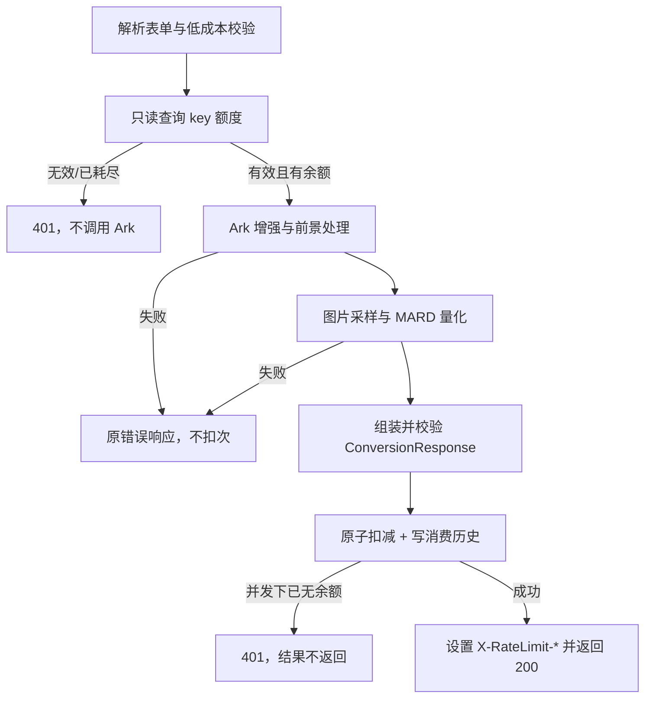

# 失败不扣减密钥次数技术方案

> 状态：待确认  
> 目标版本：MVP2 量化增强版  
> 方案日期：2026-08-30  
> 适用范围：`apps/api`，兼容现有 `apps/web` 转换接口

## 1. 背景与问题

当前 `POST /api/v1/conversions` 在图片解码完成后立即调用
`AccessKeyService.consume()`，随后才执行 Ark 增强、前景处理、图片量化和响应组装。
因此以下失败会出现“用户没有得到转换结果，但次数已经减少”：

- Ark 请求失败、超时或返回不可用图片；
- 前景抠图/背景处理失败；
- `build_bead_grid()` 内部采样或 MARD 量化失败；
- 响应模型组装失败或服务内部异常。

目标是：只有完整生成可返回的拼豆网格响应后，才扣减 1 次；所有失败路径均不扣减。

## 2. 设计结论

采用“两阶段配额处理”，不引入预扣后退款：

1. **转换前只读鉴权（preflight）**：校验 key 是否存在且 `remaining_uses > 0`，不写数据库、不产生消费历史。
2. **转换成功后扣减（commit）**：Ark、前景处理、量化和 `ConversionResponse` 全部成功后，调用现有数据库原子扣减；扣减与 `tb_api_key_usages` 审计记录在同一事务提交。

这样 Ark/量化失败不会扣次，也不会产生“退款失败”或并发退款导致超额的问题。代价是并发下可能有多个请求同时完成昂贵的 Ark 处理，最终只有获得最后可用次数的请求能提交扣减；该情况返回配额错误，不会超扣。

## 3. 处理流程

### 3.1 preflight 规则

- 保留现有参数、文件大小和图片解码校验顺序；这些校验失败不扣次。
- 新增 `AccessKeyService.assert_available()`（或等价命名），内部复用 `get_quota()`，但当 `remaining_uses == 0` 时统一抛出现有 `API_KEY_INVALID_OR_EXHAUSTED`。
- preflight 失败时不得调用 Ark、ONNX、量化，也不写 `tb_api_key_usages`。
- preflight 只是性能和用户体验优化，不作为扣减安全边界；最终仍必须依赖数据库条件更新。

### 3.2 成功提交规则

- `build_bead_grid()` 成功后先完整构造 `ConversionResponse`，确保 Pydantic 校验和所有业务字段均可序列化。
- 仅在响应对象构造成功后调用 `access_keys.consume(..., operation="conversion")`。
- `consume()` 继续使用 `remaining_uses > 0` 的原子 `UPDATE ... RETURNING`，并在同一事务插入 `ApiKeyUsage`。
- 扣减成功后再设置 `X-RateLimit-Limit` 和 `X-RateLimit-Remaining`，最后返回响应。
- 如果 preflight 后被并发请求耗尽，最终 `consume()` 返回空结果并抛出 401；不返回已生成的网格，也不新增历史记录。

## 4. 代码改造点

### 4.1 `apps/api/src/pindou/api/routes/conversions.py`

- 删除当前位于 AI 处理前的 `access_keys.consume()` 调用及其立即设置响应头的逻辑。
- 在解码完成后调用只读 `assert_available()`，不设置扣减后的响应头。
- 保持 Ark、前景处理、备份和 `build_bead_grid()` 的异常传播语义；这些异常直接走现有错误处理和 `finally` 图片释放。
- 在 `ConversionResponse(...)` 实例创建成功后调用 `consume()`，然后设置两个限流响应头。
- 让响应构造和消费提交仍位于图片资源 `try/finally` 生命周期内，避免任何异常导致图片未释放。
- 日志字段增加 `quota_commit="success"`；失败日志不记录完整 key，仅记录 `request_id`、错误码和 provider。

### 4.2 `apps/api/src/pindou/services/access_keys.py`

- 新增只读方法（建议命名 `assert_available`）：
  - 无 key、格式非法、找不到 key：抛 `API_KEY_INVALID_OR_EXHAUSTED`；
  - 找到但余额为 0：同样抛 `API_KEY_INVALID_OR_EXHAUSTED`；
  - 数据库异常：抛 `DATABASE_UNAVAILABLE`。
- 保留 `get_quota()` 的只读接口契约，供前端额度展示使用，不把它当作最终扣减。
- 保留 `consume()` 的原子更新和历史写入；必要时把方法注释更新为“仅用于成功转换提交”。

### 4.3 `apps/api/src/pindou/repositories/access_keys.py`

- 无需改变 SQL 原子扣减条件和事务边界。
- 可增加 `get_quota()` 的 `remaining_uses > 0` 查询封装，但不能移除最终 `UPDATE ... WHERE remaining_uses > 0`，否则并发下会超扣。
- `request_id` 继续写入审计记录；本方案不把失败请求写入 `tb_api_key_usages`。

### 4.4 前端兼容

`apps/web` 无需修改接口格式。成功响应仍读取 `X-RateLimit-Remaining`；Ark/量化失败时没有新的扣减头，前端继续按现有错误码展示。若前端需要在失败后刷新余额，可继续调用现有只读 `/access-keys/quota`。

## 5. 错误与边界语义

| 场景 | HTTP/错误码 | 是否扣次 | 是否写消费历史 |
| --- | --- | ---: | ---: |
| 表单、网格、颜色组或文件校验失败 | 400/413/422 | 否 | 否 |
| key 无效或已耗尽（preflight） | 401 `API_KEY_INVALID_OR_EXHAUSTED` | 否 | 否 |
| Ark/ONNX/前景处理失败 | 供应商映射错误 | 否 | 否 |
| 图片量化失败 | 现有内部/业务错误 | 否 | 否 |
| 响应模型构造失败 | 500 | 否 | 否 |
| 转换成功，原子扣减成功 | 200 | 是 | 是 |
| 转换成功但并发下扣减失败 | 401 `API_KEY_INVALID_OR_EXHAUSTED` | 否 | 否 |
| 扣减事务数据库异常 | 503 `DATABASE_UNAVAILABLE` | 事务回滚 | 否 |

数据库在提交成功后、HTTP 返回前断开时，调用方可能看见 5xx 但次数已扣；这是同步接口无法在没有幂等协议时消除的提交不确定窗口。建议保留 `request_id` 以便排查，不做自动退款。

## 6. 测试方案

在 `apps/api/tests` 增加或调整：

1. Ark 返回 `ApiError`/超时：剩余次数不变，`tb_api_key_usages` 数量为 0。
2. Ark 返回无法解码图片：剩余次数不变，历史为空。
3. `build_bead_grid()` 抛出量化异常：剩余次数不变，历史为空。
4. 成功转换：次数减 1，历史 `operation=conversion` 且 `remaining_uses_after` 正确，响应头与数据库一致。
5. preflight 对无效/耗尽 key：不触发 enhancer mock，返回 401。
6. 并发仅剩 1 次：多个请求最多一个成功扣减，数据库余额不小于 0，历史最多一条。
7. 响应模型构造失败：不扣次，并确认 `finally` 仍关闭 Pillow 图像。
8. 回归现有 `test_access_keys.py`、`test_seedream.py`、`test_quantize.py` 和 API 全量测试。

## 7. 发布与观测

- 先在测试环境启用，核对失败请求前后额度和消费历史。
- 发布后按 `request_id` 对比 Ark/量化失败日志与 `tb_api_key_usages`，预期失败日志对应 0 条消费记录。
- 增加指标：`conversion_quota_preflight_rejected_total`、`conversion_quota_commit_success_total`、`conversion_quota_commit_race_total`。
- 方案上线后保留一段时间的“失败错误码—消费记录”抽样审计，确认没有旧路径残留扣减。

## 8. 不采用的方案

### 预扣后失败退款

需要新增退款接口、状态字段和并发补偿逻辑；外部调用超时无法判断是否已执行，容易重复退款或免费调用，故不作为本版本方案。

### 仅把 `consume()` 移到 Ark 成功之后

仍无法覆盖量化失败、响应组装失败，并且会把“Ark 成功但最终转换失败”错误计费；必须把扣减点放在最终响应对象构造成功之后。

## 9. 验收标准

- 任意 Ark、前景处理、量化或响应组装失败，请求前后 `remaining_uses` 相同且无消费历史。
- 每个 200 成功转换恰好产生一条消费历史并扣减一次。
- 并发请求不出现负数、超扣或重复审计记录。
- 现有 `apps/web` 无需改动即可继续展示成功后的剩余次数。
