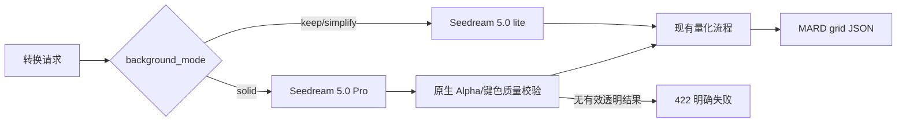

# 背景模式模型路由与移除 ONNX 处理技术方案

> 状态：待实施  
> 目标版本：MVP2 量化增强版  
> 方案日期：2026-08-30  
> 适用范围：`apps/api`，兼容现有 `apps/web` 转换接口  
> 技能说明：当前环境未提供用户指定的 “matt skills”，本文按仓库现有技术方案规范编写。

## 1. 背景与目标

当前 Seedream 增强器在进程级只持有一个模型配置，无法根据 `background_mode` 选择模型；同时代码仍保留 ONNX 前景模型、适配器、就绪探针、兜底和诊断逻辑。业务已确认：

1. `background_mode=solid` 才使用 Seedream 5.0 Pro。
2. `keep`、`simplify` 等非 Solid 模式统一使用 Seedream 5.0 lite。
3. 完全移除 ONNX 相关处理、模型资产和配置，不再加载或调用本地前景模型。

不改变现有 HTTP 请求字段、MARD 量化算法和前端背景渲染语义。

## 2. 方案结论

在 `SeedreamEnhancer` 内增加按请求选择模型的策略，使用两个独立的模型配置：

```dotenv
ARK_DOUBAO_IMAGE_MODEL_PRO=doubao-seedream-5-0-pro-260628
ARK_DOUBAO_IMAGE_MODEL_LITE=doubao-seedream-5-0-lite-260128
```

`SeedreamClient.edit_image()` 接收本次请求解析出的模型，或由增强器为每个模型维护独立 Client；推荐前者，复用连接池且避免重复构造 Ark SDK。模型选择规则固定为：

| 背景模式 | 模型 | `background` 参数 |
| --- | --- | --- |
| `solid` | `ARK_DOUBAO_IMAGE_MODEL_PRO` | `transparent` |
| `keep` | `ARK_DOUBAO_IMAGE_MODEL_LITE` | 不传 |
| `simplify` | `ARK_DOUBAO_IMAGE_MODEL_LITE` | 不传 |

模型名、实际返回模型和 Prompt 版本写入响应 `meta` 与结构化事件日志，便于核对计费和灰度结果。

ONNX 删除后，Solid 仅接受 Seedream 返回的有效原生 Alpha（或现有非 ONNX 键色验证路径，如确认仍需保留）；没有可验证透明结果时返回 `422 AI_BACKGROUND_SEPARATION_FAILED`，不再自动使用本地蒙版。Keep/Simplify 不执行任何前景抠图。

## 3. 代码改造范围

### 3.1 模型路由

- `apps/api/src/pindou/core/config.py`
  - 新增 Pro/Lite 两个模型配置，分别校验非空。
  - `ARK_DOUBAO_IMAGE_MODEL` 进入兼容迁移期时仅作为 Lite 默认值；迁移完成后删除，避免单模型配置继续产生歧义。
- `apps/api/src/pindou/services/seedream_enhancer.py`
  - 增加 `model_for(background_mode)` 私有策略。
  - 调用 Ark 时把解析后的模型传给 `SeedreamClient`。
  - `name` 改为稳定的 `seedream-5`，具体模型通过 `model`/响应元数据暴露；或将 `name` 扩展为 `seedream-5-pro`、`seedream-5-lite`，需同步 Web 类型。
- `apps/api/src/pindou/services/seedream_client.py`
  - 将模型从构造期固定值改为请求参数，并在结果中保留请求模型与上游返回模型。
- `apps/api/src/pindou/schemas/conversion.py`、`apps/web/src/lib/types.ts`
  - 扩展 `enhancer_model` 为 Pro/Lite 实际字符串，保持字段可选和向后兼容。

### 3.2 移除 ONNX

- 删除 `foreground_mask_onnx.py`、ONNX Session 构造、模型元数据注册、下载脚本和 `apps/api/models/foreground/*.onnx/*.json` 资产。
- 从 `Settings` 删除 `ENABLE_ONNX_MATTING`、`FOREGROUND_MASK_ADAPTER`、模型变体、线程/并发等字段及相关启动校验。
- 从依赖注入和 lifespan 删除 `get_foreground_mask_adapter()`、readyz ONNX 检查及关闭逻辑。
- `ForegroundPreparer` 删除 ONNX fallback、`RawForegroundMask`、蒙版验证和 `foreground_model_version` 字段；Solid 只处理原生 Alpha/现有键色路径。
- 删除 `solid_alpha.py` 中 ONNX 指标、融合策略和 `chroma_key.py` 中仅服务 ONNX 的融合/支持率分析函数；若键色仍作为独立 Solid 方案保留，保留其纯键色验证函数并去除 ONNX 参数。
- 清理测试、README、部署模板和历史方案中“当前启用 ONNX”的操作说明；历史文档可保留，但需加“已废弃”标记。

## 4. 请求处理流程



必须保证模型选择发生在调用 Ark 前，并且不会接受 HTTP 表单直接传入模型名。模型只由背景模式和服务端配置决定。

## 5. 配置与发布迁移

1. 先发布支持双模型配置的代码，保留旧 `ARK_DOUBAO_IMAGE_MODEL` 一个版本周期；启动时记录弃用告警。
2. 为生产、预发布和本地 `.env.example` 补齐 Pro/Lite 配置，确认两个 Endpoint 均有权限和额度。
3. 稳定运行后删除旧配置兼容逻辑及所有 ONNX 环境变量、模型下载步骤和容器依赖。
4. 回滚只回滚到双模型代码版本；不恢复 ONNX。若 Pro 不可用，Solid 应显式失败，不得静默改用 Lite。

## 6. 测试与验收

- 单元测试：solid 只选择 Pro；keep/simplify 只选择 Lite；请求中模型字段与响应 `meta.enhancer_model` 一致。
- 反向测试：伪造客户端断言非 Solid 不会传 `background=transparent`，Solid 一定传该参数。
- 配置测试：任一模型为空时启动失败；旧单模型配置仅在迁移期产生告警。
- ONNX 清理测试：仓库源码、依赖清单和运行日志中不再出现 ONNX 初始化；`/readyz` 不依赖模型文件。
- Solid 失败测试：上游返回 RGB PNG 时返回 `422 AI_BACKGROUND_SEPARATION_FAILED`，且不尝试本地抠图。
- 回归测试：Keep/Simplify、MARD 网格、颜色组、前端背景渲染和错误码保持原行为。
- 灰度指标：按背景模式统计 Pro/Lite 成功率、P95、上游错误、Solid 透明结果失败率及单次成本。

## 7. 风险与取舍

- Pro 仅用于 Solid，成本和延迟会上升；通过并发限制、超时和按模式指标控制风险。
- 移除 ONNX 后，Solid 不再具备本地语义分割兜底；这是明确的产品取舍，必须让失败显式可见。
- 上游可能返回与请求不同的别名模型，日志需同时记录请求模型和响应模型，不能只依赖响应字段计费。

## 8. 实施完成标准

- 三种背景模式的模型路由和 API 响应元数据均可由自动化测试证明。
- 生产启动不读取、不校验、不加载任何 ONNX 文件或运行时库。
- Solid 无有效透明结果时稳定返回 422；Keep/Simplify 不受影响。
- 文档、环境模板、监控告警和前后端类型完成同步后，状态更新为“已实施，待灰度验收”。

