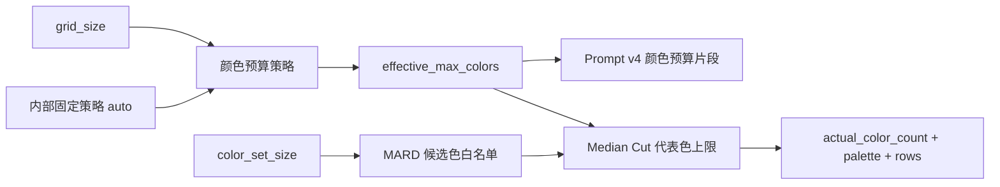

# 色彩预算感知提示词与 `max_colors` 收敛方案

> 状态：已实施，待效果集验证  
> 目标版本：MVP3 / Prompt v4  
> 方案日期：2026-08-14  
> 影响范围：`apps/api`、`apps/web`、Seedream Prompt、MARD 量化与导出信息  
> 前置方案：[Seedream 按网格大小优化提示词方案](./seedream-grid-aware-prompt-optimization.md)

## 1. 结论

保留“最大用色数”这一算法约束，但不再要求新客户端直接理解和提交原始 `max_colors`。推荐把产品概念拆为：

- `color_set_size`：用户可用的 MARD 实体颜色白名单，例如 24 色套装或 264 色全套；
- `color_budget_mode`：本期内部固定为 `auto`，暂不增加前端控件或公开请求字段；
- `effective_max_colors`：服务端根据 `grid_size` 自动派生的实际颜色预算，供 AI Prompt 与确定性量化共同使用；
- `actual_color_count`：量化完成后真正使用的 MARD 色号数量，只会小于或等于有效预算。

`color_set_size` 与颜色预算不重复：前者回答“允许从哪些颜色中选择”，后者回答“这张图纸最多使用多少种不同颜色”。

建议的目标链路：



核心原则是：**Prompt 与量化器必须消费同一个有效颜色预算**。不能让 AI 被要求使用丰富配色，而后处理又强制压成极少颜色；也不能让 AI 先生成大量渐变和碎色，再依赖量化器被动清理。

## 2. 当前实现与问题

### 2.1 两个现有参数的实际职责

当前量化分为两步：

1. Pillow Median Cut 将可见像素归并为不超过 `max_colors` 个图片代表色；
2. 每个代表色只在 `color_set_size` 对应的 MARD 颜色白名单中匹配感知距离最近的实体色。

多个代表色可能映射到同一个 MARD 色号，所以最终：

```text
actual_color_count <= max_colors <= color_set_size
```

在当前合法色卡中最小套装为 24 色，而 `max_colors` 允许 8–24，因此上述关系成立。未来如果新增更小色卡，服务端仍应显式使用 `min(planned_budget, color_set_size)`。

示例：

| `color_set_size` | `max_colors` | 实际语义 |
| ---: | ---: | --- |
| 48 | 18 | 从 48 个可采购色号中，最多使用 18 个 |
| 264 | 18 | 从完整色卡中精确找色，但仍把制作复杂度限制在 18 色以内 |
| 24 | 8 | 只使用入门套装中的颜色，并将图纸进一步简化到最多 8 色 |

### 2.2 当前问题

- Web 前端固定提交 `maxColors: 18`，用户无法选择，它实际上是隐藏策略，却表现为公开 API 输入；
- 同一个 18 色上限被用于 `8×8` 和 `156×156`，没有考虑网格承载能力；
- Prompt v3 已感知网格大小，但不知道后续颜色预算，可能保留超出量化能力的渐变和色相；
- API 只返回 `actual_color_count`，没有返回服务端采用的颜色预算和策略，不利于解释结果与复现实验；
- 如果直接删除 `max_colors`，选择 264 色套装时最终图纸可能使用大量近似色，增加采购、分拣和制作成本。

因此不应删除“颜色上限能力”，而应收敛其归属：本期由服务端自动制定预算，量化器执行硬约束，前端不新增交互负担。

## 3. 产品模型

### 3.1 本期产品决策：只启用 `auto`

```text
auto  智能配色：根据网格大小选择推荐预算
```

前端暂时不展示“配色丰富度”控件，也不要求用户理解内部颜色数量。页面沿用现有交互，转换请求停止发送固定 `max_colors=18` 后，由服务端在字段缺失时自动采用 `auto`。

`restrained | balanced | rich` 保留为后续产品方向，不进入本期 API、TypeScript 类型或测试矩阵。等自动策略经过效果集验证后，再决定是否开放用户选择。

### 3.2 有效颜色预算矩阵

推荐首版使用显式、可测试的自动策略表，不采用隐藏公式：

| 网格档位 | `grid_size` | `effective_max_colors` |
| --- | ---: | ---: |
| `micro` | 8–31 | 8 |
| `small` | 32–63 | 12 |
| `medium` | 64–95 | 18 |
| `large` | 96–156 | 24 |

最终预算：

```python
effective_max_colors = min(
    AUTO_POLICY[grid_detail_band],
    color_set_size,
    grid_size * grid_size,
)
```

最后一项是防御性上限；实际可见格可能更少，因此 `actual_color_count` 仍可能远低于预算。

策略解释：

- `auto` 随网格能力从 8、12、18 增长到 24，替代当前全尺寸固定 18 的隐藏策略；
- 低网格主动减少近似色和单格杂色，高网格允许保留更多有语义的色相与明暗层次；
- 自动预算是上限，不承诺最终一定使用满预算。

策略表是产品实验参数，不是颜色科学定律。上线前应通过固定效果集验证，再独立调整单元格，不同时修改 Prompt 文本和量化算法。

## 4. Prompt v4 颜色预算设计

### 4.1 组装结构

在 Prompt v3 的网格感知结构中加入颜色预算上下文和颜色档位片段：

```text
公共语义保护
+ 下游网格上下文
+ 网格细节档位
+ 下游颜色预算上下文
+ 颜色预算档位
+ 背景模式
+ 输出禁止项
```

仍然使用正交片段，不维护 `4 个网格档位 × 3 个颜色档位 × 3 个背景模式` 的完整提示词组合。

### 4.2 下游颜色预算上下文

```text
这张中间图最终会被映射为最多 {effective_max_colors} 种拼豆颜色。
不需要精确生成这些颜色数量，但请按照当前颜色预算组织主要色块、强调色和明暗层级。
```

只插入服务端派生的整数，不插入用户自由文本。不要把 `color_set_size`、MARD 色号或完整候选色表放入 Prompt：

- Seedream 不负责精确匹配 MARD 实体色；
- 候选套装越大不代表最终图纸应该使用更多颜色；
- 大量 HEX 或色号会显著增加提示词噪声，也无法替代后续 CIEDE2000 确定性匹配。

### 4.3 颜色预算内部档位

根据 `effective_max_colors` 选择内部 Prompt 档位：

| 内部档位 | 有效预算 | 目标 |
| --- | ---: | --- |
| `restrained` | 8–11 | 少量主色、强区分、积极合并近似色 |
| `balanced` | 12–17 | 保留主要配色和少量强调色 |
| `rich` | 18–24 | 保留有语义的色相差异和明暗层次 |

这些档位完全由自动预算产生，不是用户选项：`micro` 命中 `restrained`，`small` 命中 `balanced`，`medium` 与 `large` 命中 `rich`。网格细节片段仍会让后两档产生不同的结构复杂度。

### 4.4 建议提示词片段

#### `restrained`：8–11

```text
颜色预算：受限。
使用少量稳定主色和清楚的冷暖、明暗或色相区分，将视觉相近的颜色主动合并为连续区域。
删除只占极小面积的孤立颜色、细碎高光和渐变过渡；同一结构只保留最必要的亮面、固有色和暗面关系。
优先保证主体身份色和主体与背景的对比，不追求颜色数量。
```

#### `balanced`：12–17

```text
颜色预算：平衡。
保留主体主要配色、关键身份色和少量有意义的强调色，合并无识别价值的近似色和摄影渐变。
允许有限的明暗层级，但每种颜色应形成面积足够、边界连续的区域，避免零散杂色。
```

#### `rich`：18–24

```text
颜色预算：丰富但受控。
保留有助于识别主体的色相差异、主要材质分区、局部强调色和必要明暗层次。
仍然合并肉眼难以区分的近似色、细碎反光、噪点色和无规律渐变；不要为了用满颜色预算而添加新颜色。
```

### 4.5 冲突优先级

组合目标冲突时按以下顺序处理：

1. 主体身份、数量和核心语义；
2. 背景模式；
3. 网格缩小后的轮廓与可辨识度；
4. 主体主要配色和身份色；
5. 颜色丰富度与次要明暗；
6. 装饰、纹理和风格化细节。

典型组合：

| 组合 | 正确行为 | 错误行为 |
| --- | --- | --- |
| `micro + 8 色预算` | 使用少量身份色和大色块 | 为保留色彩恢复细纹理和单格杂色 |
| `large + 24 色预算` | 保留结构和有语义的色相层次 | 为用满预算添加近似色或噪点色 |
| `solid + 自动预算` | 保护主体身份色，纯色背景保持稳定区域 | 用多种近似色模拟纯色背景 |
| `keep + 自动预算` | 保留主要背景配色和空间层次 | 添加原图不存在的背景色或物体 |

## 5. API 契约与兼容迁移

### 5.1 `/api/v1` 兼容方案

不能直接拒绝现有 `max_colors`，否则旧客户端会立即失败。推荐将它改为可选兼容字段，不在本期新增公开的 `color_richness`：

```python
max_colors: Annotated[int | None, Form()] = None
```

解析规则：

| 请求 | 行为 |
| --- | --- |
| 传入 `max_colors` | 兼容旧客户端，直接作为有效预算并标记 `legacy-explicit` |
| 省略 `max_colors` | 按 `grid_size` 自动派生预算并标记 `auto` |

旧 `max_colors` 继续校验为 8–24。它只用于兼容，不再出现在新 Web 的 TypeScript 业务模型和表单请求中。因为没有第二个公开字段，本期也不存在颜色预算参数冲突错误。

### 5.2 新 Web 请求

```ts
export type ConversionInput = {
  image: File;
  gridSize: number;
  colorSetSize: number;
  backgroundMode: BackgroundMode;
  backgroundColor?: string;
};
```

新客户端停止发送 `max_colors`，也不发送 `color_richness`。服务端把缺少 `max_colors` 明确定义为自动策略，前端不需要为了表达默认值新增字段。

### 5.3 `/api/v2` 收敛目标

如果后续发布 `/api/v2`：

- 删除公开 `max_colors`；
- 默认使用自动预算；若届时产品已验证丰富度交互，再决定是否新增 `color_richness`；
- `effective_max_colors` 只作为服务端派生值和响应元数据；
- 量化模块内部继续接收数值预算，因为它需要一个确定性硬上限。

## 6. 后端模块设计

### 6.1 颜色预算策略模块

新增纯策略模块，例如：

```text
apps/api/src/pindou/imaging/color_budget.py
```

建议接口：

```python
@dataclass(frozen=True, slots=True)
class ResolvedColorBudget:
    source: Literal["auto", "legacy-explicit"]
    effective_max_colors: int
    prompt_band: ColorBudgetBand


def resolve_color_budget(
    *,
    grid_size: int,
    color_set_size: int,
    legacy_max_colors: int | None,
) -> ResolvedColorBudget: ...
```

该函数是唯一策略源，负责旧参数兼容、策略表查询和最终上限收敛。路由不应散落多组 `if`，Prompt 和量化器也不应各自重新计算。

### 6.2 转换编排

路由先完成表单和色卡校验，再解析一次颜色预算：

```python
color_budget = resolve_color_budget(
    grid_size=grid_size,
    color_set_size=color_set_size,
    legacy_max_colors=max_colors,
)

enhanced = enhancer.enhance(
    decoded,
    options=EnhancementOptions(
        grid_size=grid_size,
        effective_max_colors=color_budget.effective_max_colors,
        background_mode=background_mode,
        background_color=normalized_background_color,
    ),
)

grid = build_bead_grid(
    enhanced,
    ...,
    max_colors=color_budget.effective_max_colors,
)
```

保持现有同步 `def` 路由：Seedream HTTP 调用与 Pillow 处理都是阻塞操作，FastAPI 会在线程池中执行，不应仅为本次参数调整改成 `async def`。

### 6.3 响应元数据

建议向 `ConversionMeta` 添加：

```json
{
  "color_budget_mode": "auto",
  "color_budget_policy_version": "grid-color-budget-v1",
  "effective_max_colors": 12,
  "actual_color_count": 10,
  "color_set_size": 48
}
```

这些字段分别说明策略来源、策略版本、预算、结果和候选色域。对于旧 `max_colors` 请求，`color_budget_mode` 返回 `legacy-explicit`；未来 `/api/v2` 删除兼容路径后，该字段可固定为 `auto` 或随新策略重新评估。

## 7. 量化算法边界

首版不改动现有两阶段算法，只把参数名称在领域层收敛为 `effective_max_colors`：

1. Median Cut 生成不超过有效预算的代表色；
2. 代表色映射到所选 MARD 色卡白名单；
3. 合并映射到同一色号的重复颜色；
4. 返回 `actual_color_count <= effective_max_colors`。

需要明确：当前算法保证的是颜色数量上限，不保证最终恰好使用预算数量，也不保证在“限定 N 个 MARD 色号”问题上达到全局最优。若效果集发现代表色映射后大量合并或主色漂移，应单独研究“直接选择 N 个 MARD 色号”的受约束聚类算法，不与 Prompt v4 同时修改。

## 8. 前端交互

本期不增加任何配色控件，用户看到的表单保持不变。交互原则：

- 所有新 Web 请求默认走服务端 `auto`；
- 不向普通用户展示 `auto`、`8、12、18、24` 等内部策略或预算；
- 结果页显示“使用颜色：实际数量 / 有效上限”，例如 `10 / 12`；
- 颜色套装继续显示为“48 色套装”，避免把套装容量和实际用色混为一谈；
- 导出图纸可以增加“颜色上限”，但无需展示固定为默认值的“智能配色”控件；
- AI 关闭时颜色预算仍然生效，因为它同时约束确定性量化，不是 AI 专属选项。

未来只有在自动策略稳定且用户确实需要控制制作复杂度时，才新增“简约 / 标准 / 丰富”交互。

## 9. 测试方案

### 9.1 策略单元测试

覆盖：

- 四个网格档位边界与 8、12、18、24 自动预算；
- 预算始终不超过 `color_set_size` 和格子总数；
- 旧 `max_colors` 8、24 边界正常，7、25 返回稳定错误；
- `max_colors` 省略时采用 `auto`，传入时采用 `legacy-explicit`；
- 解析结果同时传给 Prompt 与量化器，不能产生两个不同数值。

### 9.2 Prompt 单元测试

覆盖：

- 精确有效预算正确插入；
- 8–11、12–17、18–24 只命中一个颜色预算片段；
- `color_set_size` 和完整色卡内容不进入 Prompt；
- 网格、颜色和背景三个维度各命中唯一片段；
- 禁止“为了用满预算添加新颜色”的约束始终存在；
- 非法背景颜色仍不能形成 Prompt 注入。

### 9.3 API 与前端测试

覆盖：

- 省略和显式传入 `max_colors` 的兼容矩阵；
- 响应返回 `effective_max_colors`，且 `actual_color_count` 不超过它；
- Web 不再提交 `max_colors`，也不新增 `color_richness`；
- 结果页和导出页区分色卡容量、有效上限和实际用色数；
- AI 开关关闭时颜色预算仍然约束量化结果。

## 10. 效果评估

Prompt v3 的网格效果应先形成基线，再单独比较 Prompt v4，避免把两个变量混在一起无法归因。

每张固定测试图建议覆盖：

- 网格：`24、52、78、104、156`；
- 颜色预算：自动策略与旧固定 18 色基线；
- 背景：至少覆盖 `simplify` 与 `keep`，纯色背景单独抽样；
- 每个生成式组合运行三次。

主要观察：

| 维度 | 关注点 |
| --- | --- |
| 配色保真 | 主体身份色、主要色相和冷暖关系是否保留 |
| 碎色控制 | 单格/小连通区域、近似色堆叠是否减少 |
| 预算利用 | `actual_color_count / effective_max_colors` 是否异常偏低 |
| 可制作性 | 找色、分拣和制作复杂度是否与选项描述一致 |
| 网格识别 | 丰富配色是否损害低网格轮廓可读性 |
| 跨次稳定 | 相同输入多次生成的主色和实际用色数是否稳定 |
| 幻觉 | 是否为追求色彩丰富度添加原图不存在的颜色或物体 |

不要把“实际颜色越接近上限”当作成功。颜色预算是上限，不是使用目标；识别度、主要配色和连续色块优先。

## 11. 灰度与回滚

建议分阶段发布：

1. 新增颜色预算策略和响应字段，但 Web 暂时通过兼容路径继续发送 `max_colors=18`；
2. 离线评估 Prompt v3 与 Prompt v4，确认颜色片段带来正向收益；
3. Web 停止发送 `max_colors`，无新增控件地切换到服务端自动策略；
4. 观察导出率、重试率、实际用色分布和 AI 成功率；
5. 稳定后将 `max_colors` 标记为废弃，并在未来 `/api/v2` 删除。

回滚层级：

- Prompt 效果异常：回退 Prompt v3，但保留服务端颜色预算用于量化；
- 自动预算异常：服务端恢复兼容的固定 18 色预算；
- 接口迁移异常：继续接受旧 `max_colors`，不强制客户端同步升级。

Prompt 版本与颜色预算策略版本应分别记录，例如：

```text
prompt_version=seedream-pindou-v4-color-aware
color_budget_policy_version=grid-color-budget-v1
```

分开版本化可以只回滚其中一层。

## 12. 实施顺序

- [x] 新增 `ColorBudgetBand` 和 `ResolvedColorBudget`；
- [x] 实现并测试唯一的 `resolve_color_budget()` 策略函数；
- [x] 将 `/api/v1/conversions` 的 `max_colors` 改为可选兼容字段，省略时使用自动策略；
- [x] 扩展 `EnhancementOptions.effective_max_colors`；
- [x] Prompt v4 增加颜色预算上下文和三档颜色片段；
- [x] 量化入口统一消费 `effective_max_colors`；
- [x] 响应增加颜色预算模式、策略版本和有效上限；
- [x] Web 删除固定 `maxColors`，不新增交互，并更新结果展示与导出信息；
- [x] 完成新旧 API 兼容、自动策略、Prompt 组合和前端测试；
- [ ] 建立 Prompt v3 基线并执行 Prompt v4 固定效果集评估；
- [ ] 小流量灰度，记录两个独立版本并保留 18 色兼容回滚。

## 13. 非目标与后续方向

本方案不包括：

- 让 Seedream 精确输出 N 种颜色；
- 把完整 MARD 色卡、色号或大量 HEX 注入 Prompt；
- 同时替换 Median Cut 与 MARD 最近色算法；
- 根据 AI 自行判断用户拥有哪些实体拼豆；
- 把 `color_set_size` 合并进颜色丰富度概念。

后续可以独立评估：

- 用确定性图像复杂度指标微调 `auto` 预算；
- 直接受 MARD 色卡约束的聚类算法；
- 根据实际库存而非累计套装构造任意颜色白名单；
- 用用户导出、重试和人工偏好数据重新校准策略矩阵；
- 在不增加碎色的前提下，为人物肤色、品牌色等关键颜色设置保护权重。
- 自动策略稳定后，再评估是否开放 `restrained | balanced | rich` 用户选项。
