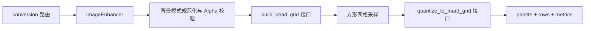

# MARD 约束颜色量化升级技术方案

> 状态：待实施与效果集验证  
> 算法版本：`bead-grid-constrained-v1`  
> 方案日期：2026-08-14  
> 影响范围：`apps/api` 的背景处理、网格采样、颜色量化、配置、响应元数据与测试，以及 `apps/web` 的背景选项、预览和豆数统计

## 1. 结论

当前 AI 增强图已经能提供较清晰的主体、构图和大色块，下一步应优先升级确定性颜色量化，而不是继续增加生成式处理。

核心改造是把现有的：

```text
任意 RGB Median Cut
→ 代表色映射到最近 MARD 色
→ 合并撞色
```

替换为：

```text
网格单元颜色与视觉权重
→ 直接从当前 MARD 套装选择最多 K 个真实色号
→ 每格分配到已选色号
→ 保守的空间清理
```

推荐按以下顺序实施：

1. 将“纯色背景”替换为“透明背景”，建立真实 Alpha、空格与豆数统计契约。
2. 将自动颜色硬上限直接调整为 `52×52 → 30`、`78×78 → 54`、`104×104 → 54`。
3. 实现 MARD 约束的贪心选色，先使用统一权重，不同时改采样。
4. 增加边缘权重和背景降权。
5. 对 BOX 采样与边缘保留采样做独立 A/B。
6. 最后加入保守的孤立格清理和实物色卡校准。

第一版不新增第二次 AI 调用。AI 继续负责生成适合拼豆化的中间图，最终色号和每格索引始终由确定性算法决定。

## 2. 背景与问题

### 2.1 当前处理链路

当前实现位于：

- [`preprocess.py`](../../apps/api/src/pindou/imaging/preprocess.py)：按比例缩放到 `N×N`，使用 BOX 重采样；
- [`quantize.py`](../../apps/api/src/pindou/imaging/quantize.py)：Median Cut、CIEDE2000 最近色匹配与调色板重建；
- [`grid.py`](../../apps/api/src/pindou/imaging/grid.py)：串联方形采样和量化；
- [`color_budget.py`](../../apps/api/src/pindou/imaging/color_budget.py)：按网格大小解析有效颜色预算。

现有流程：

1. AI 增强图按比例缩小到最终网格。
2. Alpha 小于 `16/255` 的单元标记为透明。
3. Pillow Median Cut 在任意 RGB 空间生成不超过 `effective_max_colors` 个代表色。
4. 每个代表色使用 CIEDE2000 映射到用户所选 MARD 套装中的最近色。
5. 多个代表色映射到同一 MARD 色号时合并。

现有实现的以下能力应保留：

- MARD 套装白名单；
- CIEDE2000 感知色差；
- 透明格 `-1` 契约；
- 关闭抖动；
- 稳定的并列决胜规则；
- `palette + rows` 前端数据结构。

### 2.2 二次量化目标不一致

Median Cut 优化的是任意 RGB 代表色，并不知道最终只能使用 MARD 色卡。随后再投影到 MARD 会产生：

- 多个代表色撞到同一个 MARD 色号，浪费颜色预算；
- RGB 空间中合理分开的两个中心，在 MARD 套装中没有对应颜色；
- 最终平均色差并不是“从合法 MARD 色中选择 K 个”的较优解；
- 增加 `effective_max_colors` 有时只增加中间代表色，不增加最终实际颜色。

### 2.3 面积压过视觉重要性

现有选色只看像素分布。大面积背景、柔和渐变和地面会获得更高影响力，而眼睛、轮廓、文字、Logo、蛛网等关键结构只占少量格子，容易丢失身份色或对比关系。

这在当前增强样本中尤其明显：浅蓝或深紫背景占据大量面积，红色主体包含多个明暗层级，细黑白轮廓却只覆盖少量采样单元。

### 2.4 BOX 会在量化前抹掉细线

BOX 重采样适合稳定地计算单元平均色，但窄于一颗拼豆格的高对比线条会与背景平均成灰色或中间色。一旦缩格后的输入已经没有该线条，后续调色板算法无法恢复。

因此“调色板选择”和“单元采样”必须作为两个独立变量验证：先修复选色，再评估边缘保留采样。

### 2.5 新颜色预算

自动颜色预算直接调整为：

| 网格边长 | 代表预设 | 颜色硬上限 |
| ---: | ---: | ---: |
| 8–31 | 自定义小网格 | 8 |
| 32–63 | 52×52 | 30 |
| 64–156 | 78×78、104×104 | 54 |

其中 `30 / 54 / 54` 是量化器可使用的硬上限，不是必须用满的目标色数。简单图片应在新增颜色的边际收益很低时提前停止；复杂图片才允许接近硬上限。

最终有效上限还必须按实际资源收紧：

```text
effective_max_colors = min(
    grid_color_cap,
    color_set_size,
    occupied_bead_count,
)
```

例如选择 MARD 48 色套装时，`78×78` 的硬上限虽然是 54，最终最多仍只能使用 48 色。透明格不属于 `occupied_bead_count`，因此既不产生颜色，也不占颜色槽。

### 2.6 新产品条件：纯色背景改为透明背景

背景选项调整为：

| 界面选项 | 请求值 | 增强结果 | 网格与计数语义 |
| --- | --- | --- | --- |
| 简化背景 | `simplify` | 保留背景语义并合并纹理 | 背景中的可见格正常量化并计入豆数 |
| 透明背景 | `transparent` | 完整移除背景，主体外为真实 Alpha 透明 | 透明格输出 `-1`，不占调色板、不占颜色预算、不计豆数 |
| 保留原图背景 | `keep` | 保留背景物体、布局和层次 | 背景中的可见格正常量化并计入豆数 |

透明位置不是一种“透明豆子”，而是无需放豆的空格。统一定义：

```text
occupied_bead_count = count(rows[y][x] != -1)
transparent_cell_count = width × height - occupied_bead_count
actual_color_count = len(palette)
```

必须满足：

- `rows[y][x] == -1` 的位置没有 `palette` 索引和 MARD 色号；
- 透明格不进入颜色距离矩阵、选色目标或连通分量色块统计；
- 透明格不消耗 `effective_max_colors` 中的任何颜色槽；
- 页面、导出图纸和测试使用同一个 `rows != -1` 计数规则；
- `background_color` 和颜色选择器随 `solid` 一起移除；
- 不把白色、棋盘格或其他模拟背景识别为透明背景。

## 3. 目标与非目标

### 3.1 目标

- 直接从用户选择的 MARD 套装中选出不超过 `effective_max_colors` 个真实色号。
- 降低加权平均和 P90 CIEDE2000 色差。
- 提高主体身份色、高对比轮廓和小面积关键结构的保留率。
- 减少无意义的单格、双格碎片和渐变色带。
- 相同输入、参数、色卡版本和算法策略必须产生相同结果。
- 保持 `palette + rows`、透明格和颜色套装白名单契约兼容。
- 将透明背景稳定转换为真实 Alpha，并保证透明格不计入颜色数和豆数。
- 使用单一 MARD 约束量化算法，并通过固定策略版本保证结果可复现。
- 最大 `156×156` 网格与 264 色候选集满足接口耗时和内存预算。

### 3.2 非目标

- 不让 AI 直接输出 MARD 色号、调色板或最终 `rows`。
- 不引入 Floyd–Steinberg 等抖动算法。
- 不在本期实现用户逐格编辑。
- 不承诺网页 HEX 与所有批次的实物拼豆完全一致。
- 不在第一阶段同时修改预算、采样、选色、空间清理和 Prompt。
- 不把算法内部的全部阈值暴露为 HTTP 参数或环境变量。
- 不把白色或用户指定颜色作为“透明”的替代表示。

## 4. 模块与接口设计

### 4.1 设计原则

颜色量化应作为深模块：调用方只需要提供工作图、MARD 色卡、套装大小和颜色预算；距离矩阵、候选选择、局部优化、空间权重和调色板重建均留在实现内部。

外部稳定入口仍是 `build_bead_grid`。路由不感知贪心、距离缓存、边缘权重或清理规则。



`ImageEnhancer` 的接口增加行为不变量：当 `background_mode=transparent` 时，适配器必须返回带有效主体 Alpha 蒙版的 RGBA 图片，或者返回稳定错误；不能返回不透明白底、棋盘格图片或假装成功。

- Seedream 适配器负责请求真实透明背景，并校验输出 Alpha；
- `PassThroughEnhancer` 仅在输入图片本身已有有效 Alpha 时支持透明模式；
- 对不透明输入使用 passthrough 且选择透明模式时，返回 `TRANSPARENT_BACKGROUND_UNAVAILABLE`；
- AI 返回不透明结果、主体全透明或透明覆盖比例异常时，返回 `AI_TRANSPARENT_BACKGROUND_INVALID`；
- PNG 备份必须保留 RGBA 和 Alpha，便于复现蒙版问题。

背景能力留在增强模块内，量化模块只消费规范化后的 RGBA，不感知 Seedream 或背景移除实现。

### 4.2 量化模块接口

只实现新的 MARD 约束算法，不增加算法协议、适配器或运行时分支。稳定接口继续使用函数：

```python
def quantize_to_mard_grid(
    image: Image.Image,
    *,
    chart: MardColorChart,
    color_set_size: int,
    effective_max_colors: int,
) -> QuantizedGrid: ...
```

`build_bead_grid` 继续调用这一接口。Median Cut 实现直接被替换，不保留算法选择配置。算法版本由量化模块作为常量写入结果，调用方不需要传入或选择。

### 4.3 不向外暴露内部浅接口

以下函数可以作为量化模块内部的纯函数，但不应成为路由、依赖层或公开测试必须了解的接口：

- 单元 Lab 提取；
- 距离矩阵生成；
- 贪心边际收益计算；
- 交换候选生成；
- 边缘与背景权重计算；
- 连通分量清理。

算法测试优先通过 `quantize_to_mard_grid` 的可观察结果验证。只有复杂数学纯函数使用少量直接单元测试。

### 4.4 结果模型

内部结果扩展为：

```python
@dataclass(frozen=True, slots=True)
class QuantizedGrid:
    width: int
    height: int
    palette: tuple[MardColor, ...]
    rows: tuple[tuple[int, ...], ...]
    algorithm_version: str
    metrics: QuantizationMetrics
```

`metrics` 用于日志、效果集和调试，前端渲染不依赖它。首版可以只记录服务端日志，避免一次扩大公开响应。

## 5. 核心算法

### 5.1 输入表示

最终网格的每个可见单元记为：

```python
@dataclass(frozen=True, slots=True)
class CellObservation:
    x: int
    y: int
    lab: LabColor
    alpha: float
    weight: float
    edge_strength: float
    background_likelihood: float
```

第一阶段仍从当前 BOX 缩格图中提取 `lab`，并设置：

```text
weight = 1.0
edge_strength = 0.0
background_likelihood = 0.0
```

这样第一轮效果变化只来自 MARD 约束选色。

透明背景把连续 Alpha 转换为物理拼豆的二值占用状态。初始策略使用：

```text
alpha >= 128 → occupied，参与量化并计入豆数
alpha < 128  → transparent，rows 写入 -1
```

阈值属于版本化量化策略，不成为用户参数。效果集额外比较 `64 / 128`，确认细肢、发丝和抗锯齿轮廓不会被过度收缩。无论阈值如何选择，Alpha 低于占用阈值的单元都不进入 `M`。

### 5.2 优化目标

设：

- 可见单元集合为 `i ∈ [1, M]`；
- 当前 MARD 套装的合法候选色为 `c ∈ C`；
- 颜色预算为 `K = effective_max_colors`；
- `D[i, c]` 为单元与 MARD 候选色的 CIEDE2000 色差；
- `w[i]` 为单元权重。

选择 `S ⊆ C` 且 `|S| <= K`，最小化：

```text
E(S) = Σᵢ w[i] × min(D[i, c] for c in S)
```

该问题属于离散设施选址 / 约束调色板选择。无需引入整数规划求全局最优，使用确定性的贪心加有限局部交换即可。

### 5.3 阶段 A：贪心选色

1. 计算每个候选作为唯一颜色时的加权总误差。
2. 选择误差最低者作为第一个颜色；并列时按 MARD `code` 排序。
3. 保存每个单元到当前已选集合的最近距离 `best_distance[i]`。
4. 每轮评估加入未选候选后的边际误差下降：

```text
gain(c) = E(S) - E(S ∪ {c})
```

5. 选择 `gain` 最大的候选；并列按 `code` 排序。
6. 达到 K，或相对改善低于 `min_relative_gain` 时停止。

停止阈值避免为了使用满预算而添加几乎无收益的相近颜色。必须满足：

```text
actual_color_count <= effective_max_colors
```

但不要求二者相等。

### 5.4 阶段 B：有限局部交换

贪心完成后执行有限次数的 1-for-1 交换：

1. 根据当前残差较大的单元生成未选候选短名单。
2. 固定按已选色号和候选色号排序遍历。
3. 尝试用未选色替换一个已选色。
4. 仅当相对误差改善超过 `swap_min_relative_gain` 时接受。
5. 最多接受 2 次交换或达到最大轮次后停止。

不对全部 `K × (|C|-K)` 组合做无限迭代，避免 `156×156 × 264` 下的不可控耗时。

### 5.5 每格分配

调色板确定后，每个可见单元映射到已选颜色中的最近者：

```python
selected = min(
    selected_colors,
    key=lambda color: (ciede2000(cell.lab, color.lab), color.code),
)
```

透明格仍返回 `-1`，不参与最近色分配，也不计入豆数。最终 `palette` 按网格扫描时首次出现顺序重建，未被任何占用单元使用的候选色不进入输出。

## 6. 距离计算与性能

### 6.1 数据规模

最大输入规模：

```text
M = 156 × 156 = 24,336 个单元
C = 264 个 MARD 候选色
M × C = 6,425,504 个距离
```

纯 Python 逐个调用 CIEDE2000 的成本过高。建议引入 NumPy，提供批量 sRGB→Lab 和批量 CIEDE2000 实现，并使用现有标量数学函数作为正确性基准。

### 6.2 距离矩阵

- 距离矩阵使用 `float32`，最大约 25.7 MiB；
- 单元坐标、权重和候选索引使用紧凑数组；
- MARD Lab 在色卡加载时缓存；
- 相同 RGB 单元先按颜色聚合并累计权重，减少重复计算；
- 最终写回 `rows` 时再将聚合颜色展开到坐标。

若压测显示并发内存不可接受，按以下顺序优化：

1. 重复颜色聚合；
2. 限制量化并发；
3. 使用基于 CIEDE76/OKLab 的候选预筛选，再用 CIEDE2000 精排；
4. 最后才考虑降低距离矩阵精度或改用代理距离作为最终目标。

最终颜色选择仍应以 CIEDE2000 为准，候选预筛选只用于减少计算量。

### 6.3 性能指标

日志至少记录：

- 可见单元数与聚合后唯一颜色数；
- 距离矩阵计算耗时；
- 贪心与局部交换耗时；
- 总量化耗时；
- 距离矩阵估算内存；
- 贪心轮数和实际选色数。

## 7. 空间与视觉权重

该阶段必须在纯 MARD 约束选色通过效果集后单独启用。

### 7.1 边缘权重

基于缩格后 Lab 明度和色度计算 8 邻域梯度：

```text
edge_strength[i] = normalized(max ΔE or ΔL to neighbours)
base_weight[i] = 1 + edge_weight × edge_strength[i]
```

初始 A/B：

```text
edge_weight = 0.0 / 0.5 / 1.0
```

权重必须裁剪，防止少量轮廓完全支配调色板：

```text
0.5 <= final_weight <= 3.0
```

### 7.2 背景与透明区域

透明模式已经通过 Alpha 把背景移出量化集合，不再对这些位置做背景降权。其他模式的背景只降权，不直接删除：

- `keep/simplify`：从边界连通、颜色相近和低梯度三个条件估计背景概率；
- 主体内部与背景相同的颜色仍可正常使用，不按颜色全局删除。

```text
background_factor = lerp(1.0, 0.5, background_likelihood)
final_weight = clamp(base_weight × background_factor, 0.5, 3.0)
```

### 7.3 身份色保护

第一版不硬编码“红色、肤色、黑色”等颜色类别。身份色通过以下机制自然获得保护：

- 边缘权重；
- 小面积高残差单元参与交换候选；
- 后续可选的语义重要性指导。

只有效果集证明仍存在稳定的身份色丢失，才增加显式受保护区域。

## 8. 单元采样升级

### 8.1 第一阶段保持 BOX

MARD 约束选色上线前继续使用 BOX，避免把采样收益混入算法收益。

### 8.2 边缘保留采样候选

第二阶段让采样模块保留每个目标单元覆盖的源像素分布，而不是只保留平均 RGB。每个单元计算：

- Alpha 加权平均 Lab；
- Alpha 覆盖率，用于透明背景的二值占用判断；
- 面积占比最高的主色 Lab；
- 高对比少数色占比；
- 局部梯度方向和强度。

建议比较三种确定性策略：

| 策略 | 说明 | 风险 |
| --- | --- | --- |
| `box-mean` | 当前行为，使用面积平均色 | 细线被平均掉 |
| `dominant` | 使用单元内占比最高的颜色簇 | 可能造成锯齿和色块膨胀 |
| `edge-aware` | 低梯度用平均色，高对比且少数色达到阈值时保留边缘色 | 参数较多，需要效果集验证 |

首选实验为 `box-mean` 对 `edge-aware`。不要直接改成中心点采样，单点采样会对缩放相位非常敏感。

### 8.3 AI 输出的最小特征尺度

AI 增强 Prompt 可以继续要求关键线条、眼睛和轮廓达到最终一颗拼豆可表达的尺度，但 Prompt 只作为上游输入质量控制，不能替代确定性采样。

透明模式的 Prompt 还必须明确要求“真实 Alpha 通道、主体外完全透明、不绘制棋盘格或纯色底”。Prompt 只是请求约束，服务端仍必须验证实际输出 Alpha，不能仅凭提示词认为背景已经透明。

## 9. 孤立格保守清理

量化完成后统计 8 邻域连通分量。仅当以下条件全部满足时，面积 1–2 格的小组件才可替换为邻域主色：

- 当前格不是高强度边缘；
- 邻域主色占比达到阈值；
- 替换后的 CIEDE2000 增量低于 `cleanup_max_delta_e`；
- 替换不会消除受保护区域；
- 替换颜色已存在于当前调色板，不新增色号。

清理功能必须有策略开关，默认在独立效果集通过前关闭。不得无条件删除所有单格，因为眼睛、高光、文字和轮廓尖角可能本来就只占一格。

## 10. AI 介入边界

第一版不增加新的 AI 分析调用。若确定性量化仍不能稳定保护主体，可在后续增加 `VisualImportanceAnalyzer` seam，并提供两个适配器：

| 适配器 | 作用 |
| --- | --- |
| `HeuristicImportanceAnalyzer` | 基于边缘、边界连通区域和背景模式生成权重 |
| `AiImportanceAnalyzer` | 识别主体、面部、Logo、文字和身份色区域 |

AI 只能输出归一化重要性、背景概率和受保护区域，不能输出：

- MARD 色号；
- HEX；
- 最终调色板；
- 网格索引。

AI 指导必须经过尺寸、数值范围、置信度和覆盖比例校验。失败时回退到启发式权重，不阻断基本转换。

## 11. 颜色预算策略

### 11.1 硬上限

预算策略固定为：

| 网格范围 | 颜色硬上限 |
| ---: | ---: |
| 8–31 | 8 |
| 32–63 | 30 |
| 64–156 | 54 |

前端三个预设对应 `52→30、78→54、104→54`。如果继续允许显式提交 `max_colors`，校验范围从 `8..24` 扩展为 `8..54`，并继续受 MARD 套装大小和占用格数量约束。

### 11.2 边际收益停止

硬上限不等于目标色数。贪心选色每轮计算新增 MARD 色带来的相对误差下降：

```text
relative_gain = (current_error - next_error) / current_error
```

达到硬上限或 `relative_gain < min_relative_gain` 时停止。`min_relative_gain` 固定在版本策略中，通过效果集确定，不开放为用户参数。效果集重点观察实际颜色数分布，避免简单图片也使用接近 54 种颜色。

### 11.3 与 AI Prompt 解耦

量化硬上限不直接作为“请生成 30/54 种颜色”的指令发送给 AI。Prompt 只表达有限档位：

| 网格范围 | Prompt 颜色表达 |
| ---: | --- |
| 8–31 | 克制 |
| 32–63 | 平衡 |
| 64–156 | 丰富但受控 |

Seedream 仍需合并渐变和碎色，不能因为量化器允许 54 色就主动制造 54 种颜色。`EnhancementOptions` 应传递颜色表达档位，而不是让 Prompt 拼接精确硬上限。

## 12. 配置、版本与兼容

### 12.1 固定算法策略

不增加 `QUANTIZATION_ALGORITHM` 配置。服务只运行 MARD 约束量化算法，算法阈值集中在不可变的版本策略中：

```python
@dataclass(frozen=True, slots=True)
class ConstrainedQuantizationPolicy:
    version: str
    min_relative_gain: float
    swap_min_relative_gain: float
    max_accepted_swaps: int
    edge_weight: float
    background_weight_floor: float
    cleanup_enabled: bool
```

调用方不能选择算法或逐项拼装策略，避免线上产生无法复现的任意组合。策略调整时升级 `ConstrainedQuantizationPolicy.version` 和响应中的 `algorithm_version`。

### 12.2 响应版本

背景枚举由 `solid` 替换为 `transparent`，并移除 `background_color`，属于请求与响应契约的破坏性变更。因此新响应使用：

```text
schema_version = "2"
```

`palette + rows` 的形状保持不变，`-1` 的语义进一步明确为“不放豆的空格”。

`algorithm_version` 固定返回：

```text
bead-grid-constrained-v1
```

Pydantic 契约只需要允许当前单一版本。未来算法行为发生不兼容变化时升级该值，但不为此预先保留运行时算法分支。

背景模式迁移规则：

- `BackgroundMode` 调整为 `simplify | transparent | keep`；
- Web 默认选择 `transparent`，不再维护 `backgroundColor` 状态或发送 `background_color`；
- 后端不把旧 `solid` 静默映射为 `transparent`，因为纯色豆和空格语义完全不同；
- 旧客户端发送 `solid` 时返回明确的枚举校验错误；
- `meta.background_color` 从 schema v2 删除；
- 前后端应协调发布，避免新前端请求尚未支持 `transparent` 的旧后端。

### 12.3 可选元数据

若公开以下字段，应全部为可选字段，前端不得依赖它们渲染：

```json
{
  "quantization_policy_version": "mard-palette-v1",
  "mean_delta_e00": 8.7,
  "p90_delta_e00": 17.4,
  "isolated_cell_ratio": 0.012
}
```

第一版优先写结构化日志，效果稳定后再决定是否扩展响应。

## 13. 效果集与评价指标

### 13.1 效果集

收集 20–50 张真实 AI 增强图，至少覆盖：

- 人像与肤色；
- 动漫和纯色插画；
- 黑白及高对比线稿；
- 红色、蓝色等强身份色主体；
- 渐变、散景和复杂背景；
- AI 移除背景后产生的真实透明 PNG；
- 原始文件已经带 Alpha 的透明 PNG；
- 主体贴近画布边缘、细肢和半透明抗锯齿边缘；
- 细线、文字和 Logo；
- 低饱和度与暗部场景。

保存输入图、参数、色卡版本、算法版本、`palette + rows`、预览图和人工评分。效果集不依赖线上备份目录中的临时文件名。

### 13.2 自动指标

每张图记录：

- 未加权平均 `ΔE00`；
- 加权平均 `ΔE00`；
- P90 `ΔE00`；
- 实际颜色数与颜色预算利用率；
- 占用豆数与透明空格数；
- 透明模式的前景占用比例和边缘 Alpha 分布；
- 单格、双格连通分量比例；
- 源图高对比边缘在结果中的召回率；
- 总量化耗时与峰值内存估计。

平均色差不能作为唯一指标，因为它容易奖励大面积背景。必须同时查看关键边缘、碎点和人工可制作性评分。

### 13.3 人工评分

每张候选图按 1–5 分评估：

- 主体是否一眼可识别；
- 身份色是否正确；
- 明暗层级是否足够；
- 轮廓和关键细节是否保留；
- 是否存在难以拼装的碎点；
- 总颜色数是否符合制作成本。

评审时隐藏算法名称，并随机左右位置，减少先入为主。

## 14. 测试方案

### 14.1 接口行为测试

通过 `quantize_to_mard_grid` 接口验证：

- 所有输出色号属于选定 MARD 套装；
- `palette.length <= effective_max_colors`；
- 相同输入与策略结果完全一致；
- 全透明图片返回空调色板和全 `-1`；
- 透明格不进入调色板、颜色预算或豆数；
- `occupied_bead_count` 始终等于 `rows` 中非 `-1` 的数量；
- 页面与图纸导出的豆数使用同一纯函数并得到相同结果；
- `transparent` 模式不接受或返回 `background_color`；
- 旧 `solid` 不会被静默解释为透明；
- 不透明 passthrough 输入选择透明模式时返回稳定错误；
- AI 透明模式输出缺少有效 Alpha 时转换失败，不把假背景送入量化器；
- 单色图不会添加无收益颜色；
- 调色板索引连续，`rows` 中索引全部合法；
- 并列时按 MARD `code` 稳定决胜；

### 14.2 算法质量测试

构造小型色卡和合成图验证：

- 合成图存在两个有效色簇时，算法能利用两个合法 MARD 颜色槽降低总误差；
- 小面积高权重身份色能进入最终调色板；
- 背景降权不会把背景色完全删除；
- 透明背景的空格不会影响贪心边际收益或空间清理；
- 贪心停止阈值不会加入零收益颜色；
- 有限交换只能接受严格改善；
- 清理不会修改高强度边缘格。

### 14.3 数学测试

- NumPy CIEDE2000 与现有标量实现及公开参考色对一致；
- `float32` 与标量 `float` 的排序误差不改变固定测试集结果；
- 批量 sRGB→Lab 与现有实现误差在约定容差内。

### 14.4 性能测试

覆盖：

- `52×52 / 30 色上限`；
- `78×78 / 54 色上限`；
- `104×104 / 54 色上限`；
- `156×156 / 264 候选 / 54 色上限` 最坏场景。

性能测试可使用 pytest marker 独立运行，不阻塞每次快速单元测试。

## 15. 验收标准

在固定效果集上满足：

- MARD 白名单、颜色上限、透明格和确定性测试全部通过；
- 透明模式下调色板与豆数只由占用格产生，页面和导出统计完全一致；
- 透明背景不会以白色、棋盘格或 MARD 色号进入结果；
- `52×52 / 78×78 / 104×104` 的硬上限分别为 `30 / 54 / 54`；
- 实际颜色数不超过硬上限、套装大小和占用格数量三者中的最小值；
- 简单图片能通过边际收益阈值提前停止，不要求用满预算；
- 加权平均与 P90 `ΔE00`、关键边缘召回率和孤立格比例全部被效果集记录；
- 至少 80% 的效果集样本人工总体评分达到 4/5，且无白底或棋盘格伪透明；
- 最大场景 P95 耗时符合转换接口预算；
- 前端预览和导出无需修改量化逻辑；

边际收益阈值和性能门槛必须在正式验收前固定，避免根据个别结果反复调参。

## 16. 实施阶段

### P0：透明背景与豆数契约

- 将 `solid` 替换为 `transparent`，删除颜色选择器和 `background_color` 请求字段；
- 更新 Seedream Prompt，要求真实 Alpha，并增加 Alpha 输出校验；
- 明确 passthrough 对透明输入与不透明输入的行为；
- 使用 Alpha 覆盖率生成 `-1` 空格；
- 统一页面、预览和图纸导出的占用豆数纯函数；
- 将响应 `schema_version` 升级为 `"2"`；
- 增加透明背景端到端测试。

### P1：颜色预算与效果基线

- 建立效果集和离线运行入口；
- 将自动硬上限改为 `30 / 54 / 54`；
- 将显式 `max_colors` 校验上限扩展到 54；
- 解耦 Prompt 颜色档位与量化硬上限；
- 保存指标、响应快照和预览图。

### P2：MARD 约束选色

- 实现批量 Lab 与距离矩阵；
- 实现贪心选色、停止阈值和稳定并列规则；
- 实现有限局部交换；
- 实现最终分配与调色板重建；
- 直接替换 Median Cut 量化路径；
- 固定返回 `bead-grid-constrained-v1`。

### P3：空间权重

- 增加边缘权重；
- 增加背景概率与降权；
- 分别进行独立 A/B；
- 达到门槛后写入新的策略版本。

### P4：采样与清理

- 设计保留源像素分布的单元采样；
- 比较 BOX 与 edge-aware；
- 实现默认关闭的孤立格保守清理；
- 分别验证细线召回和碎点比例。

### P5：色卡校准与可选 AI 指导

- 在统一光源和拍摄条件下采集实物 MARD 色卡；
- 更新 Lab 与色卡校准版本；
- 仅在确定性算法仍有稳定缺陷时评估 AI 重要性指导。

## 17. 风险与处理

| 风险 | 处理方式 |
| --- | --- |
| 全量 CIEDE2000 计算过慢 | NumPy 批量计算、重复颜色聚合、量化并发限制和候选预筛选 |
| 单请求距离矩阵占用约 26 MiB | 使用 float32、记录内存、限制并发，必要时按唯一颜色聚合 |
| 边缘权重造成轮廓过重 | 低权重起步、范围裁剪、独立效果集 A/B |
| 背景降权误伤主体同色区域 | 只对边界连通区域降权，不按颜色全局删除 |
| Seedream 不稳定输出 Alpha | 校验真实 Alpha；失败返回稳定错误，不把白底或棋盘格当透明 |
| Alpha 阈值让主体边缘收缩或膨胀 | 对 64/128 做效果集 A/B，阈值随策略版本固定 |
| 旧客户端继续发送 `solid` | 升级 schema 版本、明确拒绝旧枚举并协调前后端发布 |
| dominant/edge-aware 造成锯齿 | 效果集未通过前继续使用 BOX，采样策略单独版本化 |
| 孤立格清理删除眼睛或高光 | 保护高对比边缘，只处理低色差小组件，默认先关闭 |
| 54 色上限导致简单图片用色过多 | 使用边际收益停止，不要求用满硬上限，并记录实际颜色数分布 |
| MARD 网页色与实物有偏差 | 后续实物校准，独立版本化色卡数据 |

## 18. 最终推荐

第一轮开发范围应严格收敛为：

```text
透明背景、真实 Alpha 与豆数契约
→ 30/54/54 颜色硬上限与 Prompt 解耦
→ MARD 约束贪心选色
→ 效果集验证边际收益停止和实际用色数
```

透明位置始终是空格而不是一种豆色，既不占调色板，也不计入总豆数。边缘权重、背景分析、edge-aware 采样、孤立格清理和 AI 指导都应在核心选色收益得到验证后逐项加入。核心成功标准不是“用了更多颜色”，而是用更少或相同数量的合法 MARD 色号，更稳定地表达主体、轮廓和关键配色。
