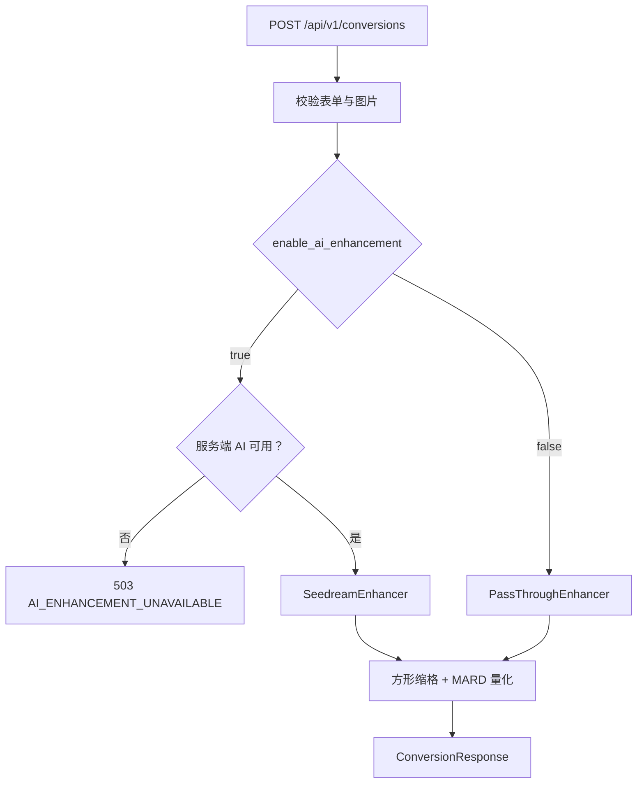

# `/api/v1/conversions` AI 增强开关技术方案

> 状态：待实施  
> 目标版本：MVP2  
> 方案日期：2026-08-14  
> 影响范围：`apps/api` / `apps/web`

## 1. 结论

为 `POST /api/v1/conversions` 的 `multipart/form-data` 增加布尔字段：

```text
enable_ai_enhancement=true | false
```

- `true`：调用当前配置的 Seedream 增强器，再执行方形缩格和 MARD 量化。
- `false`：本次请求使用 `PassThroughEnhancer`，直接对解码后的原图执行现有确定性处理，不调用方舟、不占用 AI 并发配额，也不保存 AI 对比图。
- 字段省略时按 `true` 处理，以保持当前页面“默认使用 AI 转换”的行为；前端完成改造后必须始终显式提交该字段。
- 请求明确要求 AI、但服务端没有配置可用 AI 增强器时，返回 `503 AI_ENHANCEMENT_UNAVAILABLE`，不静默降级。运维全局开关和单次请求开关是两层不同的控制。
- 响应继续用 `meta.enhancer` 表示**实际执行路径**：`seedream-5-lite` 或 `passthrough`，不增加与其重复的响应字段。

处理链路如下：



## 2. 背景与问题

当前增强器由进程级 `IMAGE_ENHANCER=passthrough|seedream` 决定，并通过 `get_image_enhancer()` 注入路由。结果是同一个进程中的所有转换请求只能共同开启或关闭 AI，前端无法让用户为单次转换做选择。

已有代码已经具备合适的模块缝隙：

- `ImageEnhancer` 是量化前增强模块的稳定接口。
- `SeedreamEnhancer` 和 `PassThroughEnhancer` 是该接口的两个适配器。
- `create_conversion()` 负责 HTTP 参数校验和处理链路编排。
- `ConversionMeta.enhancer` 已能表达实际使用的适配器。

本次改动应复用这个缝隙，只在路由进入增强模块前选择适配器；不要在 Seedream 客户端、量化算法或前端复制图片处理分支。

## 3. 目标与非目标

### 3.1 目标

- 用户可以对每次转换独立选择是否使用 AI。
- 关闭 AI 时保证不产生方舟请求和 AI 费用。
- 保留现有同步接口、响应结构、量化算法和错误结构。
- 服务端能够全局关闭 AI；请求参数不能绕过运维配置。
- 通过响应元数据和日志确认实际执行路径。
- AI 开关逻辑可通过依赖替换完成测试，不调用真实付费接口。

### 3.2 非目标

- 不新增 `/conversions/direct` 或 `/conversions/ai` 两套重复端点。
- 不允许客户端选择供应商、模型、prompt 或其他 AI 参数。
- 不在 AI 失败后自动改用原图量化；否则用户会把非 AI 结果误认为 AI 结果。
- 不改变 Seedream prompt、MARD 色卡或量化算法。
- 不引入异步任务、数据库或新的转换状态机。

## 4. HTTP 接口契约

### 4.1 请求字段

| 字段 | 类型 | 必填 | 默认值 | 说明 |
| --- | --- | --- | --- | --- |
| `enable_ai_enhancement` | boolean form field | 否 | `true` | 是否为本次转换启用 AI 增强 |

请求示例：

```bash
# 使用 AI 增强
curl -X POST http://127.0.0.1:8000/api/v1/conversions \
  -F 'image=@/absolute/path/source.png' \
  -F 'grid_size=52' \
  -F 'max_colors=18' \
  -F 'color_set_size=48' \
  -F 'background_mode=keep' \
  -F 'enable_ai_enhancement=true'

# 跳过 AI，直接量化原图
curl -X POST http://127.0.0.1:8000/api/v1/conversions \
  -F 'image=@/absolute/path/source.png' \
  -F 'grid_size=52' \
  -F 'max_colors=18' \
  -F 'color_set_size=48' \
  -F 'background_mode=keep' \
  -F 'enable_ai_enhancement=false'
```

客户端统一发送小写字符串 `true` 或 `false`。后端使用 FastAPI/Pydantic 的 boolean form 解析；无法解析的值返回框架标准 `422`，不进入图片解码和外部调用。

### 4.2 默认值与兼容性

`enable_ai_enhancement` 默认 `true`，原因是当前 Web 页面和处理中提示均以 AI 转换为默认路径。新增可选 form 字段不会改变现有线上客户端的默认结果。

该默认值只用于 `/api/v1` 的兼容期：

- 改造后的 Web 客户端必须显式发送，避免依赖隐含默认值。
- 若未来发布 `/api/v2`，建议把字段改为必填，以消除调用方意图不明确的问题。
- 若上线环境当前使用 `IMAGE_ENHANCER=passthrough`，旧客户端省略字段后会收到 `AI_ENHANCEMENT_UNAVAILABLE`；发布前应同步升级 Web 客户端，或先启用并正确配置 Seedream。

### 4.3 响应语义

响应 JSON 形状不变，使用既有字段说明实际执行结果：

```json
{
  "meta": {
    "enhancer": "passthrough",
    "enhancer_model": null,
    "enhancer_prompt_version": null
  }
}
```

| 请求值 | 实际路径 | `meta.enhancer` | model / prompt version |
| --- | --- | --- | --- |
| `true` | Seedream 成功 | `seedream-5-lite` | 返回实际值 |
| `false` | 直接量化 | `passthrough` | `null` |

不新增 `ai_enhancement_enabled` 响应字段，因为它与 `meta.enhancer != "passthrough"` 重复。保持单一事实来源能避免两个字段在异常路径中产生矛盾。

### 4.4 背景模式语义

`background_mode` 与 AI 开关是两个独立参数：

- AI 开启时，背景模式同时参与 Seedream prompt 和后续方形画布补边。
- AI 关闭时，不执行任何原图内部的背景编辑；`solid` 只控制方形画布未覆盖区域的补色，`keep` 和 `simplify` 在当前确定性后处理中都使用透明补边。

前端关闭 AI 时应将背景模式重置为 `keep`，并隐藏或禁用“简化背景/纯色背景”的 AI 语义选项，避免用户误以为原图背景仍会被智能移除或简化。后端暂不拒绝其他组合，以保持独立调用方的兼容性，但接口文档必须明确上述实际效果。

## 5. 后端设计

### 5.1 路由参数

在 `create_conversion()` 增加：

```python
enable_ai_enhancement: Annotated[bool, Form()] = True
```

路由在完成低成本表单校验后、读取和解码图片前确定本次使用的适配器。这样服务端 AI 不可用时可以尽早失败，不浪费图片解码成本。

### 5.2 适配器选择

保留现有 `ImageEnhancer` 接口，不为了一个布尔参数扩张其接口。新增一个模块级复用的 `PassThroughEnhancer`，并在路由中只选择一次：

```python
passthrough_enhancer = PassThroughEnhancer()


def select_enhancer(
    *,
    enable_ai_enhancement: bool,
    configured_enhancer: ImageEnhancer,
) -> ImageEnhancer:
    if not enable_ai_enhancement:
        return passthrough_enhancer
    if configured_enhancer.name == "passthrough":
        raise ApiError(
            503,
            "AI_ENHANCEMENT_UNAVAILABLE",
            "AI 增强当前不可用，请关闭 AI 增强后重试",
        )
    return configured_enhancer
```

`select_enhancer()` 是纯选择函数，不创建网络客户端、不修改图片，便于单元测试。路由后续只使用 `selected_enhancer`，避免在增强、备份和响应组装处重复判断布尔值：

```python
enhanced = selected_enhancer.enhance(decoded, options=options)

if selected_enhancer.name != "passthrough":
    backup_enhanced_images(...)

return ConversionResponse(
    ...,
    meta=ConversionMeta(
        enhancer=selected_enhancer.name,
        enhancer_model=selected_enhancer.model,
        enhancer_prompt_version=selected_enhancer.prompt_version,
        ...,
    ),
)
```

这使 `selected_enhancer` 成为本次请求实际行为的单一事实来源。资源关闭逻辑继续依赖 Pillow 对象身份，不依赖开关值。

### 5.3 配置的职责

`IMAGE_ENHANCER` 从“替所有请求做业务选择”收敛为“声明服务端可提供的 AI 适配器”：

| 服务端配置 | 请求 `true` | 请求 `false` |
| --- | --- | --- |
| `IMAGE_ENHANCER=seedream` 且配置有效 | Seedream | passthrough |
| `IMAGE_ENHANCER=passthrough` | `503 AI_ENHANCEMENT_UNAVAILABLE` | passthrough |

首版保留配置名，减少环境迁移风险。后续可以将其重命名为更准确的 `AI_ENHANCEMENT_PROVIDER=seedream|disabled`，但不应与本次接口变更绑在同一发布中。

### 5.4 错误策略

新增稳定错误：

| HTTP | code | 场景 | 是否自动降级 |
| --- | --- | --- | --- |
| `503` | `AI_ENHANCEMENT_UNAVAILABLE` | 请求开启 AI，但服务端未配置 AI 适配器 | 否 |

既有 `AI_INPUT_REJECTED`、`AI_OUTPUT_REJECTED`、`AI_BUSY`、`AI_TIMEOUT` 和 `AI_UPSTREAM_ERROR` 保持不变。只有 AI 开启路径可能产生这些错误；AI 关闭路径不应触发任何 AI 错误。

不做自动降级的原因：

- 请求的业务意图是使用 AI，静默回退会返回质量和语义不同的结果。
- 自动重试/回退可能掩盖配置错误，也不利于衡量 AI 成功率。
- 用户可以明确关闭开关后手动重试，行为可理解、可追踪。

## 6. 前端设计

### 6.1 TypeScript 契约

扩展 `ConversionInput`：

```ts
export type ConversionInput = {
  image: File;
  gridSize: number;
  maxColors: number;
  colorSetSize: number;
  backgroundMode: BackgroundMode;
  backgroundColor?: string;
  enableAiEnhancement: boolean;
};
```

在 `createConversion()` 中始终序列化：

```ts
form.set("enable_ai_enhancement", String(input.enableAiEnhancement));
```

新增错误文案：

```ts
AI_ENHANCEMENT_UNAVAILABLE: "AI 增强当前不可用，请关闭 AI 增强后重试",
```

### 6.2 页面状态与交互

- 增加 `enableAiEnhancement` 布尔状态，默认 `true`。
- 切换关闭时把 `backgroundMode` 重置为 `keep`，禁用 AI 专属背景选项。
- AI 开启时显示“AI 处理中…”和“AI 正在简化图像…”。
- AI 关闭时显示“处理中…”和“正在生成拼豆图纸…”，不展示 AI 文案。
- 转换完成后以 `result.meta.enhancer` 为准展示“AI 增强”或“原图直转”，不能只根据提交前的本地状态推断。

## 7. 可观测性与成本

每次转换记录结构化字段，不记录原图、Data URL、API Key 或完整 prompt：

```text
request_id
ai_enhancement_requested
enhancer
enhancer_model
result=success|error
duration_ms
```

建议分别统计：

- AI 开启率：`requested=true / conversions_total`。
- AI 成功率和各稳定错误码数量。
- AI 与直接量化的 P50/P95 耗时。
- `requested=true` 但 `AI_ENHANCEMENT_UNAVAILABLE` 的次数，用于发现部署配置错误。
- 方舟实际生成图片数和费用指标继续沿用 Seedream 客户端记录。

## 8. 测试方案

### 8.1 API 测试

- 显式 `false` 时不调用注入的 Fake AI 增强器。
- 显式 `false` 时响应 `meta.enhancer=passthrough`，model 和 prompt version 为 `null`。
- 显式 `false` 时不生成 `*-original.png` / `*-enhanced.png` 备份。
- 显式 `true` 时调用 Fake AI 一次，量化使用其返回图片。
- 显式 `true` 时继续生成成对备份并返回 AI 元数据。
- 省略字段时行为等同 `true`，锁定 `/api/v1` 兼容默认值。
- AI 未配置且请求 `true` 时返回 `503 AI_ENHANCEMENT_UNAVAILABLE`，并且不读取/解码图片。
- AI 未配置且请求 `false` 时仍能成功转换。
- 非法布尔字符串返回 `422`，不调用任何增强器。
- AI 关闭时，现有网格范围、色卡、背景色和图片安全校验保持有效。

Fake 增强器应增加调用计数，而不是仅根据响应像素间接推断是否调用，确保“关闭 AI 不产生外部调用”这一成本不变量被直接测试。

### 8.2 前端测试

- `createConversion()` 对 `true` 和 `false` 都提交正确的小写 form 值。
- 开关默认开启。
- 关闭开关会将背景模式重置为 `keep`。
- AI 开关两种状态展示对应的处理中提示。
- `AI_ENHANCEMENT_UNAVAILABLE` 映射为可操作的中文提示。

### 8.3 回归命令

```bash
cd apps/api
.venv/bin/ruff check src tests
.venv/bin/pytest -q

cd ../web
pnpm test
pnpm lint
pnpm build
```

测试环境继续强制 `IMAGE_ENHANCER=passthrough`，所有 AI 开启用例通过依赖覆盖注入 Fake 增强器，禁止访问真实方舟接口。

## 9. 实施步骤

### F1：后端契约与选择逻辑

- [ ] 为转换路由增加 `enable_ai_enhancement` form 参数和兼容默认值。
- [ ] 实现并测试纯函数 `select_enhancer()`。
- [ ] 后续增强、备份、元数据统一使用 `selected_enhancer`。
- [ ] 增加 `AI_ENHANCEMENT_UNAVAILABLE` 稳定错误。
- [ ] 更新 OpenAPI/curl 示例和 API README。

### F2：前端接入

- [ ] 扩展 `ConversionInput` 和 FormData 序列化。
- [ ] 增加 AI 开关与默认状态。
- [ ] 根据开关调整背景控件和处理中提示。
- [ ] 增加新错误码中文映射。

### F3：验证与发布

- [ ] 完成后端和前端测试矩阵。
- [ ] 在测试环境分别验证 AI 开启和关闭结果。
- [ ] 确认 AI 关闭请求没有方舟流量和图片备份。
- [ ] 前后端同批发布，避免旧客户端命中不可用默认路径。
- [ ] 灰度观察 AI 开启率、错误率、耗时和成本后全量。

## 10. 验收标准

- 同一 API 进程可连续处理 AI 开启和关闭的请求，结果互不影响。
- `enable_ai_enhancement=false` 时方舟客户端调用次数严格为 0。
- `enable_ai_enhancement=true` 且服务端 AI 可用时，实际执行 Seedream 并返回 `meta.enhancer=seedream-5-lite`。
- 请求 AI 但服务端不可用时返回稳定的 `503 AI_ENHANCEMENT_UNAVAILABLE`，不静默产出 passthrough 结果。
- AI 关闭时仍能生成合法的 MARD 网格，响应为 `meta.enhancer=passthrough`。
- 前端发送显式布尔值，处理中和完成态文案与实际路径一致。
- 现有图片大小、像素量、网格、颜色数、色卡和背景色校验无回归。

## 11. 回滚方案

前端可先隐藏开关并固定发送 `true`，恢复当前默认体验；后端保留可选参数不会影响该回滚。若后端选择逻辑出现问题，可回滚路由改动，恢复由 `IMAGE_ENHANCER` 全局选择。回滚不涉及数据库、存量数据或响应 schema 迁移。
