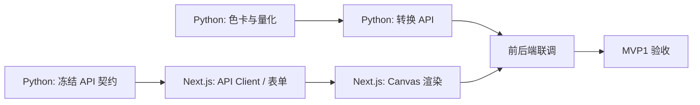

# 拼豆系统 MVP1 总计划

> 状态：实施中  
> 总体技术方案：[technical-design.md](../technical-design.md)

MVP1 已按交付边界拆为两部分：

1. [Python / FastAPI 计划](./mvp1-python-plan.md)：图片校验、方形网格采样、MARD 颜色组约束、颜色量化和网格 JSON API。
2. [Next.js 计划](./mvp1-nextjs-plan.md)：上传与参数表单、颜色组选择、Canvas 预览和浏览器 PNG 导出。

## 共同契约

- 网格为 N×N，预设 `52 / 78 / 104`，自定义 `8–156`。
- 颜色组来自 `GET /api/v1/color-sets`，前端不得另行硬编码。
- 转换请求必须显式提交 `color_set_size`。
- 后端返回 `palette + rows[y][x]`；`-1` 表示透明。
- 所有返回的 MARD 色号必须属于用户选择的 `sets[].colors`。
- 最终 PNG 只在浏览器生成，后端不生成或保存图片结果。
- MVP1 使用 `PassThroughEnhancer`，不调用 Seedream。

## 依赖关系

Python 是当前优先实施部分。其 API 测试通过后，Next.js 按 OpenAPI 与示例响应接入。

## 总体验收

- Python 与 Next.js 各自计划中的验收项全部完成。
- 52、78、104 和至少一个自定义尺寸完成端到端验证。
- 24、48、264 三个代表颜色组完成端到端验证。
- 同一输入在不同颜色组下只出现相应组内色号。
- Canvas 导出的 PNG 尺寸为 `N × cellSize`，不依赖页面缩放。
