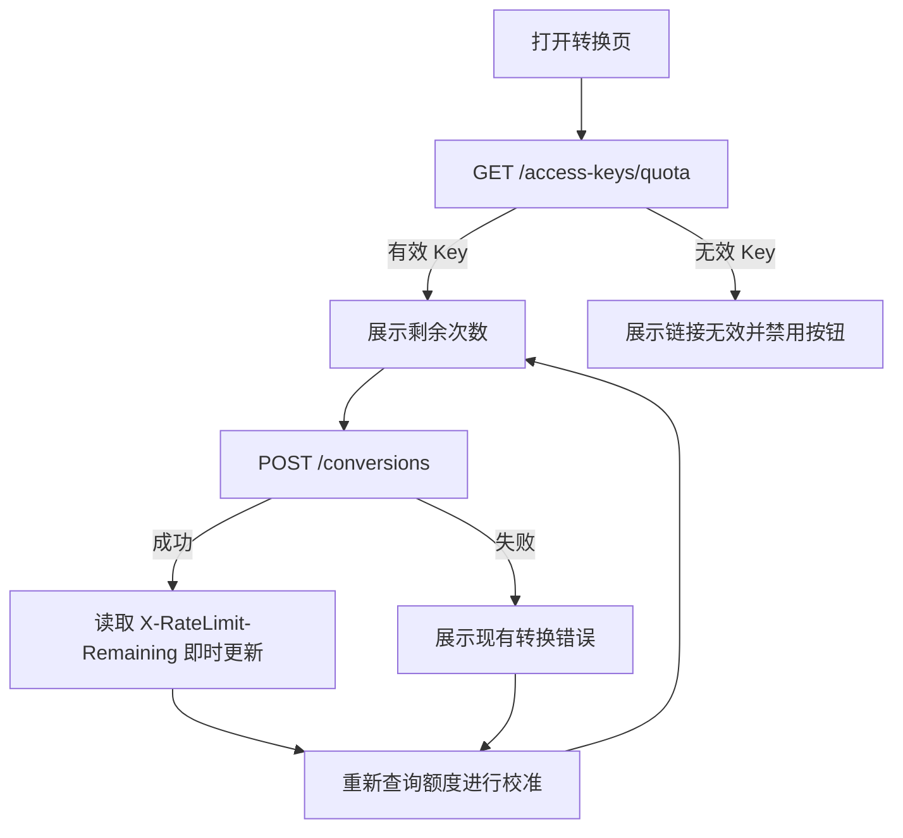

# 转换剩余次数展示技术方案

> 状态：已实施  
> 目标版本：MVP  
> 方案日期：2026-08-25  
> 影响范围：`apps/api` / `apps/web`

## 1. 结论

在首页“开始转换”按钮正上方展示当前消费密钥的剩余转换次数。为保证首次进入页面、转换成功以及转换扣次后业务失败等场景都能得到准确余额，本次改造采用两条互补链路：

1. 新增 `GET /api/v1/access-keys/quota`，使用 `X-API-Key` 查询额度但不扣次，供页面首次加载及转换结束后校准。
2. 前端读取转换成功响应已有的 `X-RateLimit-Limit` 和 `X-RateLimit-Remaining`，即时更新页面，再用额度查询接口收敛到数据库中的权威值。

不修改数据库表，不改变现有转换扣次规则，不在前端自行推算权威余额。余额为 0 的有效密钥必须正常返回额度信息，只有密钥不存在或格式非法时才返回鉴权错误。



## 2. 背景与现状

当前转换接口已经在完成原子扣减后写入以下响应头：

```text
X-RateLimit-Limit
X-RateLimit-Remaining
```

API 的 CORS 配置也已经通过 `expose_headers` 允许浏览器读取这两个响应头。但是 Web 端的 `createConversion()` 只返回转换网格，尚未保留响应头中的额度信息。

仅改造 `createConversion()` 仍不能满足完整需求：

- 页面首次进入时还没有发起转换，无法展示初始余额。
- 当前扣次发生在图片低成本校验之后、AI 增强和量化之前；扣次后即使 AI 超时或内部处理失败也不退款。
- 异常响应不保证携带成功路径中写入的额度响应头。
- 同一个 Key 可能被多个页面或多个用户同时使用，前端简单执行 `余额 - 1` 会产生漂移。

因此需要增加一个只读额度接口，并在每次转换结束后重新获取权威余额。

## 3. 目标与非目标

### 3.1 目标

- 在“开始转换”按钮上方展示当前 Key 的剩余转换次数。
- 页面首次加载时能够查询余额，查询过程不扣次、不追加消费历史。
- 转换成功后即时更新余额。
- 转换扣次后即使业务失败，页面也能刷新为真实余额。
- 余额为 0 时明确提示次数耗尽并禁用转换按钮。
- 无效 Key、额度查询失败和加载中状态具有明确且不同的 UI 语义。
- 保持数据库原子扣减为唯一的额度判定和消费入口。

### 3.2 非目标

- 不增加充值、续费、撤销、删除或额度修改能力。
- 不调整“扣次后业务失败不退款”的既有规则。
- 不引入轮询、WebSocket 或跨标签页实时同步。
- 不把完整 API Key 写入日志、错误响应或浏览器持久化存储。
- 不修改当前通过首页查询参数 `k` 向组件提供 API Key 的方式；URL 密钥传递的后续安全改造单独设计。

## 4. 产品交互

### 4.1 展示位置与文案

额度提示严格位于现有错误提示与“开始转换”按钮之间：

```text
[参数设置]

[错误信息，仅发生错误时显示]

剩余转换次数：12 次
[ ✨ 开始转换 ]
```

状态与文案如下：

| 状态 | 展示文案 | 按钮行为 |
| --- | --- | --- |
| `loading` | 正在查询剩余次数… | 暂时禁用，避免额度状态尚未确定就提交 |
| `ready` 且大于 3 | 剩余转换次数：`N` 次 | 按现有条件启用 |
| `ready` 且为 1～3 | 剩余转换次数：`N` 次 | 启用，使用警示色 |
| `ready` 且为 0 | 转换次数已用完 | 禁用 |
| `invalid` | 当前访问链接无效 | 禁用 |
| `error` | 剩余次数暂时无法获取 | 不因查询故障永久阻断；允许按现有条件提交，由转换接口最终鉴权 |

`processing` 状态继续显示“图片处理中…”。处理期间额度文案保留旧值，不提前减 1，避免请求在图片校验前失败时产生错误展示。

### 4.2 可访问性

- 额度区域使用普通说明文本，不对每次渲染主动播报。
- 从可用变成 0、无效或查询失败时，可使用 `role="status"`/`aria-live="polite"` 让辅助技术感知状态变化。
- 不能只依赖颜色表达低余额；文案必须始终包含具体次数。
- 加载和无效状态下的禁用原因由相邻文案说明。

## 5. HTTP 接口契约

### 5.1 查询当前额度

新增接口：

```http
GET /api/v1/access-keys/quota
X-API-Key: pdk_<source>_<secret>
```

成功响应使用 `200 OK`：

```json
{
  "initial_uses": 20,
  "remaining_uses": 12
}
```

字段约束：

| 字段 | 类型 | 约束 | 说明 |
| --- | --- | --- | --- |
| `initial_uses` | integer | `>= 1` | Key 签发时的总次数 |
| `remaining_uses` | integer | `0..initial_uses` | 查询时数据库中的剩余次数 |

响应建议增加：

```text
Cache-Control: no-store
```

避免浏览器、反向代理或 CDN 缓存额度。客户端 `fetch` 同时显式使用 `cache: "no-store"`。

### 5.2 错误语义

| HTTP 状态 | 错误码 | 场景 |
| --- | --- | --- |
| `401` | `API_KEY_INVALID` | 缺少 Key、Key 长度非法或摘要不存在 |
| `503` | `DATABASE_UNAVAILABLE` | 数据库暂时不可用 |

额度为 0 不是无效密钥，必须返回 `200` 和 `remaining_uses: 0`。这与现有 `consume()` 的 `API_KEY_INVALID_OR_EXHAUSTED` 语义不同，额度查询不能复用 `consume()`，也不能以 `remaining_uses > 0` 作为查询条件。

来源前缀后续即使被停用，也不改变已经签发的消费 Key 行为；查询接口应与现有消费规则保持一致，只按 Key 摘要查询。若未来需要撤销已签发 Key，应新增 Key 级状态字段并同时修改查询与消费逻辑。

## 6. 后端设计

### 6.1 Schema

在 `apps/api/src/pindou/schemas/access_key.py` 增加公开响应模型：

```python
class AccessKeyQuotaResponse(BaseModel):
    """当前消费密钥的只读额度，不触发扣次。"""

    initial_uses: int = Field(ge=1)
    remaining_uses: int = Field(ge=0)
```

### 6.2 Repository

在 `AccessKeyRepository` 增加只读查询：

```python
def get_quota(self, key_hash: bytes) -> StoredQuotaUsage | None:
    """按密钥摘要读取额度，包括 remaining_uses 为 0 的记录。"""
```

查询只选择 `initial_uses` 和 `remaining_uses`，不加载或向上层返回完整 ORM 模型，不提交事务，不修改 `last_used_at`，也不写入 `tb_api_key_usages`。

### 6.3 Service

在 `AccessKeyService` 增加：

```python
def get_quota(self, plaintext_key: str | None) -> QuotaUsage:
    """校验明文密钥并返回当前额度，但不消费次数。"""
```

处理顺序：

1. 校验 Key 是否存在且不超过 `MAX_KEY_LENGTH`。
2. 复用 `hash_key()` 计算 HMAC-SHA-256 摘要。
3. 调用 repository 的只读查询。
4. 数据库异常统一转换为 `DATABASE_UNAVAILABLE`。
5. 记录不存在时返回 `401 API_KEY_INVALID`。

查询方法和 `consume()` 共享摘要算法与返回值对象，但不得共享“余额必须大于 0”的判定。

### 6.4 Route

在现有 `/access-keys` router 增加：

```python
@router.get("/quota")
def get_access_key_quota(
    response: Response,
    service: AccessKeyServiceDep,
    api_key: Annotated[str | None, Header(alias="X-API-Key")] = None,
) -> AccessKeyQuotaResponse:
    """查询当前消费密钥的剩余额度，不扣减次数。"""
```

路由设置 `Cache-Control: no-store`，并把 service 结果映射为公开 Schema。接口只接受请求头中的 Key，不接受 query 或 body 中的 Key。

### 6.5 数据库与并发

本次不需要数据库迁移。只读查询可能与转换扣减并发发生，返回查询执行时已经提交的数据快照；前端后续刷新可以自然收敛。额度是否足够仍由转换接口的原子条件更新决定，查询结果不能作为服务端授权依据。

## 7. Web 端设计

### 7.1 类型与 API Adapter

在 `apps/web/src/lib/types.ts` 增加：

```ts
export type AccessKeyQuotaResponse = {
  initial_uses: number;
  remaining_uses: number;
};

export type ConversionResult = {
  grid: BeadGrid;
  quota: AccessKeyQuotaResponse | null;
};
```

在 `apps/web/src/lib/api.ts` 增加：

```ts
export const getAccessKeyQuota = async (
  apiKey: string,
  signal?: AbortSignal,
): Promise<AccessKeyQuotaResponse> => {
  // 实现中发送 X-API-Key，并同时禁止 HTTP 缓存。
};
```

`createConversion()` 改为返回 `ConversionResult`。成功解析响应体后读取额度响应头；两个头都存在、都是安全整数且满足 `0 <= remaining <= limit` 时才构造 `quota`，否则返回 `quota: null`，不能让格式异常的诊断响应头破坏已经成功的转换结果。

### 7.2 组件状态

在 `PindouConverter` 中增加：

```ts
type QuotaState =
  | { status: "loading" }
  | { status: "ready"; initialUses: number; remainingUses: number }
  | { status: "invalid" }
  | { status: "error" };
```

使用可辨识联合类型，避免 `null` 同时表达未加载、加载失败和无效 Key。

组件挂载时：

- 没有 `apiKey`：直接进入 `invalid`，不发送请求。
- 存在 `apiKey`：进入 `loading` 并请求额度。
- effect 卸载时通过 `AbortController` 取消请求，避免更新已卸载组件。

建议把刷新动作封装为 `refreshQuota()`，供首次加载及转换结束复用。需要用请求序号或 AbortController 防止较早的额度请求晚于较新的请求返回后覆盖新状态。

### 7.3 转换状态同步

转换成功：

1. 使用 `createConversion()` 返回的 `grid` 更新结果。
2. 响应头额度合法时立即更新 `QuotaState`。
3. 随后调用 `refreshQuota()` 校准数据库权威余额。

转换失败：

1. 保持现有错误展示和 `status` 回退。
2. 在请求结束后调用 `refreshQuota()`。

不能只在成功路径刷新。转换接口在图片通过低成本校验后即扣次，AI 超时、上游错误、量化失败或客户端晚于扣次阶段断开时，次数仍可能已经减少。

额度刷新失败不能覆盖更具体的转换错误。转换错误继续显示在现有错误区域，额度区域独立显示“剩余次数暂时无法获取”。

### 7.4 按钮禁用条件

```ts
const isQuotaBlocking =
  quotaState.status === "loading" ||
  quotaState.status === "invalid" ||
  (quotaState.status === "ready" && quotaState.remainingUses === 0);

const isConvertDisabled =
  status === "processing" || !colorSets || isQuotaBlocking;
```

`error` 状态不阻断提交，避免额度只读接口短暂故障时扩大为整个转换功能不可用；真正的密钥和额度校验仍由 `POST /conversions` 完成。

### 7.5 样式

在 `pindou-converter.module.scss` 增加额度文本样式，遵循现有 PostCSS rem 转换规则：

- 默认状态使用次要文字颜色并居中。
- 余额 1～3 次使用警示色。
- 余额 0、无效状态使用错误色。
- 与按钮间距使用现有卡片节奏，不改变按钮尺寸。
- 移动端不新增独立断点，文本允许自然换行。

## 8. 状态与时序

| 场景 | 查询前 | 查询/转换结果 | 最终 UI |
| --- | --- | --- | --- |
| 首次打开，有效 Key | `loading` | 余额 12 | 显示 12，按钮可用 |
| 首次打开，余额耗尽 | `loading` | 余额 0 | 显示已用完，按钮禁用 |
| 首次打开，无效 Key | `loading` | `401` | 显示链接无效，按钮禁用 |
| 查询服务故障 | `loading` | `503`/网络错误 | 显示暂无法获取，允许尝试转换 |
| 转换成功 | 余额 12 | 响应头 11，复查 11 | 先即时显示 11，再校准为 11 |
| 扣次后 AI 失败 | 余额 12 | 转换报错，复查 11 | 保留转换错误，同时显示 11 |
| 图片格式校验失败且未扣次 | 余额 12 | 转换报错，复查 12 | 保留转换错误，余额仍为 12 |
| 其他页面同时消费 | 余额 12 | 本页复查 10 | 更新为服务端实际余额 10 |

## 9. 错误处理与安全

- 不在日志中记录 `X-API-Key`、首页完整 URL 或完整查询参数。
- 额度接口响应不返回 Key、Key 预览、来源前缀、数据库 ID 或消费历史。
- 接口使用 `Cache-Control: no-store`，防止共享缓存泄露额度。
- 前端不把额度写入 `localStorage`；额度仅存在于组件内存。
- `401` 只表示 Key 无效；余额 0 使用正常业务响应，避免 UI 通过模糊错误猜测状态。
- 数据库异常沿用统一 `DATABASE_UNAVAILABLE`，不向客户端暴露 SQL 或表结构。
- 页面展示的余额只用于提示和按钮体验，不能代替转换接口的原子鉴权。

## 10. 测试方案

### 10.1 API 单元与集成测试

在 `apps/api/tests/test_access_keys.py` 增加：

- 新签发 Key 查询返回初始次数。
- 连续查询不会扣次，也不会新增 `tb_api_key_usages` 历史。
- 完成一次转换后查询余额减少 1。
- 余额为 0 时查询仍返回 `200`。
- 缺少、超长和不存在的 Key 返回 `401 API_KEY_INVALID`。
- 数据库异常返回 `503 DATABASE_UNAVAILABLE`。
- 响应包含 `Cache-Control: no-store`。

在转换相关测试中增加：

- 成功响应头与额度查询结果一致。
- 扣次后增强器失败，再查询仍能看到减少后的额度。
- 图片在扣次前校验失败，再查询额度保持不变。

### 10.2 Web API Adapter 测试

在 `apps/web/tests/api.test.ts` 增加：

- `getAccessKeyQuota()` 使用 `GET`、`X-API-Key` 和 `cache: "no-store"`。
- 正确解析额度响应。
- 正确映射 `401` 与 `503`。
- `createConversion()` 正确读取合法额度响应头。
- 响应头缺失、非整数或越界时返回 `quota: null`，但仍保留转换结果。

### 10.3 组件测试

建议新增 `apps/web/tests/pindou-converter-quota.test.tsx`：

- 首次加载显示加载文案，完成后展示具体次数。
- 加载中、无效 Key 和余额 0 时按钮禁用。
- 查询错误时展示兜底文案且不因额度状态禁用按钮。
- 余额 1～3 次应用警示样式。
- 转换成功后使用响应头即时更新并再次查询。
- 转换失败后仍再次查询，不覆盖原转换错误。
- 较旧查询后返回时不会覆盖较新的额度。

## 11. 实施顺序

1. 增加后端额度响应 Schema。
2. 增加 repository 只读额度查询和 service `get_quota()`。
3. 增加 `GET /api/v1/access-keys/quota` 及 API 测试。
4. 增加 Web 类型、`getAccessKeyQuota()` 和转换响应头解析。
5. 在 `PindouConverter` 增加额度状态、首次查询及转换后刷新。
6. 在“开始转换”按钮上方增加文案和样式。
7. 补齐 Web adapter 与组件测试，执行 API/Web 全量测试。

后端应先于或与前端同时发布。若必须滚动发布，应先发布查询接口，确认线上可用后再发布依赖该接口的前端。

## 12. 验收标准

- 带有效 `k` 参数打开首页后，按钮上方能够展示真实剩余次数。
- 查询额度不会扣次或写入消费历史。
- 完成一次转换后，展示次数准确减少 1。
- 转换在扣次后失败时，页面刷新后仍展示已扣减的真实次数。
- 余额为 0 时明确显示“转换次数已用完”并禁用按钮。
- 无效链接与数据库/网络故障显示不同文案。
- 并发消费不会产生负数、超额转换或由前端本地计算造成的长期错误余额。
- 不发生数据库迁移，现有签发、转换、导出和管理员交付流程不回归。

## 13. 回滚方案

前端可先移除额度查询 effect、额度文案及新增禁用条件，恢复原有按钮行为；`createConversion()` 可恢复只返回 `BeadGrid`。后端新增的只读接口和 repository/service 方法没有数据副作用，可以保留，也可以在确认无客户端依赖后删除。整个回滚过程不涉及数据迁移或额度补偿。
