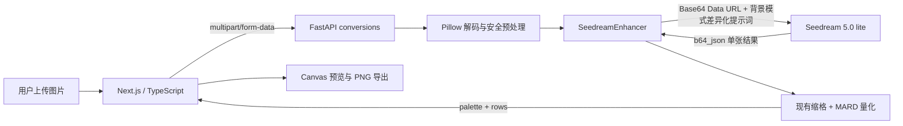

# Seedream 5.0 lite AI 增强接入技术方案

> 状态：已实施，待效果集灰度验收  
> 目标版本：MVP2  
> 方案日期：2026-08-13  
> 实施目录：`apps/api` / `apps/web`  
> 官方资料核对：[Seedream 5.0 lite 官方资料研究笔记](./seedream-5-lite-official-research.md)

## 1. 结论与推荐方案

在现有图像处理链路中实现 `SeedreamEnhancer`，用 Seedream 5.0 lite 将用户上传的复杂图片先转换为“保留主体与构图、减少细碎纹理、边界清晰、大色块化”的中间图，再继续使用已实现的 Pillow 缩格和 MARD 色卡确定性量化。

接入后的处理链路为：



核心决策：

1. **Key 仅留在 FastAPI 服务端**，浏览器和 Next.js 客户端不直连方舟。
2. **复用现有 `/api/v1/conversions`**，不新增第二套转换 API，不改 MARD 量化核心。
3. **MVP2 使用非流式同步请求**。方舟图片 API 不是提交 task ID 后轮询的异步任务；5.0 lite 的流式支持也尚未由当前公开 API 契约确认。
4. **要求单图输出**，设置 `sequential_image_generation: "disabled"`，避免组图带来不确定性和成本放大。
5. **优先使用 `response_format: "b64_json"`**，后端立即解码为 Pillow 图像，不向前端暴露供应商 URL，也不引入临时 URL 过期和二次下载 SSRF 风险。
6. **AI 失败默认不静默降级**：返回稳定业务错误，让用户知道本次未使用 AI。运维可通过 `IMAGE_ENHANCER=passthrough` 快速全局回退。
7. **背景模式必须同时影响 AI 提示词和后处理**：“简化背景”、“纯色背景”、“保留原图背景”分别组装不同的 prompt 片段，不再只把 `background_mode` 当作方形画布的补边参数。

## 2. 目标和非目标

### 2.1 目标

- 复杂照片在缩成 `24–96` 格后，主体轮廓比直接量化更可辨识。
- 减少渐变、纹理、反光和碎背景对 MARD 配色的干扰。
- 保留用户选择的网格数、最大颜色数、色卡组，并支持“简化背景 / 纯色背景 / 保留原图背景”三种端到端背景策略。
- 不保存原图、AI 中间图和最终 PNG，继续保持 API 无状态。
- 具备明确超时、错误映射、并发限制、成本记录和快速回退能力。

### 2.2 非目标

- 不让 Seedream 直接产出最终 MARD 色号或精确拼豆网格。AI 只做语义与视觉简化，最终网格仍由可测试算法生成。
- 不向用户开放任意 prompt，首版由服务端维护版本化提示词。
- 不在首版引入 Celery/Redis/数据库/对象存储。如真实 P95 耗时超过网关超时预算，再升级为应用内部异步 Job。
- 不承诺相同输入每次得到像素级一致结果。即使设置 seed，生成式模型也不应被视为强确定性算法。

## 3. 当前工程基线

当前代码已具备一个合适的深度模块缝隙：

- `apps/api/src/pindou/services/enhancer.py` 定义 `ImageEnhancer` 协议和 `PassThroughEnhancer`。
- `apps/api/src/pindou/api/routes/conversions.py` 只依赖 `ImageEnhancer`，增强后再调用现有 `build_bead_grid()`。
- `apps/api/src/pindou/api/dependencies.py` 已根据 `IMAGE_ENHANCER` 构造增强器，但目前仅允许 `passthrough`。
- `apps/api/src/pindou/core/config.py` 使用进程环境变量，但目前没有 Seedream 配置，也不应默认假定 `.env` 已被当前启动命令加载。
- `ConversionMeta.enhancer` 和前端 `BeadGrid.meta.enhancer` 现在被锁定为 `"passthrough"`，接入时必须两端同步扩展。
- 当前 `BackgroundMode` 是 `transparent | solid | keep`，并且只在 `build_bead_grid()` 中控制方形工作画布的透明/纯色补边；它不会简化、替换或保护原图内部的背景内容。MVP2 需要升级该契约，不能将现有 `transparent` 静默解释成“简化背景”。
- FastAPI 转换路由是普通 `def`，Pillow 和同步外部 HTTP 调用会在 FastAPI 线程池内执行，不会直接阻塞 asyncio 事件循环。

`apps/api/.env` 已启用 `IMAGE_ENHANCER=seedream`，运行时只校验 Key 是否配置，不回显或记录密钥值。该文件已由根 `.gitignore` 忽略；生产环境仍应由密钥管理平台注入。

2026-08-14 真实沙箱验证已确认：北京区端点、当前 Key、中文 prompt、单参考图、`2K`、`b64_json`和非流式单图输出可用，成功返回一张 `2048x2048` 图片。请求配置使用 `doubao-seedream-5-0-lite-260128`，但响应 `model` 字段为 `doubao-seedream-5-0-260128`；这可能是服务端别名/路由行为，上线前仍需在控制台核对实际计费模型。

## 4. 方舟 API 契约

### 4.1 已确认的最小契约

| 项目 | 值 |
| --- | --- |
| Base URL | `https://ark.cn-beijing.volces.com/api/v3` |
| Path | `POST /images/generations` |
| 鉴权 | `Authorization: Bearer $ARK_DOUBAO_API_KEY` |
| 建议模型 ID | `doubao-seedream-5-0-lite-260128` |
| 输入图 | `image`: URL 或 Base64 Data URL |
| 输出数 | `sequential_image_generation: "disabled"` |
| 响应方式 | `stream: false` |
| 响应图 | `response_format: "b64_json"` |

上述端点、鉴权和字段形态来自[官方图片生成 API](https://www.volcengine.com/docs/82379/1541523?lang=zh)。版本化 Model ID 可由[火山引擎官方发布记录](https://www.volcengine.com/docs/6492/2165228?lang=en)交叉确认；生产配置仍应从当前账号控制台复制 Model ID 或 `ep-...` Endpoint ID。

### 4.2 推荐请求

```json
{
  "model": "doubao-seedream-5-0-lite-260128",
  "prompt": "<由服务端组装的版本化拼豆预处理提示词>",
  "image": "data:image/png;base64,<BASE64>",
  "size": "2K",
  "sequential_image_generation": "disabled",
  "stream": false,
  "response_format": "b64_json",
  "watermark": true
}
```

`size: "2K"` 来自官方示例，但 5.0 lite 的完整尺寸枚举和像素上限需用当前账号的 API Explorer 再确认。`watermark` 是产品与合规决策：评审前默认 `true`，只有在确认服务条款、AIGC 标识要求和展示方式后才可设为 `false`。

### 4.3 不在首版发送的字段

- `stream: true`：当前公开 API 说明仅明确确认 Seedream 4.0。
- `optimize_prompt_options`：当前公开 API 说明仅确认 4.0。
- `guidance_scale`：通用文档有字段，但 5.0 lite 专属契约未确认。
- `tools` / `output_format`：官方发布记录有线索，但方舟该端点的 JSON Schema 尚未确认。
- `seed`：可在效果评估阶段引入，但不把它作为可复现性保证。

## 5. 后端设计

### 5.1 模块边界

不把 HTTP、Base64、供应商错误解析塞入路由或图像量化器。建议分为：

```text
apps/api/src/pindou/
├── core/
│   ├── config.py                 # Seedream 配置与 SecretStr
│   └── errors.py                 # 稳定业务错误
├── services/
│   ├── enhancer.py               # ImageEnhancer / PassThroughEnhancer
│   ├── seedream_client.py         # 方舟 HTTP 客户端与 DTO
│   ├── seedream_enhancer.py       # Pillow <-> Seedream 适配
│   └── seedream_prompt.py         # 版本化提示词
└── api/
    ├── dependencies.py           # 选择增强器、缓存 client
    └── routes/conversions.py      # 编排，不感知供应商细节
```

虽然项目约定优先 TypeScript，该能力应放在现有 FastAPI/Pillow 处理边界内，避免为一次外部调用拆出第三个 Node 服务。前端契约与 UI 调整继续使用 TypeScript。

### 5.2 `SeedreamClient`

使用 `httpx.Client` 实现窄接口，不让业务层依赖 SDK 的庞大类型面。建议契约：

```python
class SeedreamClient(Protocol):
    def edit_image(self, *, image_data_url: str, prompt: str) -> SeedreamResult: ...

@dataclass(frozen=True, slots=True)
class SeedreamResult:
    image_bytes: bytes
    model: str
    size: str | None
    generated_images: int
    upstream_request_id: str | None
```

客户端职责：

- 组装已确认字段，设置 Bearer header。
- 设置分离的 connect/read/write/pool timeout。
- 限制上游 JSON 响应大小，校验 `data` 仅含一张成功图。
- 对 `b64_json` 使用严格 Base64 解码，校验解码后上限、图片魔数和 Pillow 可解码性。
- 记录上游 request ID、模型、耗时和 `usage.generated_images`，绝不记录 Authorization、Data URL 或完整 prompt。
- 将供应商错误转换成内部 typed exception，不直接把上游 message 返回给浏览器。

不建议首版使用返回 URL。如 API Explorer 实测发现 5.0 lite 不接受 `b64_json`，再切换为 `url`，并为下载器加入 HTTPS-only、禁止内网 IP、有限重定向、DNS rebinding 防护、响应体上限和 Content-Type/魔数校验。

### 5.3 `ImageEnhancer` 协议演进与 `SeedreamEnhancer`

现有 `ImageEnhancer.enhance(image)` 没有背景上下文，无法做模式差异化。MVP2 将协议演进为传入不可变选项对象：

```python
class AiBackgroundMode(StrEnum):
    SIMPLIFY = "simplify"
    SOLID = "solid"
    KEEP = "keep"


@dataclass(frozen=True, slots=True)
class EnhancementOptions:
    background_mode: AiBackgroundMode
    background_color: str | None = None


class ImageEnhancer(Protocol):
    @property
    def name(self) -> str: ...

    def enhance(self, image: Image.Image, *, options: EnhancementOptions) -> Image.Image: ...


class SeedreamEnhancer:
    name = "seedream-5-lite"

    def enhance(
        self,
        image: Image.Image,
        *,
        options: EnhancementOptions,
    ) -> Image.Image:
        # 1. 转为 sRGB/RGBA，限制输入长边
        # 2. 编码为 PNG/JPEG Data URL
        # 3. 根据背景模式组装提示词并调用 SeedreamClient
        # 4. 安全解码结果并返回独立 Pillow Image
        ...
```

`PassThroughEnhancer` 也实现新签名，但忽略 `options` 并返回原图，以保持回退能力。路由只负责将经过校验的表单参数转成 `EnhancementOptions`；提示词组装仍封装在 `seedream_prompt.py`。

输入适配规则：

- 已有 `decode_image()` 完成格式、EXIF 方向、25 MP 上限与 RGBA 统一。
- 在发给方舟前把长边限制为可配置值，默认 `2048 px`，避免不必要的 Base64 和内存放大。
- 若存在 Alpha，用提示词和可配置底色明确处理；不可在 JPEG 编码时意外变成黑底。
- Data URL 的 MIME 必须与真实编码一致且使用小写，例如 `data:image/png;base64,...`。
- 上游结果解码后再经过像素上限和 `Image.verify()`/实际 load 校验，不信任响应中的 `size`。

### 5.4 背景模式与提示词设计

提示词的目标是“为确定性量化制造更好的中间图”，而不是让模型绘制假网格或虚构 MARD 色号。提示词由一份公共基础模板和一份背景模式片段组成，避免维护三份容易漂移的完整 prompt。

#### 5.4.1 公共基础模板

```text
以输入图为唯一内容依据，保留主体身份、数量、姿态、关键轮廓、主要配色和整体构图。
将图像简化为适合低分辨率拼豆图纸的平面插画中间图：使用大色块、清晰封闭边界、少量必要阴影，
去除摄影噪点、细碎纹理、反光和不必要的小装饰。不添加新的角色、物体、文字、边框、马赛克网格、珠子质感或水印。
不改变原图的核心语义。输出一张完整图片。
```

#### 5.4.2 三种背景模式

| 产品模式 | API 值 | AI 处理目标 | 后续量化策略 |
| --- | --- | --- | --- |
| 简化背景 | `simplify` | 保留场景类型和主体空间关系，将碎背景归并为少量大色块 | 正常量化整张 AI 结果 |
| 纯色背景 | `solid` | 移除原背景，换成用户指定的均匀平坦颜色 | 传入 `background_color`，最终依然会映射到所选 MARD 色组 |
| 保留原图背景 | `keep` | 保留原背景的物体、布局、层次和语义，只做与整体一致的低程度平面化 | 正常量化整张 AI 结果 |

**简化背景 `simplify` 片段：**

```text
背景处理：保留原图的场景类型、主要背景区域和主体与背景的空间关系，但将背景大幅简化。
删除无关小物体、细碎纹理和重复线条，将相近色区域合并为少量连续大色块。
不要将背景移除或替换成单一纯色。保持主体边缘清晰，使主体与背景有足够明度或色相对比。
```

**纯色背景 `solid` 片段：**

```text
背景处理：完整移除原图背景及其中所有无关物体，保留前景主体的完整轮廓、内部特征和自然边缘。
将主体放在均匀、平坦、无渐变、无纹理、无阴影、无物体的纯色背景上。
背景目标颜色为 {background_color}。不改变主体内部原本属于该颜色的区域，不增加地面、地平线、边框或投影。
```

**保留原图背景 `keep` 片段：**

```text
背景处理：保留原图背景中的场景、物体数量、相对位置、遮挡关系、主要颜色和明暗层次。
不删除、替换、虚化或改造背景内容，不把背景换成纯色。只将背景与主体一起转换为风格统一的平面色块表达，
仅去除像素级噪点和极小的摄影伪影，不改变背景语义。
```

`background_color` 必须在服务端先校验为 `#RRGGBB`，再以大写标准形式插入模板，不接受任意文本，避免 prompt injection。`simplify` 和 `keep` 模式忽略且不发送 `background_color`。

#### 5.4.3 纯色精度边界

Seedream 是生成式图像模型。即使 prompt 指定 `#RRGGBB`，也不能保证所有背景像素严格相等，边缘处还可能出现抗锯齿、色溢或模型生成的轻微阴影。MVP2 对“纯色”的定义是“视觉上单一、无纹理的背景”，最终颜色仍会被映射为用户所选 MARD 色组中的最近色。

首版增加一项保守质量检查：对 AI 输出四条边缘和四角取样，计算相对目标色的色差与方差；明显不是单色时记录 `solid_background_adherence=false` 并纳入效果评估，但不仅凭边缘取样自动改写整图，避免破坏接触画布边缘的主体。

如产品要求“背景每个像素必须等于指定 HEX”，则需要额外的可验证前景蒙版/分割步骤，再用 Pillow 做确定性合成；不应仅依赖 Seedream prompt 宣称实现了像素级换底。

#### 5.4.4 版本与可观测性

公共模板版本由 Prompt 模块中的常量记入响应 meta，并记录 `background_mode`；
不记录组装后的完整 prompt。版本号不接受环境变量覆盖，保证版本标记和实际实现
始终同步。效果评估使用固定图集，每次只改一类约束，不在代码中散落多份提示词字符串。

### 5.5 配置设计

建议将当前导入时构造的 dataclass 迁移为 `pydantic-settings` 的缓存 Settings，使 `.env` 路径、类型验证和 secret 脱敏明确可测。真实进程环境覆盖 `.env`，生产不将 `.env` 复制进镜像。

```dotenv
IMAGE_ENHANCER=seedream
ARK_DOUBAO_API_KEY=<secret>
ARK_DOUBAO_BASE_URL=https://ark.cn-beijing.volces.com/api/v3
ARK_DOUBAO_IMAGE_MODEL=doubao-seedream-5-0-lite-260128
ARK_DOUBAO_IMAGE_SIZE=2K
ARK_DOUBAO_RESPONSE_FORMAT=b64_json
ARK_DOUBAO_WATERMARK=true
ARK_DOUBAO_CONNECT_TIMEOUT_SECONDS=5
ARK_DOUBAO_READ_TIMEOUT_SECONDS=90
ARK_DOUBAO_TOTAL_TIMEOUT_SECONDS=100
ARK_DOUBAO_MAX_CONCURRENCY=2
ARK_DOUBAO_MAX_RESPONSE_BYTES=31457280
SEEDREAM_INPUT_MAX_EDGE=2048
```

规则：

- `ARK_DOUBAO_API_KEY` 使用 `SecretStr`，序列化和 repr 默认脱敏。
- `IMAGE_ENHANCER=seedream` 时缺 Key 或 model 应启动失败，不可静默切回 passthrough。
- `IMAGE_ENHANCER=passthrough` 时不要求 Key，便于本地开发和紧急回退。
- `.env.example` 只写占位值，`.env` 必须在 `.gitignore`，日志/异常/Sentry 过滤 Authorization 和 Base64。
- 启动方式必须显式保证加载 `apps/api/.env`，不依赖调用命令的偶然当前目录。

### 5.6 并发与超时

- 转换路由保持普通 `def`，首版客户端使用线程安全的同步 `httpx.Client`。
- 进程内用 `BoundedSemaphore` 限制同时 Seedream 调用。获取信号量超时返回 `AI_BUSY`，不让请求无限排队占用线程。
- 每个 API worker 都有自己的信号量，因此部署层总并发约等于 `worker 数 × ARK_DOUBAO_MAX_CONCURRENCY`。这个值必须不高于控制台账号配额。
- 建议首版 read timeout 90s、端到端 100s，但最终数值应根据沙箱样本的 P95/P99 设置，且网关/Next.js 超时必须大于后端总超时。
- 如 P95 长期大于 30–45s，或部署平台不支持足够长的 HTTP 请求，将转换拆成 `POST jobs -> 202` 和 `GET jobs/{id}`，并配套 Redis/工作队列；这是应用架构升级，不是方舟 API 原生异步。

### 5.7 重试策略

图片生成没有已确认的幂等 Key。请求在上游生成成功后丢失响应时，自动重试可能产生第二张图并重复计费。因此：

- `InputTextSensitiveContentDetected` / `OutputImageSensitiveContentDetected` / 其他 4xx：不重试。
- 401/403：不重试，触发配置告警。
- 429 `QuotaExceeded`：最多重试 1 次，指数退避加 jitter，并使用总时间预算。
- 连接建立前失败：可重试 1 次。
- read timeout、连接中断、5xx：MVP2 默认不自动重试，返回可重试错误给用户，避免隐性重复计费。

## 6. API 与前端契约

### 6.1 请求

MVP2 不增加表单字段，但会对现有 `background_mode` 枚举做一次明确迁移：

```ts
type BackgroundMode = "simplify" | "solid" | "keep";
```

| 旧值 | MVP2 值 | 迁移方式 |
| --- | --- | --- |
| `transparent` | `simplify` | **不做服务端静默兼容**；两者语义不同，前端和 API 测试同步切换 |
| `solid` | `solid` | 保留，并将经验证的 `background_color` 传给 AI prompt |
| `keep` | `keep` | 保留，并用专属 prompt 保护原背景语义 |

`solid` 时 `background_color` 必填且符合 `#RRGGBB`；`simplify` / `keep` 时服务端忽略该字段，不将陈旧颜色带入 prompt。`POST /api/v1/conversions` 其他 multipart 字段保持不变，是否启用 AI 仍由服务环境的 `IMAGE_ENHANCER` 决定。

#### 6.1.1 AI 背景与方形画布补边

背景策略先作用于 Seedream 编辑原图内容，然后量化层再把结果按比例 `contain` 到方形网格。两者顺序和补边规则固定为：

1. `simplify`：AI 简化原图内部背景；如输出不是方形，方形画布多出区域使用透明补边。
2. `solid`：AI 用目标色换底；方形画布多出区域使用同一 `background_color` 补边。
3. `keep`：AI 保留原背景；方形画布多出区域使用透明补边，不虚构原图之外的场景。

这一行为需要同步重命/拆分 `fit_to_square_grid()` 的内部参数：它只负责 `transparent | solid` 补边，不再用 `BackgroundMode` 表达 AI 编辑语义。

如后续产品需要“快速转换 / AI 增强”用户开关，再显式新增 `enhancement_mode: passthrough | seedream`，并增加用户级鉴权、额度与计费。

### 6.2 响应

扩展 `meta`，但保留现有网格数据形状：

```ts
type ConversionMeta = {
  enhancer: "passthrough" | "seedream-5-lite";
  enhancer_model?: string;
  enhancer_prompt_version?: string;
  background_mode: "simplify" | "solid" | "keep";
  background_color?: `#${string}`;
  solid_background_adherence?: boolean;
  palette_brand: "MARD";
  color_set_size: number;
  color_chart_version: string;
  actual_color_count: number;
};
```

不返回上游 URL、Base64、原始 prompt、请求体或 API Key。内部 request ID 仍从 `x-request-id` 返回，上游 request ID 只记录在服务端日志，避免将供应商细节绑定到公开契约。

建议将 `algorithm_version` 升为 `bead-grid-v2-ai`。`schema_version` 如果新字段都是可选的，可保持 `"1"`；若要求严格 JSON Schema 不允许新字段，则升为 `"2"`。

### 6.3 稳定错误码

| HTTP | 业务码 | 场景 | 用户提示/处理 |
| ---: | --- | --- | --- |
| 400 | `AI_INPUT_REJECTED` | 输入文本/图片命中安全规则 | 提示更换图片，不重试 |
| 422 | `AI_OUTPUT_REJECTED` | 输出图被安全过滤 | 提示调整素材后重试 |
| 429 | `AI_BUSY` | 本地并发满或上游 `QuotaExceeded` | 稍后重试，可返 `Retry-After` |
| 502 | `AI_UPSTREAM_ERROR` | 上游 5xx/结构异常/解码失败 | 稍后手动重试 |
| 503 | `AI_NOT_CONFIGURED` | 仅用于运行期密钥/模型配置丢失 | 服务不可用，运维告警 |
| 504 | `AI_TIMEOUT` | 超过后端时间预算 | 本次未确认成功，由用户决定是否重试 |

上游已公开的 `InputTextSensitiveContentDetected`、`OutputImageSensitiveContentDetected`、`QuotaExceeded` 分别映射到上表，其他错误按 HTTP 类别安全兜底。

### 6.4 前端调整

- 将“正在转换”的单一文案改为真实但不伪造精确进度的阶段文案：“AI 正在简化图像，随后生成拼豆图纸…”。
- 超时、忙碌和内容安全错误使用不同中文提示，保留 request ID 便于客服排查。
- AI 处理时禁止重复提交；后端仍必须有并发和频率限制，不信任按钮状态。
- 展示“AI 生成内容仅用于转换中间步骤”与必要的 AIGC 标识/隐私告知，具体文案由产品和法务确认。
- `fetch` 使用 `AbortController`。浏览器超时只能停止等待，未必能取消已到达方舟的生成，UI 不应声称“已取消计费”。

## 7. 安全、隐私与合规

1. **密钥**：开发/测试/生产使用不同 Key；仅运行时注入；禁止提交 Git、打入 Docker 镜像或使用 `NEXT_PUBLIC_*`。
2. **用户图片**：上传前界面告知会发送给第三方 AI 服务；服务端不落盘，不把原图/Data URL 写入日志。
3. **内容安全**：保留平台审核结果，不用自动改写绕过审核。
4. **访问控制**：公开上线前至少增加 IP/用户级限频和每日生成上限；否则任何人都可消耗付费配额。
5. **上游回包**：按不可信输入校验 Base64、图片容器、解码像素和响应大小，防止内存耗尽。
6. **AIGC 与水印**：`watermark: false` 不等于免除 AIGC 标识、版权、肖像权或内容审核义务。上线前由产品/法务核对当前账号的服务协议和适用规则。
7. **日志脱敏**：只记录内部 request ID、上游 request ID、模型、耗时、HTTP 类别、稳定错误码和生成张数；不记 Authorization、Base64、完整 prompt 和上游临时 URL。

## 8. 可观测性与成本控制

### 8.1 指标

- `seedream_requests_total{status, error_code, model}`
- `seedream_request_duration_seconds{model}`
- `seedream_generated_images_total{model}`
- `seedream_inflight_requests`
- `seedream_queue_wait_seconds`
- `conversion_total_duration_seconds{enhancer}`
- `conversion_failures_total{stage}`

不要以用户 ID、request ID 作为 metrics label，避免高基数。这些信息放入结构化日志即可。

### 8.2 预算

官方产品页在调研日期显示 Seedream 5.0 lite 按量价为 **0.22 元/张**，试用/新客免费额度显示 **200 张**；价格与活动必须在上线当天以[方舟产品页](https://www.volcengine.com/product/ark)和账单页复核。

估算公式：

```text
日成本 ≈ 成功生成张数 × 当日单价
月预算上限 ≈ 用户每日上限 × 活跃用户数 × 30 × 单价
```

首版必须有：进程并发上限、用户/IP 频率上限、每日成功张数上限、80% 预算告警和硬停阈值。供应商 5.0 lite 的具体 QPS/IPM 尚无法从公开页确认，不能使用 4.0 或社区文章的数字代替账号配额。

## 9. 测试策略

### 9.1 单元测试

- 配置：Seedream 模式缺 Key/model 启动失败；passthrough 模式不要求 Key；SecretStr 不出现在 repr。
- Data URL：PNG/JPEG MIME 正确，Alpha 图不变黑底，超大编码被拒绝。
- 提示词：三种模式都由“公共模板 + 唯一模式片段”组成，不串模式；`solid` 正确插入规范化 HEX，非法颜色被拒绝，无任意文本注入路径。
- 请求契约：固定仅一张、`stream=false`、prompt v2 和模型正确，不发送未确认字段。
- 纯色质量检查：均匀纯色边缘通过，明显纹理/色偏失败，主体接触边缘时不自动覆盖图像。
- 响应：正常 `b64_json`、空 `data`、多张、非法 Base64、非图片、解码炸弹、超大响应。
- 错误映射：官方三个已知 code、401/403、429、5xx、connect/read timeout。
- 并发：信号量不泄漏，排队超时返回 `AI_BUSY`。
- 资源释放：成功、量化失败和上游失败时均关闭 Pillow 对象和 HTTP 响应。

HTTP 层使用 `httpx.MockTransport` 或 `respx`，测试不命中真实方舟，不依赖真实 Key。

### 9.2 API 测试

- 覆盖 `meta.enhancer=seedream-5-lite` 及模型/prompt 版本。
- 分别提交 `simplify/solid/keep`，验证传给 enhancer 的 `EnhancementOptions`、响应 meta 和方形补边策略正确。
- 验证旧 `transparent` 值返回明确 422/400，不被静默解释成 `simplify`。
- 验证 Seedream 结果仍只会映射到用户选定的 MARD 色组，`palette.length <= max_colors`。
- 验证 AI 错误体仍符合 `{error: {code, message, request_id}}`。
- 验证响应不包含 `b64_json`、上游 URL、prompt 和 secret。
- 分别 override `SeedreamEnhancer` 和 `PassThroughEnhancer`，不让测试受全局 `lru_cache` 污染。

### 9.3 前端测试

- TypeScript 契约支持两种 enhancer。
- 背景选项只包含“简化背景 / 纯色背景 / 保留原图背景”，只有 `solid` 显示并提交颜色值。
- processing 状态防重复提交，成功/失败均正确恢复按钮。
- 不同 AI 错误码展示对应文案并保留 request ID。
- 浏览器超时/中止后不展示伪成功，不立即自动重发。

### 9.4 真实沙箱效果集

准备至少 20 张经授权且不敏感的固定图，覆盖：

- 单人像、双人/多主体、宠物、产品、风景、动漫/插画、透明 PNG、低对比图、繁杂背景、带文字图。
- 每张分别在 `24/48/72/96` 网格与代表性 MARD 色组下生成 passthrough/Seedream 对照。
- 每张 Seedream 样本覆盖 `simplify/solid/keep`，`solid` 至少覆盖黑、白、中明度和与主体相近的背景色。
- 人工 1–5 分评估：主体可辨识度、构图保真、色块清晰度、背景模式遵循度、不必要细节抑制、严重幻觉/缺失。
- 记录端到端 P50/P95/P99、单图成本、安全拒绝率和失败率。

建议验收门槛：至少 80% 样本的 AI 版“主体可辨识度”不低于 passthrough；严重改变主体数量/身份的比例不高于 5%；P95 小于部署链路的安全超时预算。门槛可在首轮基线数据后调整，但不可只看少量成功案例。

## 10. 实施计划

### P0：账号与 API Explorer 验证（0.5 人日）

- [ ] 确认当前 Key 属于 `cn-beijing` 且已开通 Seedream 5.0 lite。
- [ ] 从控制台复制当前可用 Model ID/Endpoint ID。
- [ ] 用 API Explorer 确认单参考图、`2K`、`b64_json`、`watermark`、输入上限、错误结构和配额。
- [ ] 用一张授权测试图完成首次计费调用，记录响应结构而不记录图片/Key。

### P1：配置与客户端（1 人日）

- [ ] 引入 `pydantic-settings` 和 `httpx`，实现类型化配置与 secret 脱敏。
- [ ] 实现 `seedream_client.py` 的请求/响应 DTO、大小限制、超时和 typed exception。
- [ ] 实现官方错误码映射和结构化日志。
- [ ] 实现 MockTransport 单元测试，不调用真实 API。

### P2：图像适配与业务编排（1 人日）

- [ ] 实现图像限边、Alpha 底色、Data URL 编码和上游结果安全解码。
- [ ] 将背景契约从 `transparent | solid | keep` 迁移为 `simplify | solid | keep`，将 AI 背景策略与方形画布补边内部参数拆开。
- [ ] 实现 `EnhancementOptions`、三种模式提示词组装、`seedream_prompt.py` 及 `SeedreamEnhancer`。
- [ ] 实现纯色背景的保守遵循度检查，记录但不自动破坏性换底。
- [ ] 在依赖注入中支持 `seedream | passthrough`，实现信号量和资源关闭。
- [ ] 扩展 Python/TypeScript `meta` 契约和 API 测试，保证 MARD 不变量。

### P3：前端与产品告知（0.5 人日）

- [ ] 增加 AI 处理文案、超时和安全错误提示。
- [ ] 将背景选项更新为“简化背景 / 纯色背景 / 保留原图背景”，只在纯色模式展示颜色选择。
- [ ] 加入第三方 AI 处理告知/AIGC 标识，完成产品与法务确认。
- [ ] 设置浏览器超时与防重复提交测试。

### P4：效果调优与灰度（1–2 人日）

- [ ] 使用固定图集对比 passthrough 和 Seedream 三种背景模式，冻结 prompt v2。
- [ ] 记录延迟、错误率、安全拒绝率与单图成本，据此调整超时/并发。
- [ ] 先在内部/小流量环境启用 `IMAGE_ENHANCER=seedream`，保留一键回退。

预估实施量：**4–5 人日**，不包方舟账号开通等待、法务审核、用户账号/计费系统和异步任务系统。

## 11. 发布、回退与验收

### 11.1 发布步骤

1. 先以 `IMAGE_ENHANCER=passthrough` 发布新代码，确认契约变更不影响现有转换。
2. 在测试环境注入独立 Key，启用 `seedream`，完成真实沙箱图集。
3. 核对网关/Next.js/FastAPI 超时链、worker 数、总并发与账号配额。
4. 设置费用告警和硬停阈值，再开启生产小流量。
5. 达到效果、延迟、错误率与成本门槛后全量。

### 11.2 回退

- 配置回退：将 `IMAGE_ENHANCER` 改为 `passthrough` 并滚动重启，无需修改 API 和量化代码。
- 触发条件：AI 失败率超阈值、P95 超时、严重幻觉率超标、额度异常消耗或合规问题。
- 不在单个请求内自动返回 passthrough 结果，除非未来 API 显式返回 `degraded=true` 且 UI 向用户告知。

### 11.3 上线验收清单

- [ ] 实际 Model/Endpoint ID 、`b64_json`、`2K`、输入限制和账号配额已由 API Explorer 确认。
- [ ] 浏览器网络、Next.js 包与前端源码均不包含 `ARK_DOUBAO_API_KEY`。
- [ ] 日志、错误追踪和测试失败输出不包含 Authorization、Base64 或原图。
- [ ] 成功响应只包含网格 JSON，没有上游图片、URL 或服务端路径。
- [ ] 所有色号仍严格属于用户选定 MARD 色组，颜色数不超过 `max_colors`。
- [ ] `simplify` 保留场景语义但明显减少背景细节；`keep` 不删除关键背景物体；`solid` 达到约定的视觉单色遵循度。
- [ ] 方形画布补边符合约定：`simplify/keep` 透明，`solid` 使用同一 `background_color`。
- [ ] 内容安全、429、超时、5xx、非法 Base64 和解码超限均有测试。
- [ ] 发布前完成价格、预算、AIGC 标识、隐私告知和服务条款复核。
- [ ] `IMAGE_ENHANCER=passthrough` 回退经过演练。

## 12. 待产品/运维确认的决策

1. AI 增强是全量默认，还是后续提供用户开关。本方案首版按环境级全局开关实施。
2. `watermark` 是否保留，以及 UI 中 AIGC 标识和第三方处理告知的最终文案。
3. 每个用户/IP 的日额度、全局月预算和硬停阈值。
4. 真实部署平台的 HTTP 超时上限是否允许保持同步架构。
5. 对非确定性 AI 结果是否允许用户手动“重新生成”，以及该操作的额度和成本告知。
