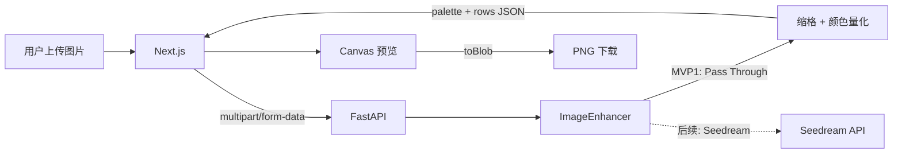

# 图片转拼豆系统技术方案

> 状态：待审查  
> 目标版本：MVP  
> 技术栈：Next.js（React + TypeScript）/ Canvas / FastAPI / Pillow；Seedream 仅预留适配器  
> 范围：上传图片、生成拼豆网格、前端预览及导出 PNG；不包含编辑器、账号、支付、并发任务系统和服务端图片下载。

## 1. 推荐方案

采用三段式处理：

1. 图片先经过 `ImageEnhancer`；MVP1 默认实现为 `PassThroughEnhancer`，直接返回输入图。
2. FastAPI 使用 Pillow 对图片缩格，并量化到仓库已有的 MARD 固定色板，返回“色号调色板 + 网格位置数据”。
3. Next.js 使用 Canvas 渲染拼豆效果，并在浏览器中导出 PNG。

API 不返回原图、中间图或最终 PNG，也不保存结果。原始上传只在当前请求期间存在。这样后端可以保持无状态，不需要数据库、对象存储、结果目录或下载接口。

版本能力划分：

| 版本 | 增强器 | 实现重点 |
| --- | --- | --- |
| MVP1 | `PassThroughEnhancer` | 颜色量化、网格数据、Canvas 渲染与 PNG 导出 |
| 后续版本 | `SeedreamEnhancer` | 复杂照片的主体与色块简化 |

MVP1 不调用豆包/Seedream API、不展示 AI 模式开关，也不要求配置 API Key。仅保留接口和配置入口，未来增加 `SeedreamEnhancer` 时不改颜色量化和前端数据契约。

## 2. 用户流程

1. 用户选择 JPG、PNG 或 WebP 图片。
2. 前端显示原图本地预览，并提供：
   - 方形网格尺寸：`52 × 52 / 78 × 78 / 104 × 104 / 自定义 N × N`，默认 `52 × 52`；
   - 最大颜色数：`8 / 12 / 18 / 24`，默认 `18`；
   - MARD 颜色组：`24 / 48 / 72 / 96 / 120 / 144 / 168 / 192 / 216 / 240 / 264`，默认 `264`；
   - 背景：保留 / 透明 / 指定纯色；
   - 前端外观：圆珠 / 方格、网格线、导出单格像素数。
3. 前端上传图片并等待 FastAPI 完成颜色量化、返回网格 JSON。
4. Canvas 根据网格数据渲染预览。
5. 用户点击导出，浏览器从 Canvas 生成并下载 PNG。

MVP1 自定义 `N` 暂定为 `8–156` 的整数；上下限通过后端配置控制。图片按比例放入 N×N 画布并居中，不拉伸、不裁剪。

`bead_shape`、网格线和导出像素尺寸只影响前端显示，不参与颜色计算，因此不需要传给后端。

## 3. 简化系统架构



只部署 Next.js 和 FastAPI。一次转换是一个同步 HTTP 请求，不设计任务队列、Worker、任务状态、轮询、数据库或文件持久化。

### 3.1 Next.js 职责

- App Router、React 函数组件、Hooks 和 TypeScript。
- 上传表单、原图本地预览、Loading、错误提示。
- 从 `/api/v1/color-sets` 加载颜色组选项，并在每次转换中显式提交所选组。
- 保存 API 返回的 `BeadGrid`，用 Canvas 绘制预览和导出 PNG。
- 将渲染器实现为纯函数；预览与导出调用同一套绘制逻辑。
- MVP1 不接触 Seedream API Key。

### 3.2 FastAPI 职责

- 校验上传文件和生成参数。
- 通过依赖注入调用 `ImageEnhancer`，MVP1 注入 `PassThroughEnhancer`。
- 做 EXIF 纠正、缩格、量化，返回网格 JSON。
- 使用 Pydantic 定义返回模型，使用 `Annotated` 声明表单字段。
- Pillow 计算放在普通 `def` 路由中，不在 `async def` 中直接运行阻塞代码。

## 4. 后端图像管线

### 4.1 输入预处理

1. 同时检查 MIME、文件魔数和实际解码结果。
2. 应用 EXIF Orientation，删除 EXIF/GPS，转换为 sRGB。
3. 限制上传大小为 `10 MiB`、解码后总像素为 `25 MP`。
4. 将处理长边限制在 `2048 px`，防止不必要的内存消耗。
5. PNG 保留 Alpha；JPG 视为不透明。
6. 请求结束时释放原始图片和所有中间数据，不落盘持久化。

### 4.2 图像增强器预留

MVP1 只定义接口和默认实现：

```python
class ImageEnhancer(Protocol):
    def enhance(self, image: Image.Image) -> Image.Image: ...


class PassThroughEnhancer:
    def enhance(self, image: Image.Image) -> Image.Image:
        return image
```

路由不判断供应商，也不包含 Seedream 请求逻辑；它只依赖 `ImageEnhancer`。MVP1 配置固定为 `IMAGE_ENHANCER=passthrough`。后续实现 `SeedreamEnhancer` 时，再按 [Seedream API 核对笔记](./seedream-api-research.md) 接入提示词、超时、重试和审核错误映射。

`PassThroughEnhancer` 可以返回同一个 Pillow 对象，但调用方不得原地修改输入；预处理和量化函数保持纯函数式输入输出，避免未来替换增强器时出现副作用。

### 4.3 网格采样

设用户选择的方形网格边长为 `N`：

1. 预设值为 `52 / 78 / 104`，也可传 `8–156` 的自定义整数。
2. 创建 `N × N` 方形工作画布，使用 `contain + 居中补边` 保持完整构图。
3. 通过 area/box sampling 缩到 `N × N` 网格，避免单点采样偏色。
4. 对透明图片使用 Alpha 加权采样，避免透明像素隐藏的 RGB 污染边缘。

### 4.4 颜色量化与 MARD 色板映射

1. 将网格颜色从 sRGB 转到 Lab。
2. Alpha 低于阈值的单元标记为透明。
3. 用 Median Cut 得到不超过 `max_colors` 个图片代表色，关闭抖动。
4. 根据用户提交的 `color_set_size` 精确读取色卡中对应 `sets[].colors`，形成允许颜色白名单。
5. 将每个代表色通过 CIEDE2000 映射到该白名单中的最近颜色，禁止映射到组外色号。
6. 合并映射到同一 MARD 色号的代表色，并重建单元索引。
7. 将用户所选颜色组、色板 schema 版本写入响应元数据。
8. 固定颜色取整、距离并列时的选择规则，确保相同输入参数返回相同网格。

因此最终 `palette.length` 仍不超过 `max_colors`，而且每个 MARD `code` 都必须属于用户选择的颜色组。颜色组按 [MARD_色卡.json](./MARD_色卡.json) 的累计套装定义，例如 48 色组使用 `sets[size=48].colors` 的全部 48 个色号。仓库色卡注明 HEX 是网页显示近似值，实物可能存在批次和屏幕色差，UI 需要提示。

## 5. 网格数据契约

### 5.1 为什么使用调色板索引

不要为 9216 个格子重复返回 `#RRGGBB`，也不要返回大量 `{x, y, color}` 对象。推荐用调色板加二维索引矩阵：

- `palette[index]` 是实际颜色；
- `rows[y][x]` 是 `(x, y)` 位置的调色板索引；
- `-1` 表示透明格。

这样坐标明确、JSON 易调试；最大 `156 × 156` 只有 24,336 个索引，MVP1 无需 RLE 或 Base64 二进制压缩。

### 5.2 TypeScript 类型

```ts
type PaletteColor = {
  id: number;
  brand: "MARD";
  code: string;
  hex: `#${string}`;
  rgb: [number, number, number];
};

type BeadGrid = {
  schema_version: "1";
  algorithm_version: string;
  width: number;
  height: number;
  palette: PaletteColor[];
  rows: number[][];
  meta: {
    enhancer: "passthrough";
    palette_brand: "MARD";
    color_set_size: number;
    color_chart_version: string;
    actual_color_count: number;
  };
};
```

必须满足：

- `rows.length === height`；
- 每一行 `rows[y].length === width`；
- 每个值是 `-1` 或合法的 `palette` 索引；
- `palette.length <= max_colors`；
- `palette[i].id === i`；
- 每个 `palette[i].code` 都存在于 `sets[size=meta.color_set_size].colors`。

## 6. API 设计

统一前缀：`/api/v1`。

### 6.1 查询可选颜色组

`GET /api/v1/color-sets`

```json
{
  "brand": "MARD",
  "schema_version": "1.0",
  "default_size": 264,
  "sets": [
    { "size": 24, "label": "MARD 24色", "color_count": 24 },
    { "size": 48, "label": "MARD 48色", "color_count": 48 },
    { "size": 72, "label": "MARD 72色", "color_count": 72 }
  ]
}
```

`sets` 必须从色卡 `sets[]` 动态生成，不能在前后端分别维护两套列表。示例仅省略了后续组，实际响应包含到 264 色的全部 11 组。

### 6.2 生成网格

`POST /api/v1/conversions`

请求为 `multipart/form-data`：

| 字段 | 类型 | 约束 |
| --- | --- | --- |
| `image` | File | JPG/PNG/WebP，最大 10 MiB |
| `grid_size` | int | 预设 `52/78/104`，或自定义 `8..156` |
| `max_colors` | int | `8..24` |
| `color_set_size` | int | 必须是 `GET /color-sets` 返回的某个 `size` |
| `background_mode` | Enum | `keep` / `transparent` / `solid` |
| `background_color` | string? | `solid` 时必须为 `#RRGGBB` |

处理完成后返回 `200 OK`：

```json
{
  "schema_version": "1",
  "algorithm_version": "bead-grid-v1",
  "width": 8,
  "height": 8,
  "palette": [
    { "id": 0, "brand": "MARD", "code": "A4", "hex": "#FFE953", "rgb": [255, 233, 83] },
    { "id": 1, "brand": "MARD", "code": "H1", "hex": "#E2E2E2", "rgb": [226, 226, 226] },
    { "id": 2, "brand": "MARD", "code": "B5", "hex": "#00BD35", "rgb": [0, 189, 53] }
  ],
  "rows": [
    [-1, -1, 0, 0, 0, 0, -1, -1],
    [-1, 0, 0, 0, 0, 0, 0, -1],
    [1, 1, 0, 0, 0, 0, 1, 1],
    [1, 0, 0, 0, 0, 0, 0, 1],
    [1, 0, 0, 0, 0, 0, 0, 1],
    [1, 1, 2, 2, 2, 2, 1, 1],
    [-1, 1, 1, 2, 2, 1, 1, -1],
    [-1, -1, 1, 1, 1, 1, -1, -1]
  ],
  "meta": {
    "enhancer": "passthrough",
    "palette_brand": "MARD",
    "color_set_size": 24,
    "color_chart_version": "1.0",
    "actual_color_count": 3
  }
}
```

API 不返回以下内容：

- 原始上传图片；
- Seedream 返回图片或临时 URL；
- 预览 PNG、最终 PNG 或下载地址；
- 服务端文件路径。

MVP1 不调用外部 AI，前端请求超时可设为 30 秒。服务端必须同时验证 `grid_size` 和 `color_set_size`，不能只依赖前端选项。

### 6.2 错误响应

```json
{
  "error": {
    "code": "IMAGE_UNSUPPORTED",
    "message": "仅支持 JPG、PNG 和 WebP 图片",
    "request_id": "req_..."
  }
}
```

MVP1 稳定错误码：`IMAGE_TOO_LARGE`、`IMAGE_UNSUPPORTED`、`IMAGE_DECODE_FAILED`、`GRID_SIZE_INVALID`、`COLOR_SET_INVALID`、`PROCESSING_FAILED`。AI 相关错误码等接入 Seedream 时再增加。

## 7. Canvas 渲染与 PNG 导出

### 7.1 Canvas 与 SVG 选型

MVP 推荐 Canvas：

- 一个画布即可处理数千个格子，不产生数千个 DOM 节点；
- 预览和导出可以复用同一个绘制函数；
- `canvas.toBlob("image/png")` 可直接导出；
- 当前没有单格点击、焦点、编辑等需要 DOM 的交互。

SVG 暂不使用。以后若需要单格编辑、矢量打印或无损缩放输出，可以增加 SVG renderer，但它也必须消费同一份 `BeadGrid`。

### 7.2 统一绘制函数

```ts
type RenderOptions = {
  beadShape: "round" | "square";
  cellSize: number;
  showGrid: boolean;
  background: "transparent" | `#${string}`;
};

const drawBeadGrid = (
  ctx: CanvasRenderingContext2D,
  grid: BeadGrid,
  options: RenderOptions,
): void => {
  // 遍历 rows[y][x]，-1 跳过，其余从 palette 取色
};
```

绘制规则：

- 画布逻辑尺寸为 `width × cellSize`、`height × cellSize`。
- 方格使用整数坐标 `fillRect`。
- 圆珠默认直径为单格的 `84%`，圆心位于单格中心。
- 透明格不绘制；透明背景先 `clearRect`。
- 颜色只从 `palette` 读取，渲染层不得重新量化或自动调整颜色。
- 预览可根据 `devicePixelRatio` 放大 backing store，CSS 控制显示尺寸。
- 正式导出使用固定 `cellSize`，例如 `20`，不能依赖当前页面缩放或 DPR。

### 7.3 导出 PNG

1. 创建不显示在页面上的 export canvas。
2. 设置固定尺寸，例如 `grid.width * 20` 和 `grid.height * 20`。
3. 调用与预览相同的 `drawBeadGrid`。
4. 使用 `canvas.toBlob(blob => ..., "image/png")`。
5. 创建临时 Object URL，触发 `<a download>`，随后调用 `URL.revokeObjectURL`。

导出发生在用户浏览器，不向后端上传 Canvas，也不从 API 下载图片。网格数据本身是可复现结果；圆形边缘的抗锯齿像素在不同浏览器上可能存在极小差异，不应作为网格正确性的判断依据。

## 8. 工程目录建议

```text
.
├── apps/
│   ├── web/
│   │   ├── app/page.tsx
│   │   ├── components/
│   │   │   ├── UploadForm.tsx
│   │   │   └── BeadCanvas.tsx
│   │   └── lib/
│   │       ├── api.ts
│   │       ├── bead-grid.ts
│   │       └── canvas-renderer.ts
│   └── api/
│       ├── pyproject.toml
│       ├── src/pindou/
│       │   ├── main.py
│       │   ├── api/routes/conversions.py
│       │   ├── core/config.py
│       │   ├── schemas/conversion.py
│       │   ├── services/enhancer.py
│       │   ├── data/mard_palette.json
│       │   └── imaging/
│       │       ├── grid.py
│       │       └── quantize.py
│       └── tests/
├── compose.yaml
└── docs/
```

后端图像模块只产生数据：

```python
class ImageEnhancer(Protocol):
    def enhance(self, image: Image.Image) -> Image.Image: ...

def build_bead_grid(image: Image.Image, options: GridOptions) -> BeadGrid: ...
```

后端不再需要 `render.py`、结果存储服务和文件下载路由。

## 9. 配置

```dotenv
APP_ENV=development
IMAGE_ENHANCER=passthrough
UPLOAD_MAX_BYTES=10485760
UPLOAD_MAX_PIXELS=25000000
MIN_GRID_SIZE=8
MAX_GRID_SIZE=156
```

颜色组列表和成员关系直接来自 MARD 色卡 `sets[]`，不通过环境变量重复维护。前端默认选择 264 色，但请求必须显式提交。

Seedream 相关环境变量不进入 MVP1 部署模板。未来启用时，API Key 只能存在于 FastAPI 环境中，不能使用 `NEXT_PUBLIC_*` 暴露。

## 10. 安全与隐私

- 严格校验文件体积、像素量、MIME、魔数和解码结果。
- 拒绝 SVG、动画 GIF 和未知格式。
- 原图只在请求内存或临时目录中存在，必须在 `finally` 中释放/删除。
- API 响应和日志都不包含原图、Base64 图片或文件路径。
- 面向公开互联网时补充反向代理限流、隐私政策和用户授权说明。

## 11. 日志与测试

### 11.1 结构化日志

每次请求生成 `request_id`，记录：增强器名称、网格尺寸、颜色上限、各阶段耗时和错误码。不要记录图片内容。

### 11.2 后端测试

- EXIF 旋转、透明边缘、灰度图、超宽图和损坏图。
- `rows` 高宽与声明一致，每个索引合法。
- 量化后调色板不超过 `max_colors`。
- 对 24、48、264 三个代表颜色组分别验证：所有输出 `code` 都属于所选 `sets[].colors`。
- 选择较小颜色组时，即使组外颜色距离更近，也不得出现在结果中。
- CIEDE2000 距离相同的颜色使用固定规则决胜，结果可复现。
- 相同算法版本、输入和参数得到相同 `palette + rows`。
- `PassThroughEnhancer` 保持图像内容不变，且管线确实通过接口调用它。
- `/color-sets` 的组数、size 和 color_count 与色卡 `sets[]` 一致。
- 非法颜色组返回 `COLOR_SET_INVALID`。
- 成功和失败路径都不会残留临时图片。
- 响应 JSON 不含 URL、Base64 或文件路径。

### 11.3 前端测试

- 使用小型固定网格测试透明格、方格、圆珠和网格线。
- 校验 export canvas 的像素尺寸。
- Canvas 导出的 Blob MIME 为 `image/png` 且非空。
- 对方格模式做像素快照测试；圆珠模式以关键区域或宽松视觉差异测试为主。
- 预览和导出必须调用同一个 `drawBeadGrid`。

## 12. 部署

开发和部署都只有 `Next.js + FastAPI` 两个进程，无数据库、Redis、对象存储和持久卷。FastAPI 是无状态服务，容器重启不会影响已返回到浏览器的网格数据。

MVP1 反向代理读取超时可设为 30 秒。当前不考虑并发；以后需要扩容时，因为 API 无本地结果状态，可以直接增加 FastAPI 实例。

## 13. 实施拆解

### 阶段 A：MVP1 网格闭环（约 2–3 人日）

- 建立 Next.js 与 FastAPI 工程。
- 完成 `PassThroughEnhancer`、颜色组列表接口、上传校验、方形画布预处理、受选定颜色组约束的量化和网格 JSON API。
- 支持 `52/78/104` 预设及 `8–156` 自定义尺寸。
- 实现 Canvas 预览、圆珠/方格渲染及浏览器 PNG 导出。
- 完成后端网格快照和前端 Canvas 测试。

验收：原图从上传到量化、预览、导出完整可用，API 不调用 Seedream，也不返回或保存图片结果。

### 阶段 B：MVP1 加固（约 0.5–1 人日）

- 配置反向代理超时、容器内存限制和结构化日志。
- 完善临时文件清理、隐私文案和错误提示。
- 使用基准图片复核 52、78、104 三种尺寸，以及 24、48、264 三个颜色组的量化效果。

验收：所有预设和边界自定义尺寸稳定返回合法网格，导出 PNG 可用。

### 后续：Seedream 接入（不属于 MVP1）

- 新增 `SeedreamEnhancer`，替换依赖注入配置。
- 增加提示词版本、超时重试、审核错误和调用指标。
- 网格 API 与 Canvas 渲染契约保持不变。

MVP1 预计 **2.5–4 人日**，不包含 UI 精修、域名、合规评审和 Seedream 账号开通。

## 14. MVP 验收标准

- 支持 JPG、PNG、WebP 和既定上传限制。
- `PassThroughEnhancer` 为默认且不产生任何外部 AI 请求。
- 支持 `52×52 / 78×78 / 104×104` 和 `8–156` 自定义 N×N 网格。
- 支持 8–24 色和三种背景策略。
- 前端可选择 MARD 24–264 的 11 个累计颜色组。
- 最终颜色严格来自用户选择组的 `sets[].colors`，API 返回 MARD 色号和 `color_set_size`。
- `rows[y][x]` 坐标规则明确，所有调色板索引合法。
- 后端响应、日志和文件系统中不保留原始图、中间图或最终 PNG。
- 前端支持圆珠/方格预览，并能从 Canvas 导出 PNG。
- 导出尺寸只由网格尺寸和导出 `cellSize` 决定，不受页面缩放影响。
- 相同输入和参数返回相同网格数据。

## 15. 需要确认的产品决策

1. 默认外观使用圆珠还是方格？本文默认圆珠。
2. 颜色组默认值是否使用 264？本文允许用户选择全部累计套装，并默认 264。
3. 导出时每格默认使用多少像素？本文建议 `20 px`。
4. 自定义尺寸范围 `8–156` 是否合适？本文将它作为 MVP1 的可配置保护范围。
5. 是否接受圆珠抗锯齿像素可能在不同浏览器上有极小差异？网格颜色数据本身不受影响。

## 16. 参考资料

- Seedream 具体接口与限制：[Seedream API 核对笔记](./seedream-api-research.md)
- FastAPI：[Request Files](https://fastapi.tiangolo.com/tutorial/request-files/)
- MDN：[CanvasRenderingContext2D](https://developer.mozilla.org/docs/Web/API/CanvasRenderingContext2D)、[HTMLCanvasElement.toBlob](https://developer.mozilla.org/docs/Web/API/HTMLCanvasElement/toBlob)
- Pillow：[Image quantization](https://pillow.readthedocs.io/en/stable/reference/Image.html#PIL.Image.Image.quantize)
- W3C：[CSS Color 4 - Delta E](https://www.w3.org/TR/css-color-4/#color-difference-E2000)
