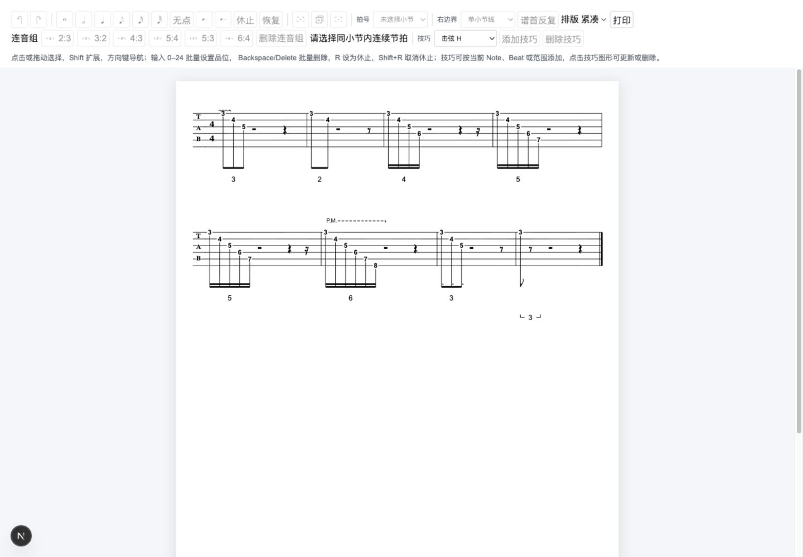
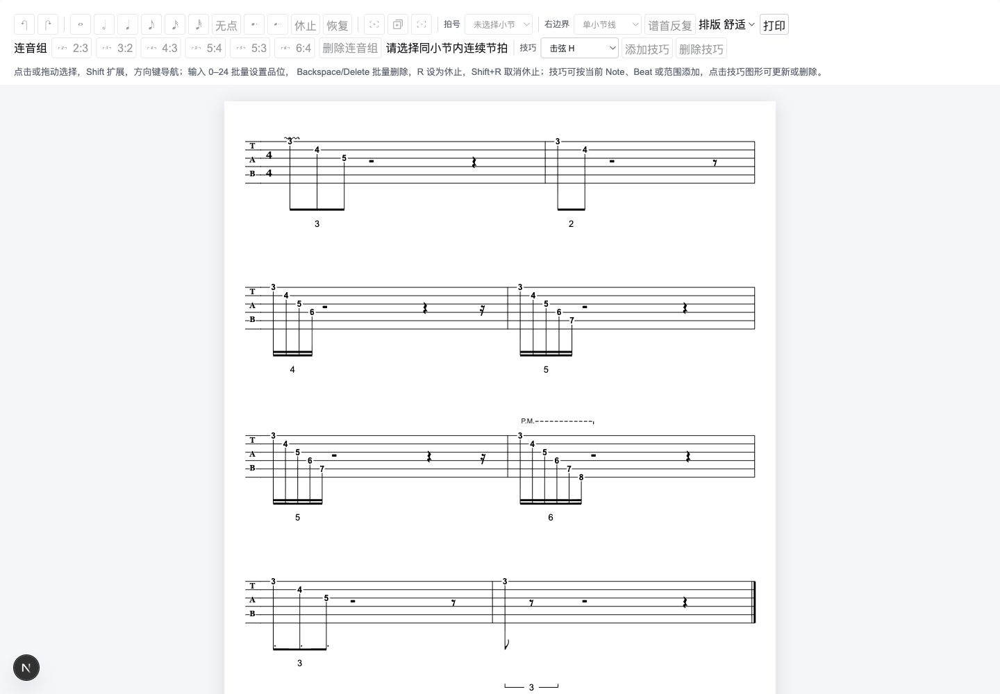
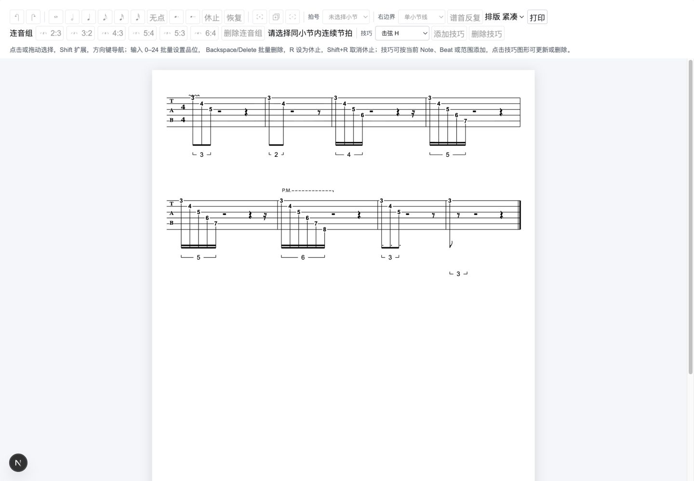

# MVP v5.1 连音组实施验收

## 实施结果

按已确认的 [技术方案](./technical-design.md) 与 [实施计划](./implementation-plan.md) 完成 v5.1 工程实现。核心包负责实际时间和最终几何，website 转发命令并消费布局；默认页面加载正式八小节 v5.1 谱例，原 v5 规范谱例独立保留。

## 模型与时间

- `CURRENT_SCHEMA_VERSION` 从 1 升至 2；每个小节必须显式保存 `tuplets`。全部示例和构造器同步更新；旧 schema 或缺字段直接拒绝，不做 loader 默认填充或旧版本迁移。
- `ILXMTuplet` 保存稳定 ID、按时间排序的 `beatIds` 以及严格六种 ratio。
- `createMeasureRhythmContext(measure)` 一次索引分组，提供实际 `getBeatDurationTicks(beat)`；独立 `getBeatDurationTicks(measure, beat)` 与 `getBeatEndTick(measure, beat)` 使用同一实现。
- 书写时值仍由 `calculateRhythmTicks` 定义；先应用附点，再以整数分子取模校验 `normal / actual`。非整数时长明确失败，绝不舍入。
- 语义校验覆盖成员存在性、数量、有序连续、时值/附点一致、重叠、组排序、ID 唯一、实际时间连续与容量闭合。
- 移除 example 目录已提交的旧 JS/map 编译副本，避免模块解析继续读 schema 1 的示例。构建产物统一位于 dist。

## 命令与容量

- 新增 `tuplet.set`、`tuplet.remove`，成功只增加一次 revision/历史；失败和 no-op 保留原文档。
- 同范围同比例 no-op；`5:4 ↔ 5:3` 保留组 ID。部分重叠、嵌套、逆序、数量不符、混合时值与非整数 ticks 明确拒绝。
- `reconcileMeasureTimeline` 统一保护 notes Beat、空 notes Beat、全部组成员及命令保护目标；只重建它们之后的未分组尾部休止。容量不足或剩余容量不可表示时原子失败。
- 删除组只移除关系，成员 Beat/Note ID 保留，包括全休止组。
- 组内单拍时值修改返回 `BEAT_IN_TUPLET`；组外修改的压缩 DP 跳过成员，使用实际时间重排。
- Note/kind 编辑保留关系；复制小节重建组 ID 和所有成员引用；插入使用空数组；删小节与 v5 技巧级联继续有效。
- 拍号协调使用实际时长；全休止但有组按明确内容保护；多小节失败不提交任何部分结果。
- v5 技巧引用在连音时间调整后继续有效；JSON 序列化后经正式 loader 重新加载等价。

## 布局和页面

- spacing 使用实际 rhythmTicks，宽度权重保持书写时值；标注作为独立最小宽度贡献者。
- 连音组首尾形成 beam seam，组内不被普通拍组边界切断；休止/空 notes 打断完整连梁。
- 根据 2026-10-09 用户后续确认，所有连音组始终显示数字和范围括号，不再按连梁覆盖省略括号。
- `ILXMTupletLayout` 返回 label 与 bracket 最终几何。bracket 除方案字段外增加最终 `lines[]`，JSX 直接绘制，不计算中央 gap 或钩端点。
- 标注统一在节奏图形、旗帜、附点、休止符下方；最低点进入 measure/system/document 高度；技巧扩高时标注与其他小节图形统一平移。
- 工具栏提供六种完整比例及删除入口，用既有 SVG 资产。选区忽略弦维度、归一拖动方向，跨小节即时禁用；核心最终裁决时值、重叠和容量规则。
- 紧凑/舒适排版是临时 UI 状态，不进入文档历史。打印入口使用浏览器原生打印；选择层、工具和技巧焦点色仍由打印 CSS 处理。

## 自动化验证

- `pnpm test`：核心 269 项 + website 20 项，共 **289 项通过**。
- 新增 45 项连音领域测试、7 项布局测试、3 项选区/历史测试。
- v5 收尾新增 16 项技巧目标恢复测试；原有 22 项锚点布局回归继续通过。
- `pnpm type-check`、`pnpm lint`、`pnpm build`、`git diff --check`：通过。

覆盖六种比例、附点、非整数 tick、连续/容量守卫、失败原子性、保护休止、比例 no-op/ID、DP 跳过组、复制/插入/删除、多小节拍号失败、技巧引用、JSON 重载、beam seam、数字/括号、两种密度、动态高度、布局确定性和撤销重做。

## 浏览器验收

正式 localhost 开发页面，桌面 CSS 视口 1440×1000；截图对应两种密度。

- 八小节、六种比例、同附点组与含 rest/空 notes 的括号显示正常。
- 完整选中三连音后删除、撤销：标注数量 3 → 2 → 3，工具状态随文档恢复。
- 五拍选择同时启用 `5:4`、`5:3`；切到 `5:3` 后该比例标注数量 1 → 2，撤销恢复 `5:4`。
- 复制小节后组标注 8 → 9，撤销恢复；拍号切换保留 8 个组且没有领域错误。
- 紧凑与舒适模式均检查，控制台 warning/error 为空。

## 验证边界与版本限制

工程实现、自动化检查和桌面交互已完成。实际系统打印预览仍待人工确认：本轮点击打印后，内置浏览器自动化被系统窗口阻塞；原生 Codex 应用控制不在工具允许范围。未验证纸张分页或物理打印，不能将其记录成通过。

不支持混合基础时值/附点、嵌套、重叠、跨小节组，也不支持拖拽括号。成员实际时长即使为整数，剩余容量若无法由当前休止集合精确表达，命令仍明确失败。

保存加载验证使用既有 JSON/loader 能力；文件保存 UI、导出和旧版本迁移不在 v5.1 范围。后续音乐文本能力见路线图 v6。

## 后续显示规则调整

2026-10-09：按用户确认，取消完整连梁时的数字-only 分支。八小节谱例的全部组均输出四条括号线段；数字、比例、实际时间和连梁分组保留。原上方截图记录首次实现，最新统一括号效果见下图。

