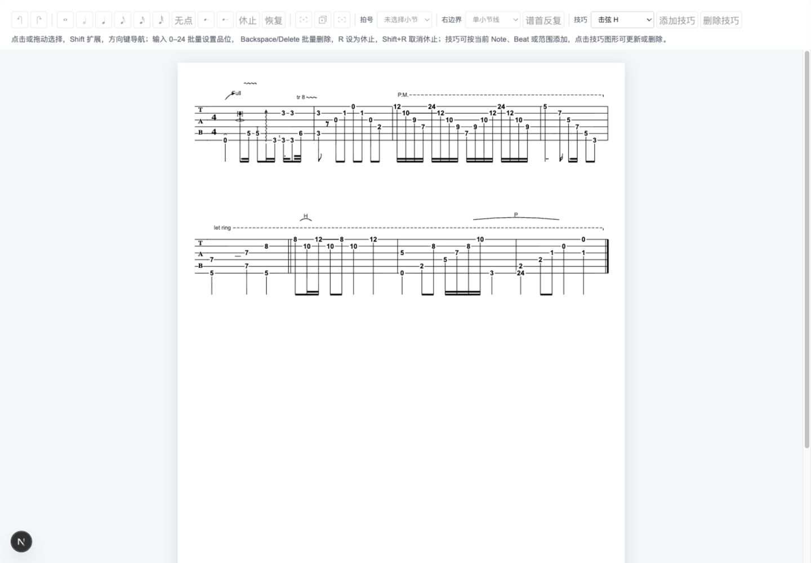

# MVP v5 技巧音符锚点布局修复验收

## 实施依据与结果

按已确认的 [技巧音符锚点布局修复方案](./technique-note-anchor-layout-fix.md) 实施。

最小复现只包含一个点弦技巧。修复前，第一弦音符到技巧文字基线的距离为 38px，第六弦为 98px；修复后，无碰撞时两者均为 5px。根因是技巧使用 system 顶部的绝对 laneY，再按 lane 数量下移 staff；技巧没有跟随真实音符。

- Tie、H/P、推弦、颤音、点弦、颤音奏和拨片方向先以完整 Note/Beat 几何生成自然 plan。
- Tie、H/P 真实端点避开一位/两位品位文字、白色描边及横向净空；极短距离使用不反向的安全退化模板。
- 使用最终二维 collisionBounds 做稳定 first-fit，每增加一级 lane 都整体向上平移 14px；同一 lane 可以用于不同弦的不同自然 Y。
- 音符局部技巧避开其他品位文字及固定 staffLocal 技巧，弦线本身不作为障碍。
- 文字完整估算框可能需要两个或更多 lane 步长才能避让；不强制“第二个技巧一定进入 lane 1”，以最终二维不相交为准。
- P.M./Let Ring 按稳定 Beat 顺序收集每段覆盖范围，标签、虚线与结束钩整体保持在第一弦文字上方。
- system 顶部扩展由最终 visualBounds 推导，staff、measure、技巧图元与命中 bounds 同步平移；无技巧基线保持不变。
- 跨行滑音使用当前行的弦线 Y 与安全边，避免每个 segment 重复输出跨页面端点。
- 品位字号、基线、白色描边和 SVG marker 尺寸由核心常量与 React 共用；页面不增加技巧几何算法。

几何模板只生成一次。新增内部 `technique-geometry.ts` 负责保守 bounds 与整体平移；公开布局返回最终 `visualBounds`、`collisionBounds`、命中 `bounds`。文档 schema 和领域技巧实体不变。

## 自动化验证

- 新增 22 项布局回归测试：八类锚点、第一/第六弦、一位/两位品位、二维碰撞、静态品位障碍、推弦整体平移、跨行 Tie/滑音、极短连接、区间说明、system 扩高、确定性与源文档不可变。
- `pnpm test`：核心 201 项、页面 17 项，共 218 项通过。
- `pnpm type-check`、`pnpm lint`、`pnpm build`、`git diff --check`：通过。
- 首次沙箱构建因 Turbopack CSS 编译子进程绑定本地端口被 EPERM 拒绝；允许在沙箱外重新执行后，正式生产构建通过。没有修改构建配置。

## 浏览器验收

通过项目原有 `http://localhost:3000` 开发服务器，在 1440×1000 桌面视口检查固定 A4 规范谱例。

- 首轮页面检查发现区间说明靠近第一弦品位；补充 staff 安全净空后再次检查，P.M./Let Ring 与第一弦文字分离。
- 技巧点击选择、删除、撤销、重做验证通过，点弦元素数量依次为 1 → 0 → 1 → 0，最终恢复初始谱例。
- 浏览器捕获的 warning/error 日志为空。
- 跨行与 compact/comfortable 几何由自动化测试覆盖；本轮页面视觉检查使用默认 compact。未重新实施完整打印对话框验收，也未将 comfortable density 增加为页面入口。

## 验证边界与后续

字体包围框使用核心确定性保守估算，不读取实时 DOM 字形。复杂密集叠加可能使局部技巧被推离音符，这是碰撞避让结果，不再是固定 system 顶部定位。后续如出现特定字体外延，应校准集中度量，不能在页面层追加偏移。

后续技巧编辑收尾见 [v5 收尾验收](./20261009_v5收尾验收.md)，连音组工程实现见 [v5.1 验收记录](../v5.1/20261009_连音组实施验收.md)。
