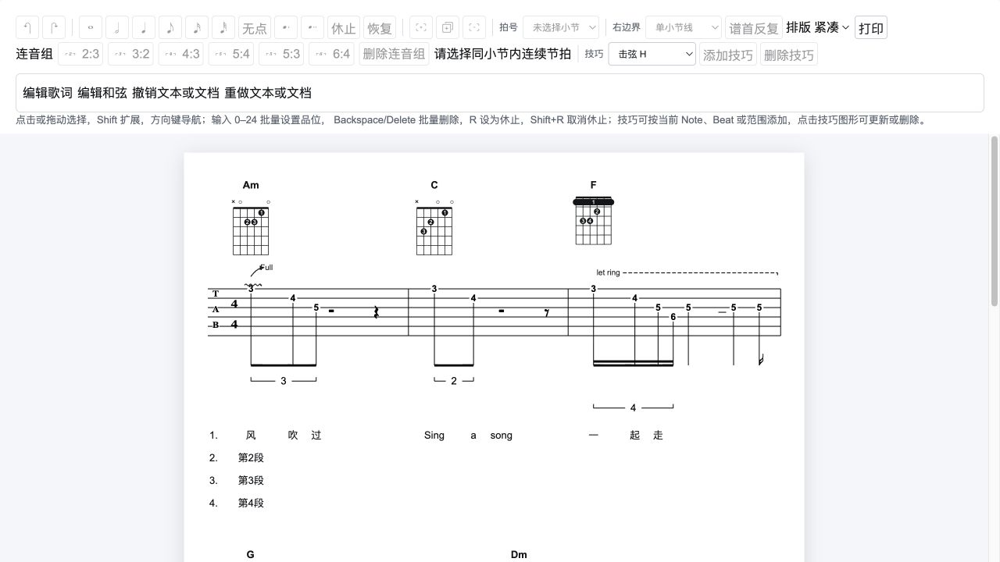
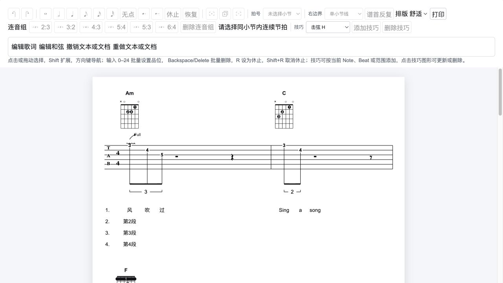
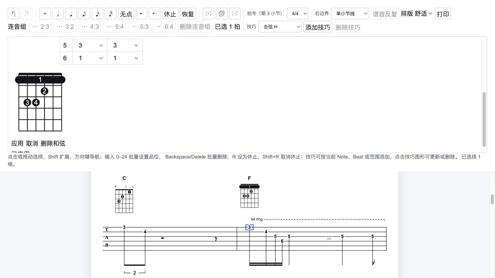
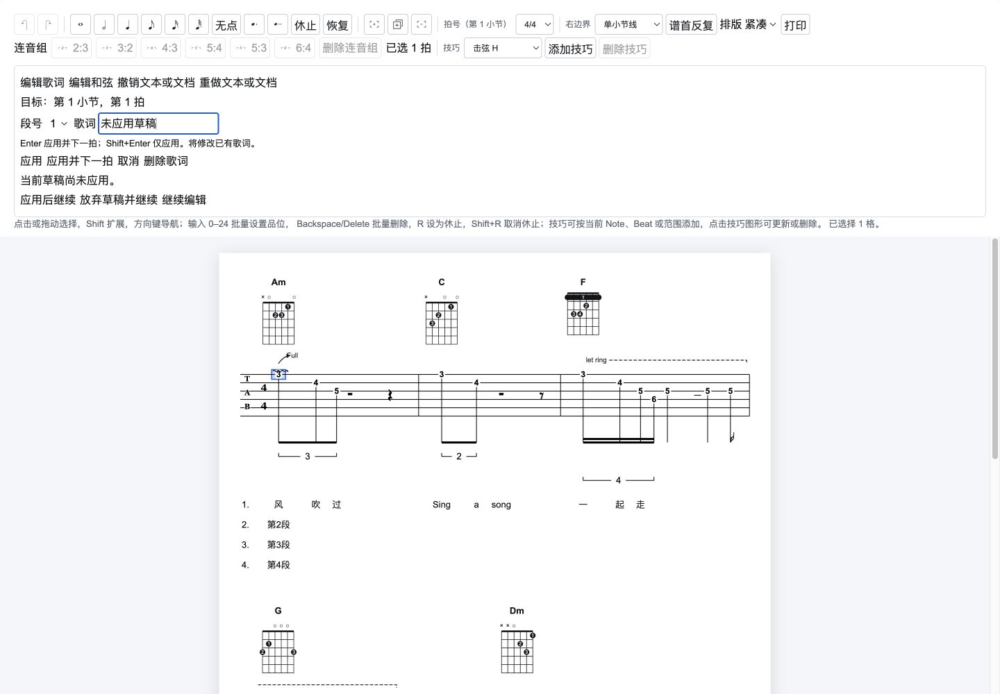

# MVP6 实施与验收记录

2026-10-09：用户已授权按审查方案实施，并在实施完成后推送远程分支。音乐文本功能已实现，工程验证和下列桌面浏览器流程已通过；系统输入法候选字与系统打印预览仍需人工验收。

## 交付能力

- schemaVersion 3：小节保存 `lyrics`，歌词与和弦使用稳定 `beatId`，和弦包含自足名称与可选指法快照。schemaVersion 2 明确拒绝，不提供隐式升级。
- 四段单行歌词：创建、修改、删除、段号切换、Enter 应用并下一拍、Shift+Enter 仅应用。连续录入包含休止拍，可跨小节和谱面行，预填已有歌词。
- 和弦：纯名称/名称加图、14 个常用预设、六弦绝对品位和手指、五格观察窗口、最多四条横按、实时错误和共享核心预览。仅名称可保留指法，另提供清除指法。
- 草稿：应用/取消、未应用内容的切换保护、原始多行粘贴拒绝、IME 组合与确认 Enter 隔离、关闭后归还焦点、外部历史切换关闭草稿。打开面板会取消品位计时器并清空技巧焦点。
- 不可变领域命令：同值不增加 revision 或历史；复制小节重建文本与 Beat 引用，指法数组深复制；节奏/连音重排保留稳定锚点，文本覆盖的尾部休止不被容量协调吞掉。
- 联合排版：断行前计入实际文本/图宽度；和弦在技巧上方，歌词在节奏及连音括号下方；统一平移后生成命中。超宽内容保持字号与真实宽度，横向滚动并提示 A4 打印限制。
- 网站在字体就绪后测量真实 SVG bbox，字体事件使缓存失效，缓存最多 2048 项；无 DOM/无效测量使用保守估算并标记来源，部分测量失败时页面提示。

## 实现与方案的位置调整

预设登记在 `packages/lxm-editor/src/core/chord-presets.ts`，供网站草稿和真实 fixture 共用；提交仍保存完整局部快照，没有增加可变全局和弦库。歌词字段与生命周期集中在 `MusicTextToolbar.tsx`，和弦字段独立为 `ChordEditor.tsx`，避免为单行输入增加没有业务逻辑的转发组件。度量快照使用 SVG 原始 `{x,y,width,height}`，核心由其推导上下左右边界。

面板打开时暂停其他谱面修改工具；点击其他 Beat/文本走同一草稿切换保护，文档撤销/重做按钮仍可使用。网站生产构建固定使用 `next build --webpack`：实施前默认 Turbopack 构建在本环境未完成，Webpack 基线和最终生产构建均成功；没有修改依赖版本。

## 工程验证

| 检查               | 结果                                                            |
| ------------------ | --------------------------------------------------------------- |
| `pnpm test`        | 核心 300 项 + 网站 27 项，共 327 项通过；最终相关测试均实际执行 |
| `pnpm type-check`  | 核心与网站通过                                                  |
| `pnpm lint`        | 核心与网站通过                                                  |
| `pnpm build`       | 核心 TypeScript 构建与网站 Webpack 生产构建通过                 |
| `git diff --check` | 通过                                                            |
| 本地生产服务       | `next start`，HTTP 200                                          |

新增 38 项测试覆盖领域校验、不可变编辑、同值历史、复制引用、受保护休止、schema3 重载、确定性测量快照、真实宽度驱动的溢出与断行、四段槽位、最终命中及输入法按键判断。原有节奏、技巧、连音、范围编辑与历史测试保留。

## 桌面浏览器验证

环境：Codex 内置浏览器，1440×1000，最终 Webpack 生产服务。

- 混合八小节谱例包含四段中文、英文、纯名称、F/Bm 横按、六种连音比例、推弦、颤音、P.M. 与跨行 Let Ring。
- 紧凑版 89 个文字图元全部标记为 `measured`。用实际 DOM screen bounds 与布局 bounds 按 SVG 比例换算对照，越界列表为空。截图显示和弦、技巧、连音括号与歌词分带。
- 实际点击歌词预填正确，焦点进入输入框；dirty 时切换到和弦或点击 TAB 另一拍出现应用/放弃/继续编辑提示；放弃后进入第 1 小节第 2 拍并预填“吹”。
- Enter 更新并前进，连续六次进入第 3 小节第 1 拍，含休止和跨行；已有词“一”预填并提示将修改。
- 撤销恢复原词并关闭草稿，重做恢复修改。纯名称切换隐藏图元，名称及保留的六弦指法说明仍在；再次编辑可恢复图。
- F 预设与横按提交正常。起始品位改为 8 后原指法超出窗口，应用禁用；六弦和横按改为合法高把位后可提交。
- 通过真实剪贴板粘贴两行文字，出现“请粘贴单行文本”，原草稿保持不变。

## 验证边界与版本范围

- IME 组合状态、keyCode 229、组合结束后的确认 Enter 已实现并有单元测试；自动化填写中文与多行粘贴已验证，但没有将系统中文输入法候选字操作声称为实机通过。
- print CSS 保留正文并隐藏编辑控件/选区；实际点击打印后浏览器控制命令超时，系统打印预览无法读取，因此纸张分页和打印机输出未验收；已用 Escape 退出测试。超宽谱面明确提示不能保证 A4 完整输出。
- 未模拟实际网络字体晚到、OS 字体替换和不同浏览器缩放组合；已实现字体加载事件重测、过期请求丢弃及估算提示。
- 文件保存/加载 UI、导出、歌词延长线、自动和弦识别、移动端与分页打印仍属后续版本范围。本版核心 loader 可验证完整 JSON，但网页刷新仍重置示例会话。

推送目标：`origin/codex/mvp6-music-text`，普通新分支推送，不改写已有远程历史。
