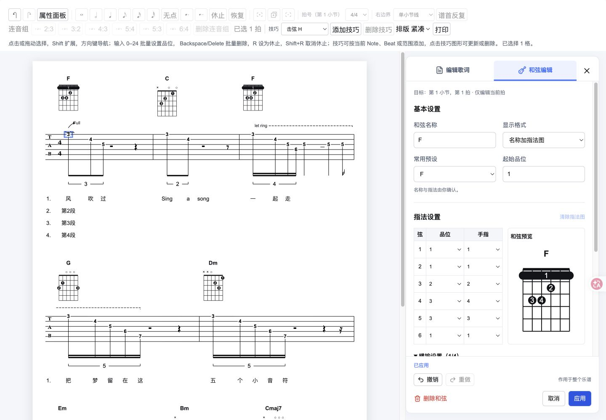
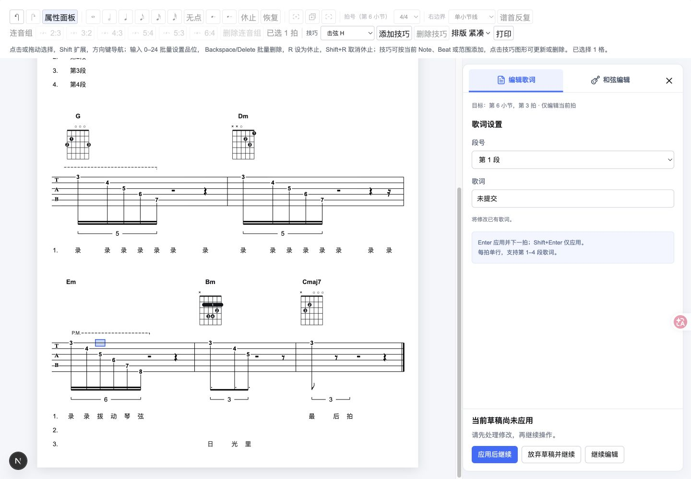
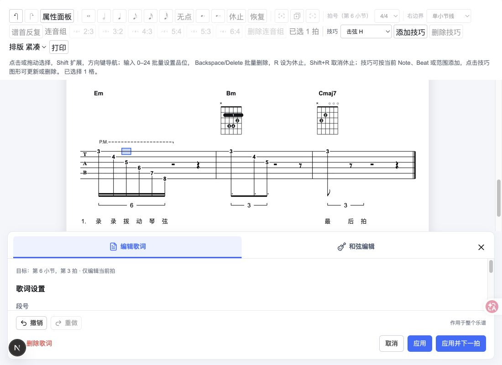

# 音乐文本属性侧边栏实施验收

> 日期：2026-10-10。用户已授权按复审方案实施。首版已实现，工程检查及关键真实页面交互通过；系统打印预览、真实 200% 页面缩放和系统中文输入法候选操作仍待人工验收。
> 对应[技术方案](./20261010_音乐文本属性侧边栏方案.md)与[正式设计稿](./设计稿/侧边栏.png)。

## 交付结果

- 将原音乐文本工具行与表单迁入右侧属性面板，提供歌词/和弦标签、目标说明、独立表单滚动和底部操作区。默认只显示面板外壳，不创建草稿或暂停谱面。
- 复用四段逐拍歌词、和弦名称/显示模式、14 个预设、六弦指法、起始品位及最多四条横按；和弦表格与实时预览并排，横按可折叠。非法指法先校验，再决定是否生成预览。
- 关闭、取消、顶部开关、换标签、换拍、切段共用草稿保护。同一目标重复点击不重载；应用失败保留草稿，删除失败显示领域错误；提交标记通过 finally 释放。
- 顶部历史及属性开关从 inert 工具组拆出，编辑期间可操作；谱面修改工具继续暂停，排版密度与打印独立。侧栏撤销/重做明确作用于整个乐谱；文档历史切换结束草稿并显示提示。
- 草稿与面板可见性分开管理，组件关闭时保留挂载。输入框仅在目标变化或确认结束时聚焦，父壳重渲染不抢走品位等控件焦点；关闭后返回属性面板开关。
- 谱面视口独立滚动。编辑目标、容器尺寸与布局变化时检查可见性，空间足够则包含该拍文字/和弦；空间不足优先保留 Beat 锚点。A4 纸张实测保持约 793.7px，核心排版宽度、字体与数据模型不变。
- 工作区宽度小于 1320px 时切为上下布局，不遮挡谱面；小高度窗口调整面板占比，底部操作区也可滚动。断点切换不卸载草稿。
- print CSS 显式隐藏侧栏与控件，并释放工作区分栏及高度限制；保留既有正文打印规则。本次未确认实际系统打印预览。

实现位置：`MusicTextToolbar.tsx` 重组为 `MusicTextSidebar.tsx`，新增 `music-text-draft.ts` 的目标读取与切换决策纯函数；修改 `ChordEditor.tsx`、`EditorShell/index.tsx` 和样式。不修改核心包模型、领域命令、布局算法或依赖。

## 工程验证

| 检查         | 结果                                                                |
| ------------ | ------------------------------------------------------------------- |
| 网站测试     | 5 个测试文件、32 项通过，含新增 5 项侧栏草稿回归                    |
| 网站类型检查 | `pnpm --filter @liuxianmao/website type-check` 通过                 |
| 网站 lint    | `pnpm --filter @liuxianmao/website lint` 通过                       |
| 生产构建     | `pnpm build` 通过；网站 Webpack 生产构建实际执行，核心构建复用缓存  |
| Diff 检查    | `git diff --check` 通过                                             |
| 生产页面     | 仅监听本机的 `next start` 服务，实际打开并验证和弦侧栏与 F 预设提交 |

新增回归覆盖默认无草稿、无效目标、非法脏草稿关闭/切换保护、相同目标不同弦重复点击、和弦字段变更保护、换拍重新读取与快照隔离。现有 27 项网站测试保留。核心未改，本轮未重复运行核心全量测试。

## 真实页面检查

环境：Chrome，开发服务与最终生产服务，独立验收标签页；没有修改用户原页面的会话数据。

- 1440×1000：侧栏右置，表格/预览并排，正文和侧栏分别滚动；默认空态不创建选区。
- 点击现有“风”打开正确歌词目标。修改后切和弦出现三种草稿处理选项；放弃后进入和弦，原歌词不被修改。
- F 预设包含横按与六弦预填。起始品位改为 8 出现“按弦品位超出当前图格”并禁用应用；期间改变排版密度，焦点仍保持在起始品位输入框。
- 脏草稿关闭后选择继续编辑/Esc，字段仍保留；放弃并关闭后重新打开，从当前文档恢复 Am，而非保留未提交的 F。
- F 应用后，顶部撤销恢复原和弦并结束编辑；重做恢复 F，点击“编辑当前拍”重新预填 F。最终生产页面再次完成 F 提交，提示“已应用”。
- 歌词 Enter 与“应用并下一拍”均可前进；连续操作覆盖第 1–6 小节、休止与三条谱行。到第 6 小节时谱面 scrollTop 为 283.5，caret 在视口内，输入焦点仍为歌词文本。
- 多行粘贴显示“请粘贴单行文本”，原草稿“小窗口”保持。确认区域 Tab 从“继续编辑”循环回“应用后继续”；Esc 表示继续编辑。
- 1100×800：上下布局，上方谱面仍可操作，底部动作保持可达；1319/1320px 断点前后草稿值一致。
- 720×500：顶部、表单与底部可以分别滚动，表单仍有约 65px 可滚动高度，应用可访问。该项是小窗口检查，不作为真实 200% 页面缩放的替代证据。
- 1920×1080：面板关闭时 A4 宽度不变；关闭后焦点为“属性面板”按钮。

## 截图

最终生产页面的和弦面板：

开发页面验证草稿保护与窄窗口布局：

## 验证边界与后续调整

尝试检查原生 Chrome 的系统打印预览与页面缩放时，浏览器工具因当前 URL 的访问限制停止会话。遵守该限制后没有继续操作浏览器，因此系统打印预览与真实 200% 缩放标为待人工验收，不能用源码检查或小窗口截图代替。

IME 判断函数的现有测试通过，多行粘贴与输入焦点已经真实页面检查；本轮没有操作系统中文输入法候选字。全浏览器兼容性、打印机输出不在已验证范围。

首版不新增下方和弦图卡库、点击预览改指法、拖动侧栏宽度或 UI 状态持久化。可根据实际使用继续调整面板宽度、窄窗口高度与表单间距。工程完成与上述人工验收边界分别记录，不将方案全部验收项笼统宣称为完成。
