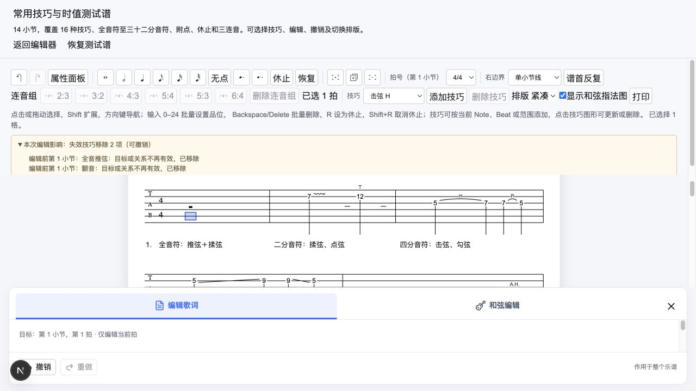

# MVP v7.0 编辑保真与宿主集成实施验收

2026-10-10。本阶段按 G16 → G04 → G05 实施，依据[技术方案](./20261010_编辑保真与宿主集成技术方案.md)。schemaVersion 保持 3，未加入作品生命周期、保存基线、播放、多轨或云端作品库。

## 1. 已实施

| 切片         | 实现与契约                                                                                                                                                                                                                                  |
| ------------ | ------------------------------------------------------------------------------------------------------------------------------------------------------------------------------------------------------------------------------------------- |
| G16 宿主会话 | `createEditorSession(input, options)` 创建独立 store；`EditorSession` Provider 装配外壳和音乐文本侧栏。会话拥有文档及受限历史，首页保留默认实例，测试页不再覆盖全局 store。                                                                 |
| G16 替换     | `session.getState().replaceDocument(input)` 接受 JSON 字符串或对象，先经 loader，再限制为有小节的单轨文档。失败保留当前文档、历史、选区、会话版本与草稿；成功清空焦点/历史/影响并重挂载壳，取消计时输入、拖选和文本草稿。同 ID 替换也生效。 |
| G16 通知     | `onChange({document, reason, command?, effects})` 在真实命令、undo/redo 提交后触发；选择、no-op、错误和外部替换不回发。`onError({message})` 报告输入/编辑错误；宿主回调抛错不回滚成功结果。                                                 |
| G04 完整复制 | 16 类技巧按新的 Note/Beat 引用复制，技巧 ID 独立，参数保持；歌词、和弦和连音保留原复制契约。完整小节复制一次命令、一次 revision、一次历史。                                                                                                 |
| G04 边界     | 只有完整包含的技巧复制；跨边界连接/区间及两端在外但贯穿小节的范围不复制并报告。插入使旧 Tie 不再相邻时按原规则移除，同时报告。                                                                                                              |
| G05 影响     | 核心结果按实际前后状态提供压缩拍、起点重排、技巧清理及复制遗漏 effects；no-op/失败不产生。页面显示中文可展开明细，位置指向编辑前的小节/拍，沿用撤销；effects 不进入 document。                                                              |

会话实例身份和替换版本只服务于 UI 生命周期，不代表作品 ID、版本库或保存状态。改变传给 `EditorSession` 的实例也会重建壳。替换版本变化时同步取消计时器，避免等 React 重挂载期间旧输入回写。

相关实现：`apps/website/stores/editor-store.ts`、`stores/editor-context.ts`、`components/EditorShell/EditorSession.tsx`、`EditorImpactNotice.tsx`；核心 `core/copy-measure-techniques.ts`、`core/command-effects.ts` 与命令入口。

## 2. 宿主使用方式

```tsx
const [session] = useState(() =>
  createEditorSession(initialDocument, {
    onChange: ({ document, reason, effects }) => {
      // 接收已提交的领域结果；宿主自行决定如何消费，不自动回填编辑器。
      receiveEditorResult({ document, reason, effects });
    },
    onError: ({ message }) => receiveEditorError(message),
  }),
);

return <EditorSession session={session} />;
// 宿主确需替换整份输入时调用；不要把每次 onChange 又回填成外部替换。
// session.getState().replaceDocument(nextDocument);
```

接口目前由网站适配层提供，核心包保持纯文档命令和结构化影响；本阶段不发布独立 React 编辑器 SDK。输入校验失败没有示例谱回退，也不会覆盖已有会话。草稿的丢弃规则只针对宿主明确调用替换成功的会话边界，不引入作品离开确认流程。

## 3. 验证

- 新增 27 项测试：核心 19 项覆盖 14 小节复制、全部 16 类技巧样本、参数/引用唯一性与不可变性、正式 loader/layout、贯穿区间、旧跨小节 Tie 和影响语义；网站 8 项覆盖提交后通知、同 ID 替换、坏/多轨/空/循环输入、宿主异常、隔离与单条历史。
- 全量 437 项测试（核心 393、网站 44）通过；`pnpm type-check`、`pnpm lint`、`pnpm build` 与 `git diff --check` 通过。
- 桌面浏览器 `/technique-test`：复制首小节可见推弦/揉弦一同复制；删除首音/将首拍设为休止显示 2 项失效技巧明细，撤销后技巧恢复且说明清空；恢复测试谱清空历史和选区；输入 `1` 后立即恢复，超过 600ms 后首品位仍为 `12` 且撤销禁用；未应用歌词草稿随恢复消失；侧栏应用歌词写入本页独立会话。
- 非法替换的文档/历史/选区/版本保留由 store 测试验证；本页没有非法输入宿主 UI，因此未做浏览器非法替换时 IME/指针/文本草稿的全链路验收。真实 IME、多浏览器长谱和系统打印/PDF 保持后续验收项。



## 4. 当前阶段结论

v7.0 的 G16/G04/G05 已实施并通过上述验证，可进入 v7.1 的 schema/记谱规则设计与实现。整个 v7 尚未完成：G08 音符 x、G09 设置/标记、G10 乐句复用、G15 拍点结构、G12 确认子集，以及 G06/G07 输出与最终质量仍按总体规划推进。外壳完整重构仍是独立分阶段维护事项，不能因本次新增 Provider 就标记整体重构完成。
