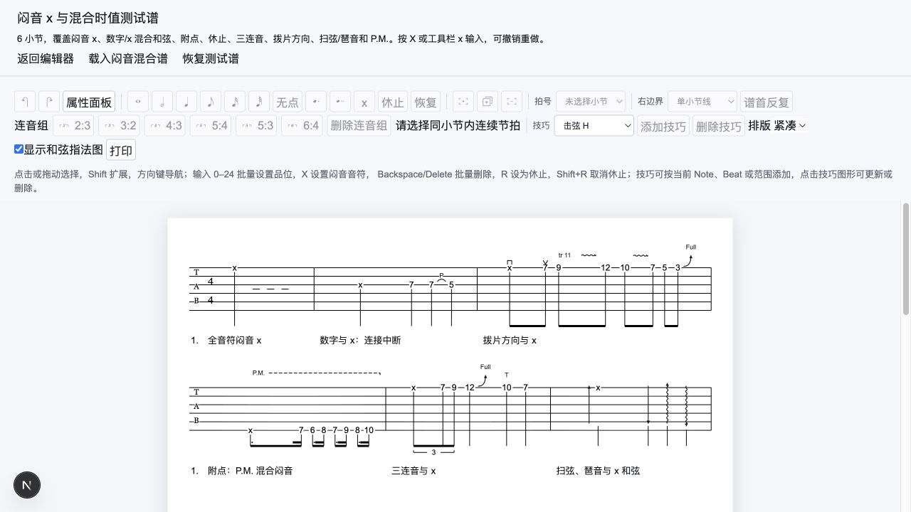

# MVP v7.1-A 闷音音符实施验收

2026-10-10。依据[技术方案](./20261010_闷音音符与记谱模型技术方案.md)，本切片完成 G08，并冻结后续 G09/G10/G15/G12 首批边界。业务、播放、多轨与云端作品库保持排除。

## 1. 已落地

- Note/命令/layout 共用 `ILXMFret = number | "x"`。x 是有 Beat 时值的无确定音高音符；同拍数字和 x 可混合，保持 Note ID、tick 和选区语义。和弦图禁奏 x 仍是另一种语义。
- X/x 键和工具栏设置选区内闷音，取消等待中的数字草稿。Ctrl/Cmd/Alt 与 IME 组合输入不接管；歌词/和弦文本编辑继续走表单。删除、rest 转 notes、数字覆盖、整小节复制及单条历史闭环。
- x 不支持 H/P、滑音、Tie、推弦/揉弦、泛音、点弦或颤音奏；两端 x 也不能 Tie，连接不能跳过同弦 x。拨片、扫弦/琶音与合法 P.M./Let Ring 范围可保留。数字转 x 原子清理失效技巧，通过既有影响说明报告，撤销恢复原关系。
- x 使用核心 Note 字形/宽度/halo/命中。扫弦/琶音范围内的 x 保留可见，方向记号左移并提前预留断行空间，避免覆盖字形；纯数字范围维持原显示规则。
- `/technique-test` 增加“载入闷音混合谱”，6 小节包括纯 x、数字/x 混合、附点、休止、三连音和兼容技巧。原 14 小节技巧谱保留，页面标题和说明跟随当前谱例。
- 修复独立会话首次/SSR 快照先为空的初始化问题：合法输入直接成为 initial snapshot，不短暂显示加载失败；外部替换仍保留原生命周期契约。

## 2. 版本边界

当前正式文档版本是 **schema 4**。内置纯数值谱例已明确升级版本，音乐内容与 ID 不变。loader/schema 拒绝外部 schema 3，错误提示当前支持 4；本次没有隐式迁移或降级。宿主需要先确认旧数据符合当前规则并升级版本，不能仅靠旧加载器的 schema 3 标识推断支持 x。

v7.0 文档中 schema 3 描述的是当时实施边界；当前使用以此记录和核心 `CURRENT_SCHEMA_VERSION` 为准。

## 3. 验证证据

- 全量 473 项测试：核心 426、网站 47；较 v7.0 新增 36 项。覆盖合法/非法输入与版本、数字/x ID 保真和 no-op、矩形/休止/复制、11 类音高技巧拒绝、5 类 Beat/区间技巧组合、同弦连接中断、窄宽布局和命中/方向线避让、快捷键修饰/IME 解析、SSR 快照与历史/宿主通知。
- `pnpm type-check`、`pnpm lint`、`pnpm build`、`git diff --check` 通过。类型检查在生产构建完成后执行。
- 桌面浏览器：X 与工具栏输入、Shift+方向键后的矩形输入、1→X 后超过 600ms 不回写数字、撤销/重做恢复、x 上添加推弦报错、6 小节混合谱与紧凑/舒适切换验证。
- 真实中文输入法候选操作、长谱性能、多浏览器、系统打印/PDF 尚未验收；输入法这里只覆盖组合状态的快捷键解析边界。没有把核心回归替代人工输出验收。

## 4. 下一切片

进入 v7.1-B：G09 单轨调弦/capo与结构记谱、G10 多小节复用。G15 拍点拆分/合并与后续 Beat 粘贴、G12 半音推弦仍未实施；v7.2 输出与最终质量验收继续保留。G12 本版首批已收敛为半音推弦，不承诺预推/回落、倚音、重音和歌词延长线全部实现。
