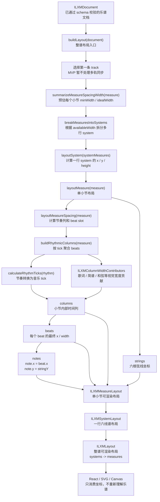
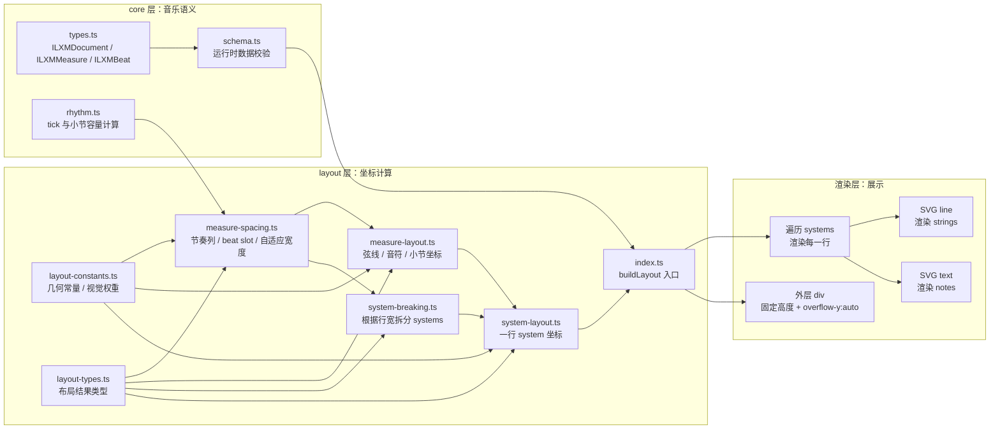
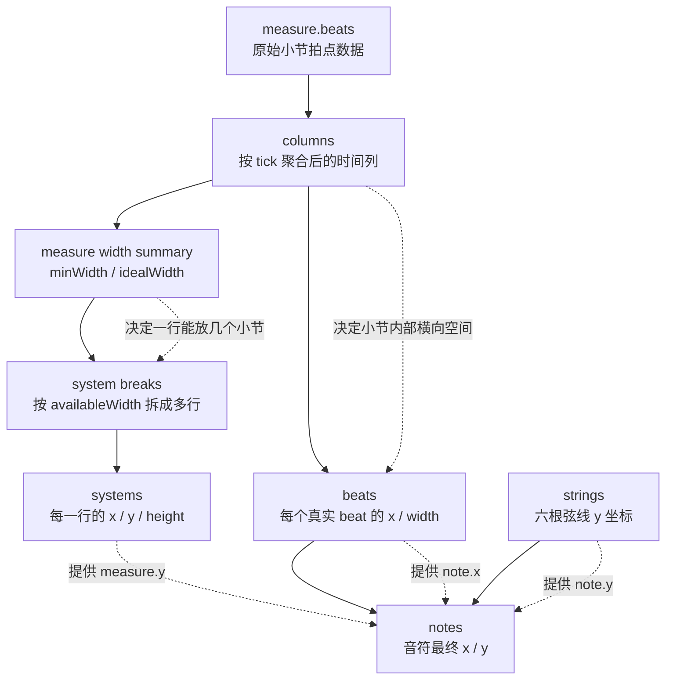

# MVP Layout 流转架构图

这份文档用于说明 MVP layout 方案的核心流转：原始乐谱数据先转换为音乐时间，再转换为视觉列宽，然后按可用宽度拆成多行 system，最后输出小节、弦线、音符等可渲染坐标。

## 总体流转

## 分层职责

## 关键数据关系

## 核心原则

- `tick` 是音乐时间坐标，不是像素宽度。
- `calculateRhythmTicks` 只计算音乐时值，不参与视觉宽度决策。
- `columns` 负责小节内部横向空间分配，是未来歌词、简谱、和弦对齐的扩展点。
- `beats` 是真实 beat 的最终布局结果，包含 `x` 和 `width`。
- `systems` 是多行六线谱的行布局结果，负责承载同一行内的小节集合。
- `strings` 决定弦线位置，也为音符提供纵坐标参考。
- `notes` 是最终可渲染音符坐标，通常由 `beat.x + string.y` 得到。
- `layout.height` 是排版后的内容高度，用于设置 SVG 高度或滚动容器内容高度。
